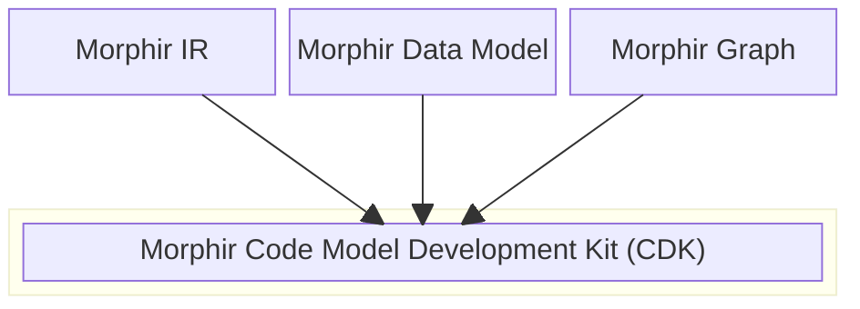

# Morphir CDK

**Morphir Code Model Development Kits** In the context of Morphir, CDKs are libraries which provide a programming language specific representation of the Morphir code model. This allows you to work with Morphir models in your favorite programming language.

## Supported Languages

| Language | Status |
|----------|--------|
| Scala | |
| Rust  | |

## What's In a CDK?

