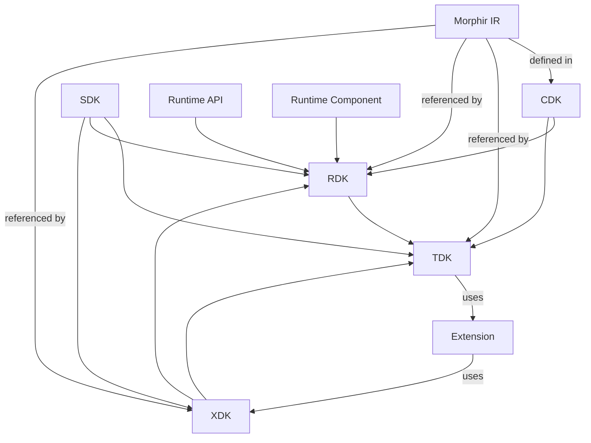

# Morphir DevKit

> Note: Development of the DevKit is a work in progress. More mature offerings are available at language specific repos like: finos/morphir-elm and finos/morphir-scala.

The Morphir DevKit is a collection of tools and libraries that help you work with Morphir models. The DevKit includes:

- [CDKs](cdk/ReadMe.md) - **Morphir Code Model Development Kits** In the context of Morphir, CDKs are libraries which provide a programming language specific representation of the Morphir code model. This allows you to work with Morphir models in your favorite programming language.
- [SDKs](sdk/ReadMe.md) - **Morphir Software Development Kits** In the context of Morphir, SDKs are implementations of libraries which are represented by Morphir. The Morphir core SDK (often referred to as `Morphir.SDK`), forms the base class library for the Morphir ecosystem. It provides the necessary APIs for executing and/or describing executable models.
- [TDKs](tdk/ReadeMe.md) - **Morphir Tooling Development Kits** - packages focused on providing tools (such as CLI tools) for working with Morphir models. This is what provides the tooling side of the Morphir ecosystem. A tool is capable to act as a host that pulls together various components and extensions to provide solutions around concepts like workspace management, project management, package management, and dependency management.
- [RDKs](rdk/ReadMe.md) - **Morphir Runtime Development Kits** - libraries for hosting a Morphir runtime in a variety of programming languages. This is similar to the SDKs but with a focus on runtime execution, and not on general tooling like the SDKs, which provide tooling around workspace, project, package, and dependency management.
- [XDKs](xdk/ReadeMe.md) - **Morphir Extension Development Kits** - libraries for extending Morphir with a variety of programming languages. This is the extension side in a hosting model (or what is referred to as a "guest language" in WebAssembly Component Model). Put simply, an XDK allows you to build plugins to tools and/or runtimes. An XDK will provide the necessary APIs and interfaces to allow you to extend the Morphir ecosystem with your own custom functionality.

