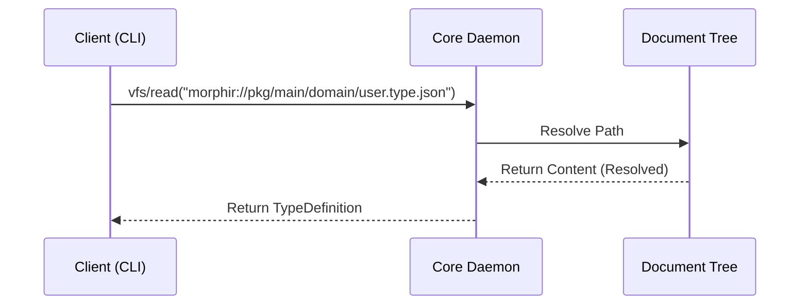
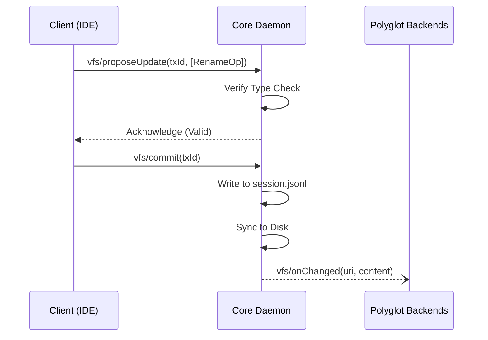

# Document Tree Protocol (JSON-RPC 2.0)

This document details the JSON-RPC 2.0 methods and notifications used by the Morphir Core Daemon to manage the Document Tree and coordinate with backends.

## Protocol Interaction Diagrams

### Read Request Flow



### Propose-Commit Transaction Flow



## VFS Methods

### `vfs/read`

Retrieve a specific node from the Document Tree with resolved configuration context.

**Request:**
```json
{
  "method": "vfs/read",
  "params": {
    "uri": "morphir://pkg/main/domain/user.type.json"
  }
}
```

### `vfs/proposeUpdate`

Starts a speculative change to the IR. The Daemon verifies type-checking before committing.

**Request:**
```json
{
  "method": "vfs/proposeUpdate",
  "params": {
    "txId": "refactor-001",
    "ops": [
      {
        "op": "RenameType",
        "path": "main/domain",
        "oldName": "order",
        "newName": "purchase"
      }
    ],
    "dryRun": false
  }
}
```

### `vfs/commit`

Finalizes a transaction.

1. The Daemon writes the `commit` line to `session.jsonl`
2. The Pending State is synced to the physical `.morphir-dist` directory
3. A `vfs/onChanged` notification is broadcast to all active backends

### `vfs/subscribe`

Backends observe specific namespaces to reduce network traffic.

**Request:**
```json
{
  "method": "vfs/subscribe",
  "params": {
    "namespaces": ["main/domain"],
    "depth": "recursive"
  }
}
```

## Notifications

### `vfs/onChanged`

Sent by the Daemon whenever the IR or Config is updated.

**Payload:**
```json
{
  "method": "vfs/onChanged",
  "params": {
    "uri": "morphir://pkg/main/domain/order.type.json",
    "changeType": "Update",
    "content": { "..." : "..." },
    "resolvedConfig": { "..." : "..." }
  }
}
```

## Workspace Management Methods

(See [Daemon Documentation](../daemon/README.md) for full workspace API)

### `workspace/create`
Create a new workspace.

### `workspace/open`
Open an existing workspace.

### `workspace/loadProject`
Load (compile) a specific project.
