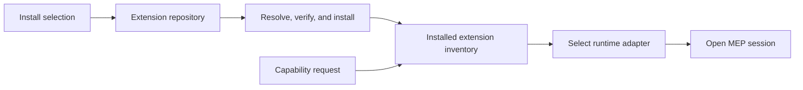
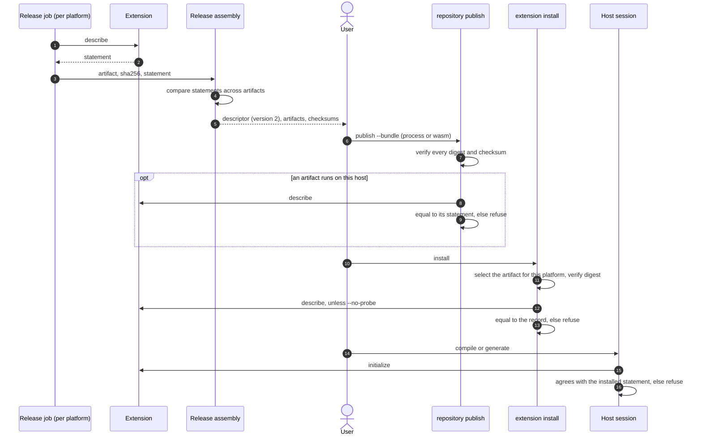

# Extension distribution and package acquisition

Morphir needs two related distribution systems. Morphir packages distribute reusable logic and types for frontends to compile. Extension distributions deliver capability providers that a Morphir host can load, start, or contact. They should share identity, resolution, integrity, acquisition, caching, and locking machinery without sharing one manifest or lifecycle.

The [Morphir Extension Protocol](./protocol.md) begins after the host has selected an installed extension. This design covers the work that happens before that point and the local state that remains afterward.

The accepted [WASM runtime and Avro backend proposal](../../proposals/wasm-extension-runtime-and-avro-backend.md)
specializes this draft for portable WASM extensions. That feature is not
released. The accepted proposal controls if the two documents differ.

## Boundaries

| Concern | Morphir package | Extension distribution |
|---|---|---|
| Purpose | Supply reusable model logic and types | Supply frontend, backend, validator, or transform capabilities |
| Primary content | Source modules and native project metadata | WASM module, executable, JVM artifact, or daemon connection metadata |
| Materialized result | Verified source tree | Verified runnable artifact or connection description |
| Consumer | Frontend and build pipeline | Extension host |
| Runtime lifecycle | Compiled as build input | Initialized, called, cancelled, and stopped through MEP |
| Platform selection | Usually none for source packages | Often required for native and JVM artifacts |

An extension may consume Morphir packages while compiling a project. That dependency does not turn the package into an extension or make the extension host responsible for package semantics.

## Direction from Morphir Scala and MoonBit

The morphir-scala knowledge base contains two inputs to this design:

- [Package URL-centered package management](https://github.com/finos/morphir-scala/blob/2f697f4e4155926eb3107c8f83b009fe2d0b3f40/kb/bundles/morphir/morphir-scala/design/package-url-package-management.md) proposes Package URL as the canonical package identity, Package VERS for ranges, typed source descriptors, immutable resolution, content digests, and locks that retain the complete graph and provenance.
- [MoonBit registry, resolution, and source materialization](https://github.com/finos/morphir-scala/blob/2f697f4e4155926eb3107c8f83b009fe2d0b3f40/kb/bundles/morphir/morphir-scala/design/moonbit-package-management.md) documents a Git-distributed registry index with one line-delimited history per package, a small resolver-facing record, separate archive storage, checksum verification, staged extraction, and immutable materialized trees.

MoonBit provides architectural evidence, not a format to copy. Its implementation is AGPL-3.0, its version-selection rules belong to its ecosystem, and its observed registry has case-colliding paths that fail on common case-insensitive filesystems. Morphir must define its own schema, namespace rules, and resolution policy.

The useful lessons are:

1. Keep logical identity independent from content location.
2. Keep the resolver record small while allowing publication metadata to grow.
3. Resolve the complete graph before acquiring content.
4. Verify cached and downloaded bytes before materialization.
5. Validate the materialized manifest against the selected identity.
6. Pin the repository-metadata revision as well as package versions and digests.
7. Treat local workspace replacements as policy over a stable identity, not as publishable dependencies.

## Shared distribution kernel

A common distribution kernel should provide pure value types and effects for:

- canonical identity and version requirements;
- version discovery and dependency metadata;
- exact resolution and lock generation;
- typed source descriptors and provenance;
- content and normalized-tree digests;
- authenticated acquisition;
- staged verification and materialization;
- content-addressed storage under `MorphirHome`;
- offline and mirror-aware lookup.

Interpreters provide network, Git, filesystem, credential, archive, and cache behavior. Buildkit, frontends, and the extension host consume resolved or materialized values and do not depend on repository endpoints, cache layouts, or credentials.

Package and extension policy remains above this shared kernel:

- the Morphir package resolver understands package dependencies, source roots, module enumeration, and source-package locks;
- the extension resolver understands capabilities, MEP versions, permissions, runtime kinds, operating systems, architectures, launch arguments, and daemon endpoints;
- each family validates its own manifest after materialization.

## Repository architecture

The first distributed repository backend should be service-free and mirrorable. A Git-backed repository is a good launch option when paired with a local-directory backend for development, tests, and air-gapped use.

Repository metadata should partition histories by a canonical, filesystem-portable encoding of package identity. Each version record should contain only what resolution needs:

- exact identity and version;
- dependency requirements when the package family supports dependencies;
- source descriptor or an input from which the source can be derived;
- content digest and digest algorithm;
- manifest kind and schema version;
- optional yanked or revoked status.

Presentation fields such as descriptions, licenses, documentation, maintainers, and search keywords may extend the record without becoming inputs to dependency resolution.

The client pins the Git commit or metadata revision used for resolution. A future registry may expose the same logical operations over HTTP, but reproducibility must not depend on a mutable `latest` response. Multiple endpoints may provide the same repository identity and digest.

### Repository and catalog topology

Morphir packages and extension distributions use separate logical repositories. Each repository has its own metadata schema, validation rules, version history, and resolution policy. A model-package repository cannot contain extension records, and an extension repository cannot contain model-package records.

Both repository kinds implement the same client capability for version discovery, exact-record lookup, provenance, and mirroring. That shared capability does not erase the different record types.

A repository is a logical collection, not a directory, Git checkout, or service. Those are repository endpoints. One Git repository may host package and extension repository metadata under separate roots, for example `model-packages/` and `extensions/`. Deployments may also place them at separate endpoints or expose them through different registries. Endpoint layout is a backend and operational choice. It does not change the logical repository boundary.

The catalog is a searchable view over enabled repositories. It may merge results, but every result retains its repository identity and endpoint provenance. The catalog is neither the publication authority nor the installed-state record.

When one endpoint contains both repository kinds, a lock records the repository kind, logical repository identity, endpoint, root path, and pinned metadata revision. This prevents the shared endpoint from making a repository reference ambiguous.

### Release channels

Each repository supports release channels as mutable version-selection policy. The first channel model includes:

- `stable` for versions intended for general use;
- `preview` for pre-release testing, also exposed as `insiders` by products that already use that name;
- optional segmented preview channels such as `preview/<segment>` for a bounded prototype, compatibility test, or staged rollout.

A segmented preview channel remains part of the same logical repository. It does not create a new package identity, extension identity, or repository. Repository policy defines valid segment names, who may publish to them, and whether they inherit candidates from the general preview channel.

A channel request resolves to an exact version before acquisition. The lock records the requested channel, exact selected identity and version, repository identity, metadata revision, source, and digest. Reusing the lock never follows a moving channel. Refreshing or changing channels is an explicit resolution operation.

Stable resolution excludes preview versions unless the request or workspace policy opts into them. Promotion changes channel eligibility. It does not let a repository replace locked bytes for an existing exact identity and digest.

## Morphir package flow


A Morphir package is a source distribution first. A materialized package may come from a registry archive, immutable Git commit, vendored tree, or workspace snapshot. All sources must declare the same logical identity and produce the locked normalized digest. Compiler caches and generated IR remain derived data unless a later package format explicitly includes them.

Compilation receives a prepared source view and runs without package-network access. Credentials remain confined to acquisition and are resolved through the protected secret mechanism.

## Extension flow



The installed extension inventory is local state, not a repository or catalog.
It records the extension ID, name, version, runtime, platform, arguments,
artifact digest, content-addressed store path, capabilities, MEP versions,
repository provenance, frontend metadata, backend metadata, and executable
mode. The matching lock also records the requested selection and artifact
source; the inventory does not. Both records persist matching frontend or
backend metadata whenever that capability is declared. The host uses the
inventory and lock together to select an artifact and runtime without contacting
a registry during normal execution.

An extension manifest needs:

- extension identity and version;
- supported MEP versions;
- a capability statement for each artifact, captured from the extension itself (see [Capability statements in distribution](#capability-statements-in-distribution));
- requested permissions;
- one or more artifacts;
- each artifact's runtime kind, source, digest, and platform constraints;
- launch commands and arguments for managed processes;
- endpoint and authentication requirements for connected daemons.

The runtime kind is independent from the acquisition source. A GitHub Release may contain a portable WASM module, a native process, or a JVM process. A daemon entry may require no artifact at all when policy permits connecting to an existing endpoint.

The `schemaVersion` field is a quoted `"major.minor"` JSON string. This is the
form records had before SemVer became the default contract versioning scheme;
readers keep accepting it as version 1, and the next record version uses a
SemVer string. Schema `"1.0"`
extension records require matching metadata for every declared frontend or
backend capability and use these rules for runnable artifacts:

| Runtime | Platform | Arguments and executable bit | Rights |
|---|---|---|---|
| `wasm` | Must be absent. The artifact is portable. | Arguments must be empty and `executable` must be `false`. | The guest has no direct filesystem or network access. |
| `process` | Required and matched to the host OS and architecture. | The locked arguments and executable mode are used exactly. | The process retains the ambient rights of the user who launches Morphir. |

`wasm` is the public runtime name. Extism is the current engine behind that
adapter and does not appear as a runtime value. A future WASM engine can replace
it without changing an extension record or the MEP methods.

Installation verifies the selected artifact's SHA-256 before publishing it to
the content-addressed store. It then records the exact artifact in both the
inventory and lock. Frontend records lock language IDs, file extensions,
supported Morphir IR versions, and compile support. Backend records lock target
IDs, supported Morphir IR versions, and generate support. Normal activation is
offline. It loads one inventory and lock snapshot, checks that they agree,
canonicalizes the stored artifact under Morphir home, rehashes it, and verifies
its runtime-specific mode before starting a session.

The MEP handshake is a second check, not a replacement for the lock:

| Stage | Compared values | Result on mismatch |
|---|---|---|
| Inventory against lock | Extension ID, name, version, runtime, platform, arguments, digest, capabilities, MEP versions, repository provenance, complete frontend and backend metadata, and executable mode | Activation stops before guest code runs. |
| Installed record against initialization | Extension ID, name, version, capability kinds, complete frontend metadata including languages, file extensions, IR versions, and `compile`, and complete backend metadata including targets, IR versions, and `generate` | The host rejects initialization and does not call the provider. |
| Requested operation against negotiated capability | Frontend language, requested IR version, and `compile`, or backend target, input IR version, and `generate` | The host does not send `morphir.frontend.compile` or `morphir.backend.generate`. |

This comparison prevents a verified file from silently advertising a different
frontend or backend after installation. Artifact integrity proves which bytes
the host loaded. The handshake proves what those bytes claim in the current
session.

The host supports these activation modes behind one session contract:

- load a portable WASM module through the current Extism engine;
- spawn a process and use `Content-Length` framed MEP over standard input and output;
- connect to an existing daemon through a specified MEP socket or HTTP transport;
- start a managed daemon, wait for its endpoint, and then use the daemon transport;
- call a built-in provider through the same logical operation contract where practical.

## Capability statements in distribution

The [protocol](./protocol.md#capability-statements) defines the capability
statement and the `morphir.extension.describe` method that returns it. This
section defines how the statement travels from a release to an installed
record. The working specification is
[finos/morphir#921](https://github.com/finos/morphir/discussions/921).

### The gap this closes

Until statements exist, capabilities are declared by hand in a release
manifest (`.github/extensions.toml` in morphir-rust, `extension.json` in
morphir-elm) and turned into capability kinds by key: `languages` becomes
`frontend`, `targets` becomes `backend`, `workspaceDiscovery` becomes
`workspace`. Every parser of these documents rejects unknown fields, so each new
capability needs a manifest key, a writer in every packaging tool, a host parser
change and a host release. `extension repository publish` also accepts only a
single-artifact WASM bundle, so a multi-platform process extension such as the
Elm MEP extension has no supported path to an installed record.

### Release descriptor, version 2

A release has one descriptor with one entry per artifact. Each entry carries the
statement that the artifact returned from `describe` on its own platform:

```json
{
  "schemaVersion": "2.0.0-draft.1",
  "extensionId": "morphir-elm",
  "shortId": "elm",
  "version": "0.3.0",
  "gitCommit": "<40 hexadecimal characters>",
  "platformDifferences": "none",
  "artifacts": [
    {
      "platform": "aarch64-apple-darwin",
      "runtime": "process",
      "filename": "morphir-elm-extension-0.3.0-aarch64-apple-darwin.tgz",
      "sha256": "<64 hexadecimal characters>",
      "statement": { "extension": { "types": ["frontend", "workspace"] } }
    }
  ]
}
```

A WASM release is the case with one artifact and no `platform`. A bundle
directory contains the descriptor, every artifact it lists and one checksum per
artifact, and nothing else.

### Publication and installation



**Figure 1:** A statement comes from the extension at packaging time and is
checked against the extension three more times. Notice that installation is the
first place where the artifact that will run is on the machine that runs it:
publication can check only the artifacts that run on the publishing host.

The repository index record and the installed record keep each artifact's
statement unchanged. The installed record keeps only the statement of the
installed artifact. The host's provider registry reads that statement, so a
member such as `frontend.multiDocument` or the `workspace` kind is known before
a session starts.

A session is compared with the installed statement by the
[agreement rule](./protocol.md#when-a-session-agrees-with-a-statement), not by
equality: the session carries one negotiated protocol version and may offer less
than the statement. Publication and installation compare two statements, which
must be equal.

`extension install --no-probe` skips the install-time `describe`. It exists for
users who do not accept that a `process` artifact runs at installation rather
than at first use. The first session still compares the statement.

The existing checks in [Extension flow](#extension-flow) gain one stage:

| Stage | Compared values | Result on mismatch |
|---|---|---|
| Install probe against record | The complete statement of the selected artifact | Installation stops before the artifact is recorded. |

### Platform differences

Artifacts of one release may report different statements. Two guards apply:

1. **A difference is declared, never accidental.** The release job compares the
   statements it collected. When they differ and `platformDifferences` is
   `"none"`, the job fails. A release that differs on purpose sets
   `"declared"`.
2. **A difference is visible.** `extension install` and `extension info` report
   when the installed artifact's statement differs from other artifacts of the
   same release, naming the members that differ.

The index record never merges statements. A merged statement would claim a
capability that some installed artifact does not have.

## Compatibility and release paths

Every document that carries a statement follows the same rules:

1. **Must-ignore unless critical.** A reader ignores an optional member it does
   not understand, and refuses a member named in `critical` that it does not
   understand.
2. **Schema ranges.** A host reads the current released major and the previous released
   major of the descriptor and of each record, plus the exact drafts it lists.
   A publisher writes the highest version that the oldest host it targets
   reads. Versions follow the default
   [SemVer contract versioning](https://github.com/finos/morphir/blob/main/kb/bundles/morphir/morphir-cli/decisions/0003-semver-is-the-default-contract-versioning-scheme.md)
   rule: a draft such as `2.0.0-draft.1` matches only exactly.
3. **Minimum host.** An extension that needs a newer host states `requires.host`
   and lists it in `critical`.
4. **`describe` is optional.** A host falls back to a session when an extension
   does not implement it.
5. **Old records are converted.** A record without a statement becomes a
   statement built from its capability keys, marked `declared` rather than
   `probed`. Installation and the first session verify it as usual.

These rules let a host and an extension release independently:

| Release path | What must hold | Gate |
|---|---|---|
| Host only | The new host reads every supported older descriptor, record and extension (rules 2, 4 and 5). | The host compatibility suite: CI runs the released bundles pinned in `.config/published-extension-bundles.toml` through the new host. |
| Extension only | The extension works with the host release it targets, or states `requires.host` (rules 1 and 3). | The extension's release check runs its bundle through the pinned host release. |
| Both | The host releases first, then the extension. They never have to release at the same time. | The host suite passes and the host releases; the extension pin moves and its release check passes. |

A host released before these rules existed follows none of them. The first host
release that implements them is therefore a host-only release that still reads
version-1 descriptors and records. Extensions keep writing version 1 until that
release is pinned, and adopt statements and version 2 afterward.

## Morphir Scala example

Morphir Scala publishes native CLI archives, a portable executable JVM assembly, and checksums through GitHub Releases. An extension record can point at those independently released assets instead of packaging them with the Morphir CLI.

On Windows ARM64, the resolver selects the JVM artifact because GraalVM Native Image does not provide a Windows ARM64 target. Installation verifies the release checksum and records a launch description such as `java -jar <artifact> extension stdio`. Other platforms may select a native artifact from the same extension version. Both variants must report the same MEP identity. Their capabilities may differ only when the release declares the difference; see [Platform differences](#platform-differences).

The existing `morphir server` command becomes an extension daemon only if it implements a specified MEP transport and lifecycle. Otherwise Morphir Scala should expose a dedicated MEP entry point. A user-facing HTTP server and a host-managed standard-stream process have different lifecycle and logging requirements.

## Security and reproducibility

- Normal compilation and generation do not download missing extensions without an explicit install policy.
- Checksums provide integrity, not publisher authenticity. Signature or provenance verification remains an open policy decision.
- Registry and repository credentials use protected secret references and never enter identities, locks, manifests, transcripts, or diagnostics.
- Installation uses staging and atomic publication so readers never observe partial content.
- Archives must reject path traversal, unsafe links, device files, and platform path collisions.
- Native processes inherit a filtered environment and explicit working directory.
- Daemon connections require a transport-specific identity, authentication, timeout, and ownership policy.
- Locks retain the exact repository-metadata snapshot, selected records, sources, digests, and transitive package graph.

## Current host and guest split

The SDK keeps protocol types and extension traits portable across native and
WASM builds. Its Extism PDK dependency, guest exports, and imported host
functions are compiled only for `wasm32`. Native hosts use the Extism runtime
adapter and do not link guest PDK imports.

Process and WASM adapters feed the same runtime-neutral MEP session controller.
An in-memory provider remains useful for unit tests, while runtime tests load an
independently built artifact through the production host boundary.

## Open questions

1. Which Package URL convention identifies Morphir-native packages, and should extension distributions use that type or a distinct provisional type?
2. What normalized digest rules remain stable across archives and case-sensitive or case-insensitive filesystems?
3. Which version and range rules apply to Morphir-native packages and extensions?
4. Which signature or build-provenance policy establishes publisher authenticity?
5. How does a host distinguish a daemon it owns from an endpoint it only connects to?
6. Which yank and revocation behavior must work before the first public repository?
7. What canonical form do two capability statements take before they are compared?
8. Should publisher provenance or a signature cover each artifact's capability statement?
9. Can an install-time probe of a `process` artifact run under an operating-system sandbox where one is available?

## Non-goals

- Copy MoonBit's index schema, resolver, or AGPL implementation.
- Make MEP responsible for installation or repository storage.
- Treat a Morphir package as an executable extension.
- Require a network service for the first repository backend.
- Let compiler or runtime cache layouts become public package contracts.
- Infer trust from a checksum alone.
