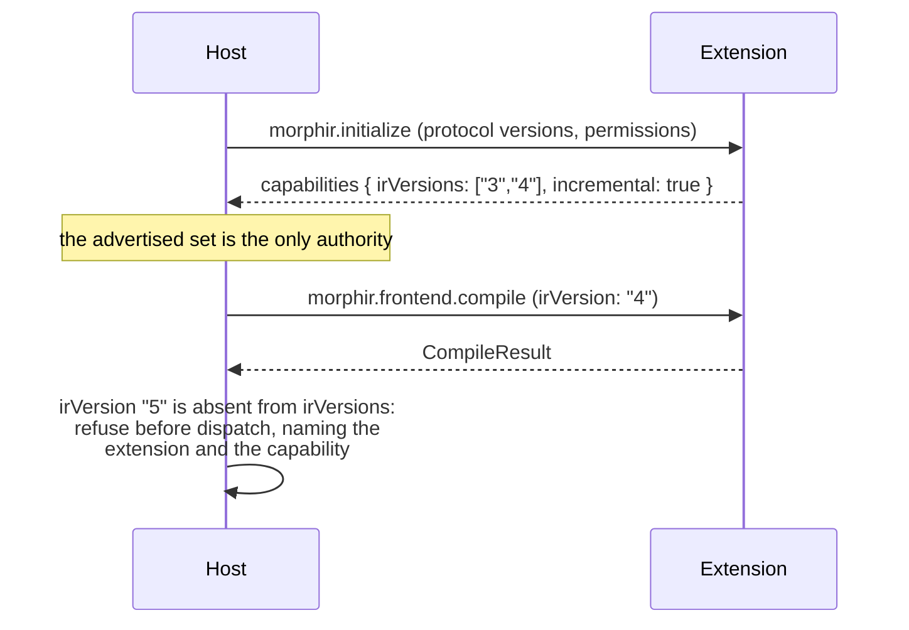

# Morphir Extension Protocol

The Morphir Extension Protocol, abbreviated MEP, defines how a Morphir host discovers and calls independently packaged functionality. It uses JSON-RPC 2.0 and follows the same broad model as LSP and BSP: a versioned handshake, capability negotiation, typed operations, structured diagnostics, cancellation, and an orderly shutdown.

MEP separates the logical API from its transport. The public runtime kinds are
`process` and `wasm`. A process connects over standard input and output. A WASM
module carries the same JSON-RPC envelopes through host calls. Extism is the
current WASM engine, not a protocol runtime name. HTTP and local sockets may use
the same methods later without changing backend behavior.

## Status

This is a proposed version 0.1 contract. It consolidates the method names already present in `morphir-extension-sdk` with the lifecycle, transport, and single-file compilation behavior needed for a working Elm frontend.

The accepted [WASM runtime and Avro backend proposal](../../proposals/wasm-extension-runtime-and-avro-backend.md)
specializes this draft. That feature is not released. Where this draft and the
accepted proposal differ, the accepted proposal controls.

## Goals

MEP must support:

- extensions written in any language;
- frontend compilation from source text to Morphir IR;
- backend generation from Morphir IR to artifacts;
- validators and IR-to-IR transforms;
- capability discovery before an operation is called;
- structured diagnostics that the CLI and editors can render;
- cancellation and progress for long-running work;
- local native processes first, without ruling out WASM or remote execution;
- a one-file Elm compilation path that does not require a Morphir project.

MEP does not define extension installation, repository storage, daemon discovery, or Morphir IR itself. Those systems use the protocol but have separate formats and lifecycles.

The adjacent [extension distribution and package acquisition design](./distribution-and-acquisition.md) defines how a host resolves, acquires, verifies, installs, and selects extension artifacts. It also records the shared distribution machinery and separate semantics for reusable Morphir model packages.

The Rust host stores its user-global installed extension inventory under `MorphirHome`. Host implementations must use that resolver instead of hardcoding a user-home path, so `MORPHIR_HOME` relocates extension state along with other Morphir state. This changes discovery and installation behavior, not the MEP wire contract.

## Roles

The **host** discovers an extension, starts or loads it, negotiates capabilities, supplies inputs, and enforces resource permissions. The Morphir CLI and daemon can both act as hosts.

The **extension** implements one or more capabilities. A frontend compiles source documents to Morphir IR. A backend converts Morphir IR to generated artifacts. Validator and transform capabilities operate on Morphir IR.

The term **backend** is reserved for IR-to-artifact generation. It should not be used as a synonym for every extension or external process.

## Protocol and transport

Every message is a JSON-RPC 2.0 request, response, or notification. Method names use the existing dotted Morphir namespaces, such as `morphir.frontend.compile`.

JSON-RPC request identifiers may be strings or integers. A host must not reuse an identifier while its request is active. An extension must return the identifier without changing its type or value.

### Native executable transport

The host starts the configured executable and connects its standard streams as follows:

| Stream | Use |
|---|---|
| standard input | Requests and notifications from the host |
| standard output | Responses and notifications from the extension |
| standard error | Human-readable logs |

Standard output must contain protocol frames only. The host may capture or display standard error according to its logging configuration.

Each standard input or output message uses `Content-Length` framing. The byte count covers the UTF-8 JSON body, not the headers.

```text
Content-Length: 60\r\n
\r\n
{"jsonrpc":"2.0","id":1,"method":"morphir.ping","params":{}}
```

Readers must accept additional headers and ignore headers they do not understand. Header names are case-insensitive. Writers must emit `Content-Length`.

This framing allows formatted JSON and prevents extension logs from being mistaken for messages. It also makes the protocol compatible with established LSP framing libraries.

### Other transports

HTTP, local sockets, and WASM bindings may carry the same JSON-RPC messages. A transport specification must define message framing, identity, authentication, and lifecycle details that do not apply to the logical API.

The `wasm` adapter invokes a guest through the current Extism engine. It does
not expose Extism as a runtime value in configuration, manifests, locks, or
provider selection. The guest receives request values and returns response
values. It gets no direct filesystem or network access. Process extensions use
the same logical session, but they retain the ambient rights of the user who
started the host unless the operating system supplies a separate sandbox.

## Lifecycle

An extension session has four states:

```text
starting -> initializing -> ready -> stopping -> stopped
```

The host follows this sequence:

1. Start or load the extension.
2. Send `morphir.initialize`.
3. Validate the selected protocol version and capabilities.
4. Send the `morphir.initialized` notification.
5. Call advertised operation methods.
6. Send `morphir.shutdown` and wait for its response.
7. Send the `morphir.exit` notification.

Before initialization, an extension may accept only `morphir.initialize`, `morphir.extension.describe`, `morphir.ping`, and `morphir.exit`. After shutdown, it may accept only `morphir.exit`.

A host may also start an extension only to read its capability statement: it sends `morphir.extension.describe` and then `morphir.exit`, with no session. See [Capability statements](#capability-statements).

If the process exits before responding to `morphir.shutdown`, the host reports an extension failure. If it remains alive after `morphir.exit`, the host may terminate it after a configured grace period.

## Core methods

| Method | Kind | Purpose |
|---|---|---|
| `morphir.initialize` | request | Negotiate the protocol version, identity, permissions, and capabilities |
| `morphir.initialized` | notification | Tell the extension that the host accepted the handshake |
| `morphir.ping` | request | Check whether the extension process can respond |
| `morphir.extension.describe` | request | Read the extension's capability statement, before or after initialization, with no side effects |
| `morphir.extension.info` | request | Read extension identity and version after initialization |
| `morphir.extension.capabilities` | request | Read the negotiated capabilities after initialization |
| `morphir.shutdown` | request | Ask the extension to stop accepting work |
| `morphir.exit` | notification | End the session |
| `$/cancelRequest` | notification | Ask the receiver to cancel an active request |
| `morphir.progress` | notification | Report progress for an active request |

## Initialization

The host offers the protocol versions it supports. The extension selects one version and returns only the capabilities available in that session.

```json
{
  "jsonrpc": "2.0",
  "id": 1,
  "method": "morphir.initialize",
  "params": {
    "protocolVersions": ["0.1"],
    "host": {
      "name": "morphir-cli",
      "version": "0.1.0"
    },
    "workspace": {
      "rootUri": "file:///work/acme-orders"
    },
    "capabilities": {
      "cancellation": true,
      "progress": true
    },
    "permissions": {
      "workspaceRead": false,
      "workspaceWrite": false,
      "network": false,
      "environment": []
    }
  }
}
```

The workspace may be absent for configuration-free compilation. Version 0.1 sends source text and Morphir IR inside operation requests, so a frontend does not need workspace access.

```json
{
  "jsonrpc": "2.0",
  "id": 1,
  "result": {
    "protocolVersion": "0.1",
    "extension": {
      "id": "org.finos.morphir.frontend.elm",
      "name": "Morphir Elm frontend",
      "version": "2.100.0"
    },
    "capabilities": {
      "frontend": {
        "languages": [
          {
            "id": "elm",
            "fileExtensions": [".elm"]
          }
        ],
        "irVersions": ["3"],
        "compile": true,
        "incremental": false,
        "fragments": false
      },
      "cancellation": false,
      "progress": false
    }
  }
}
```

Initialization fails with a protocol-version error if the peers have no version in common. The host must not infer support for a method that the extension did not advertise.

### Capabilities are consulted, not remembered

A capability is the *only* authority on what an extension can do. The rule cuts both ways, and both
directions are load-bearing.

**A host must not assume more than an extension advertises.** This is stated above for methods, and
it applies to every field: a host must not send a `baseline` to a frontend advertising
`incremental: false`, nor request an IR version absent from `irVersions`.

**A host must not refuse less than an extension advertises.** A host that hardcodes a limit it
once observed will keep enforcing it after the extension grows past it, and nothing will detect the
drift, because nothing consulted the capability. The host negotiates against the advertised set
every time, for every run.

**An error reporting a restriction must name what imposed it.** "This does not support IR v4" tells
a reader nothing they can act on. Naming the extension and the capability tells them the limit
belongs to their *provider*, and that selecting a different one may lift it. A host that reports a
capability limit as though it were a property of the operation makes a provider's choice look like
a law.



**Figure 1:** Capability negotiation. Notice the last exchange never reaches the extension. A
version the extension did not advertise is refused by the host before dispatch, so an extension
never has to defend itself against a request the host should not have sent. Notice also that the
host holds no opinion of its own about IR versions: every decision is read back from what was
advertised at initialization, so an extension gaining a version needs no host change to become
usable.

### Frontend capabilities

`compile` says whether the frontend accepts `morphir.frontend.compile` at all.
`incremental` says whether the frontend accepts `CompileRequest.baseline` and
returns `CompileResult.moduleResults`; a host must not send a `baseline` to a
frontend that advertises `incremental: false`. `fragments` is reserved for a
future source-fragment compilation mode; it has no defined meaning in 0.1, and
a host must not act on it. `multiDocument` says whether one compile request may
carry more than one source document. It is absent from the wire when false. A
host must not send a larger source set to a frontend that does not declare it;
it refuses before dispatch and names the frontend.

## Capability statements

An extension's **capability statement** is what the extension says about
itself: its identity, the capability kinds it implements, the members of each
capability, and the protocol versions it speaks. The extension is the only
author of its statement. Packaging, publication and installation copy the
statement the extension reported; no manifest declares a capability by hand.
The working specification is
[finos/morphir#921](https://github.com/finos/morphir/discussions/921).

```json
{
  "statementVersion": "0.1.0-draft.1",
  "protocolVersions": ["0.1"],
  "extension": {
    "id": "morphir-elm",
    "name": "Morphir Elm frontend",
    "version": "0.3.0",
    "types": ["frontend", "workspace"]
  },
  "capabilities": {
    "frontend": {
      "languages": [{ "id": "elm", "fileExtensions": [".elm"] }],
      "irVersions": ["3"],
      "compile": true,
      "incremental": false
    },
    "workspace": { "protocolVersions": ["0.1.0-draft.1"], "discover": true }
  },
  "requires": { "host": [">=0.4.0-alpha.7"] },
  "critical": ["requires.host"]
}
```

A reader checks `types`, the capability kinds, strictly: an unknown kind is an
error. A reader carries `capabilities` unchanged, uses the members it
understands and ignores the others. `critical` lists member paths that change
meaning; a reader that does not understand a listed path refuses and names it.
`requires.host` is a list of single SemVer comparators over the host version,
such as `[">=0.4.0-alpha.7", "<0.5.0"]`, all of which must hold. Single
comparators parse the same way in the Rust `semver` crate and in `@std/semver`;
combined range strings do not, because the two libraries separate comparators
differently. A host outside the range refuses and names the range.

### `morphir.extension.describe`

| | |
|---|---|
| Kind | request |
| Allowed | before `morphir.initialize`, and in any later state before shutdown |
| Params | `{ "protocolVersions": ["0.1"] }`, the versions the caller understands |
| Result | the capability statement |
| Side effects | none: no workspace access, no network, no writes, no dependence on environment values the host did not pass |

`describe` is optional for an extension. A host that receives `-32601`, or a
refusal because the request came before `morphir.initialize`, reads what it can
through a session instead, following the lifecycle: `morphir.initialize`, the
`morphir.initialized` notification, `morphir.extension.capabilities`,
`morphir.shutdown` and `morphir.exit`. A session reports less than a statement,
so the statement the host builds from it lists only the negotiated protocol
version and has no `requires` or `critical` members.

### Where the statement is read

| Phase | Caller | Extension answers | Extension side effects |
|---|---|---|---|
| package | release tooling, once per platform | `describe` | none |
| publish | `extension repository publish`, for an artifact that runs on the publishing host | `describe` | none |
| install | `extension install`, for the selected artifact, unless `--no-probe` | `describe` | none |
| session | host | `initialize`, whose result must agree with the statement | none until an operation is called |
| operate | host | operation methods | only through host functions or within its sandbox |
| shutdown | host | `shutdown`, then `exit` | releases its resources |

Publication, installation, update and removal remain host operations. The
extension takes part in them only through `describe`, so it cannot change
anything while it is published or installed. Reading a statement means running
the artifact: a `process` artifact runs as a child process under the session's
launch rules and with the user's rights, and a `wasm` artifact runs in the WASM
engine without direct file or network access. The
[distribution design](./distribution-and-acquisition.md#capability-statements-in-distribution)
describes how the statement travels between these phases.

### When a session agrees with a statement

An initialization result is not a capability statement. It carries one
negotiated `protocolVersion` and the capabilities available in that session,
while a statement lists every protocol version the extension speaks and adds
`requires` and `critical`. A host therefore does not test the two for
equality. An initialization result **agrees with** a statement when all of the
following hold:

1. the extension's `id`, `name` and `version` are equal;
2. the negotiated `protocolVersion` is one of the statement's `protocolVersions`;
3. every capability kind the session reports is among the statement's `types`;
4. every capability member the session reports has the value the statement
   gives it.

A session may offer less than its statement, because negotiation can narrow
what one session provides. It may never offer a kind or a member the statement
does not have, or a different value for one it does. A result that does not
agree is refused, and the refusal names the first rule that failed.

Comparing two statements, as publication and installation do, is a comparison
of equal documents.

## Capability methods

Version 0.1 defines these operation methods:

| Method | Capability | Input | Output |
|---|---|---|---|
| `morphir.frontend.compile` | frontend | Source documents and compilation context | Morphir IR and diagnostics |
| `morphir.backend.generate` | backend | Morphir IR and generation options | Generated artifacts and diagnostics |
| `morphir.validator.validate` | validator | Morphir IR and rule options | Diagnostics |
| `morphir.transform.transform` | transform | Morphir IR and transform options | Morphir IR and diagnostics |

An extension may implement any combination of these capabilities. The first Elm delivery implements only `morphir.frontend.compile`.

Backend capability metadata has a typed shape:

```json
{
  "backend": {
    "targets": ["avro"],
    "irVersions": ["3", "4"],
    "generate": true
  }
}
```

`targets` lists stable target IDs used for provider selection. `irVersions`
lists the Morphir IR major versions the backend can consume. `generate` says
whether the backend accepts `morphir.backend.generate`. The host selects a
provider by target and input IR version before it sends a request. It must not
derive target support from the extension ID.

## Source documents

The host sends source text by value. An extension must not assume that a document URI is a readable operating-system path.

```json
{
  "uri": "file:///work/Example.elm",
  "languageId": "elm",
  "version": 1,
  "text": "module Example exposing (add)\n\nadd : Int -> Int -> Int\nadd a b = a + b\n"
}
```

`uri` identifies the document for diagnostics and incremental updates. `version` increases when the host changes the document during a session. A one-shot host may use version `1`.

Passing content rather than paths has four consequences:

- a sandboxed extension does not need filesystem permission;
- unsaved editor buffers compile correctly;
- remote and local extensions receive the same request;
- tests can run without creating a project directory.

## Frontend compilation

### Request

`morphir.frontend.compile` compiles one or more source documents into a Morphir IR distribution.

The request carries its documents in one of two envelopes, and a provider may be
sent either. They are alternatives: a request carrying both is refused, because
each names its own source root and a request stating two has no honest answer
for which one module identities resolve against.

- **Current** — `sources: { root?, documents }`. The root travels with the
  documents whose identities depend on it.
- **Legacy** — a top-level `documents` array with the root in
  `options.sourceRootUri`. This is what released providers were built against.

The host chooses per provider rather than per request: a native provider
receives the current envelope, while a process or WASM provider receives the
legacy one, so a provider released before `sources` existed keeps working
unchanged. See `compile_wire_request` in the CLI. A provider built on the SDK
decodes either envelope and sees only the normalized `sources`, so an extension
does not implement this distinction itself — it is a wire concern.

The legacy envelope is retained until an explicit protocol transition replaces
it, at which point the host stops sending it and the decoder stops accepting it.

```json
{
  "jsonrpc": "2.0",
  "id": "compile-1",
  "method": "morphir.frontend.compile",
  "params": {
    "languageId": "elm",
    "sources": {
      "root": "file:///work",
      "documents": [
        {
          "uri": "file:///work/Example.elm",
          "languageId": "elm",
          "version": 1,
          "text": "module Example exposing (add)\n\nadd : Int -> Int -> Int\nadd a b = a + b\n"
        }
      ]
    },
    "package": {
      "name": "local/example",
      "exposedModules": ["Example"]
    },
    "dependencies": [],
    "options": {
      "typesOnly": false,
      "irVersion": "3"
    },
    "baseline": {
      "modules": [
        {
          "name": "My.Types",
          "uri": "file:///work/My/Types.elm",
          "sourceDigest": "sha256:aa",
          "interfaceDigest": "sha256:bb",
          "dependsOn": ["My.Other"],
          "ir": {}
        }
      ]
    }
  }
}
```

The `package` field supplies language-neutral compilation context. A host compiling one file may synthesize it. For Elm, the adapter converts this value to the package information expected by the existing compiler.

`package.exposedModules` is optional. Omission means all compiled modules are
public; an explicit empty array means all are private. A nonempty array selects
exactly the public modules, with other modules retained as private package
definitions. Unknown names are errors. Frontends that cannot implement the
requested visibility must report that limitation instead of changing access.

`baseline` is optional and owned by the host: it carries what an earlier
`morphir.frontend.compile` call returned in `moduleResults` and
`contextDigest`, so a host that keeps no cache omits it and gets a full
compile. A host must not send `baseline` to a frontend that advertises
`incremental: false`. Each `baseline.modules` entry
describes one module the host still trusts: `name` and `uri` identify it,
`sourceDigest` is the digest of its source text as last seen, `interfaceDigest`
is the digest of its resolved public interface, `dependsOn` lists the
in-package modules it depends on, and `ir` is the module's previously compiled
IR. `baseline.contextDigest` is optional and echoes the digest an incremental
frontend returned as `CompileResult.contextDigest` on the run that produced
this baseline. A host stores that digest next to the module results it keeps
and sends it back unchanged; it does not compute or interpret it. A frontend
whose own digest of the current compile context — IR version, `typesOnly`,
prelude, and dependency interfaces — differs from `baseline.contextDigest`, or
a baseline that carries none, ignores the whole baseline rather than reuse
entries computed against something else.

`sources.root` — spelled `options.sourceRootUri` in the legacy envelope —
supplies the absolute source root for stable relative document identities. The
root travels with the documents whose identities depend on it, so replacing or
combining source sets cannot silently rename modules; that is why it moved
inside the set rather than staying beside it in the options bag. Relative
document paths retain their nesting. Multiple documents containing absolute
URIs require this field; one absolute document without it retains basename
identity for existing single-document callers.
Absolute documents must be below the root, with matching scheme and authority.
Query and fragment metadata do not affect identity. Decode path segments once;
reject dot segments, encoded separators, invalid UTF-8, outside-root paths, and
duplicate identities. Keep the original URI for diagnostics. URI resolution
does not perform I/O or grant access to source locations.

The Rust SDK exposes this validation as `CompileRequest::source_paths()`.
Hosts should use hierarchical URIs; absolute native paths remain accepted for
compatibility. See [Project compilation context](../../project-compilation-context.md)
for project selection, CLI precedence, exposure, and artifact-loading rules.

Dependencies are Morphir IR distributions. Version 0.1 permits them inline:

```json
{
  "packageName": "morphir/sdk",
  "irVersion": "3",
  "distribution": {}
}
```

Large dependency transfer and content-addressed references are deferred until measurements show they are needed.

### Successful response

```json
{
  "jsonrpc": "2.0",
  "id": "compile-1",
  "result": {
    "success": true,
    "irVersion": "3",
    "ir": {},
    "diagnostics": [],
    "modules": ["Example"],
    "moduleResults": [
      {
        "name": "Example",
        "uri": "file:///work/Example.elm",
        "status": "compiled",
        "sourceDigest": "sha256:cc",
        "interfaceDigest": "sha256:dd",
        "dependsOn": [],
        "ir": {},
        "diagnostics": []
      }
    ],
    "contextDigest": "sha256:ff"
  }
}
```

`ir` contains the Morphir IR distribution as JSON, not a JSON-encoded string. The host validates the returned IR against the declared version before writing it or passing it to another extension.

`contextDigest` is returned only by a frontend that advertised
`incremental: true`, and covers everything a module's compiled form depends on
besides its own source: the IR version, the frontend's configuration
(including its prelude, for a language that has one), and the dependency
distributions supplied with the request. A host stores it next to the module
results it keeps and echoes it back as `baseline.contextDigest` on the next
request; it never computes or compares the digest itself. Its absence means
the frontend computes none, in which case a host still stores `moduleResults`
but sends no `contextDigest` on the next baseline.

`moduleResults` is present only from a frontend that advertised
`incremental: true`, and has one entry per module the request touched. Each
entry's `status` is one of four values: `compiled` means the module was
parsed, resolved and emitted in this call; `unchanged` means its source
digest matched the baseline and no module in its `dependsOn` had a new
interface digest, so the baseline IR was reused; `failed` means the module
could not be compiled, and its diagnostics explain why; `blocked` means a
dependency failed and no baseline interface was available to resolve against.
`sourceDigest` and `interfaceDigest` are the digests of the module's source
text and resolved public interface; both are present when known. `dependsOn`
lists the in-package modules the entry depends on, including every in-package
import plus resolved references, deliberately wider than actual use so
incremental runs equal clean runs. `ir` is present only when
`status` is `compiled`; an `unchanged` entry omits it because the host already
holds that module's IR from the baseline. `modules` lists the names of
`compiled` and `unchanged` modules only, so a host that ignores
`moduleResults` still sees a correct module list. The top-level `ir` is the
merged distribution of every `compiled` and `unchanged` module; it is present
even when `success` is `false`, so a host can keep the modules that did
compile.

### Compilation failure

Valid source that fails parsing, type checking, or Morphir validation returns a normal result with `success` set to `false`. A compilation failure is not a JSON-RPC failure.

An incremental frontend can fail some modules while compiling others in the
same call. `Example.Broken` fails, `Example.Ok` compiles, and the top-level
`ir` still carries the distribution for the modules that did compile:

```json
{
  "jsonrpc": "2.0",
  "id": "compile-1",
  "result": {
    "success": false,
    "irVersion": "3",
    "ir": {},
    "diagnostics": [
      {
        "severity": "error",
        "code": "elm.type-mismatch",
        "message": "This expression does not match the declared type.",
        "location": {
          "uri": "file:///work/Example/Broken.elm",
          "range": {
            "start": { "line": 3, "character": 10 },
            "end": { "line": 3, "character": 15 }
          }
        }
      }
    ],
    "modules": ["Example.Ok"],
    "moduleResults": [
      {
        "name": "Example.Broken",
        "uri": "file:///work/Example/Broken.elm",
        "status": "failed",
        "sourceDigest": "sha256:ee",
        "dependsOn": [],
        "diagnostics": [
          {
            "severity": "error",
            "code": "elm.type-mismatch",
            "message": "This expression does not match the declared type.",
            "location": {
              "uri": "file:///work/Example/Broken.elm",
              "range": {
                "start": { "line": 3, "character": 10 },
                "end": { "line": 3, "character": 15 }
              }
            }
          }
        ]
      },
      {
        "name": "Example.Ok",
        "uri": "file:///work/Example/Ok.elm",
        "status": "compiled",
        "sourceDigest": "sha256:ff",
        "interfaceDigest": "sha256:gg",
        "dependsOn": [],
        "ir": {},
        "diagnostics": []
      }
    ]
  }
}
```

`success` is `false` because not every module resolved to `compiled` or
`unchanged`. `modules` and the top-level `ir` still reflect only the modules
that did compile, so a host on a non-incremental path can keep using them the
same way it always has.

Lines and characters are zero-based. Ranges use an inclusive start and exclusive end. This matches LSP positions and avoids conversion in editor clients.

## Backend generation

`morphir.backend.generate` accepts one IR distribution and returns artifacts by
value. Its parameters are exactly `GenerateRequest { ir, target, options }`.
`target` is required. The host selects the target, and states the selected
target ID in the request so that an extension advertising more than one target
can dispatch on it. Input paths, output paths, and IR-version detection remain
host concerns and do not appear in the guest request.

A backend that advertises one target may ignore `target`. A backend that
advertises several targets must fail with a diagnostic when `target` is not one
of its advertised targets. It must not fall back to a default target.

```json
{
  "jsonrpc": "2.0",
  "id": "generate-1",
  "method": "morphir.backend.generate",
  "params": {
    "ir": {},
    "target": "avro",
    "options": {}
  }
}
```

```json
{
  "jsonrpc": "2.0",
  "id": "generate-1",
  "result": {
    "success": true,
    "artifacts": [
      {
        "path": "generated/Example.scala",
        "content": "package example\n",
        "binary": false
      }
    ],
    "diagnostics": []
  }
}
```

An artifact has exactly `path`, `content`, and `binary`. `path` is relative to
the host's output directory. `content` is UTF-8 text when `binary` is `false`
and base64-encoded bytes when `binary` is `true`.

The host decides whether and where to write artifacts. This prevents a backend from choosing paths outside the configured output area.

Before the call, the host compares the selected target and detected IR version
with the negotiated backend capability. It also compares locked discovery
metadata with the initialization result. A mismatch in extension identity,
version, capability kind, backend targets, backend IR versions, or backend
`generate` support ends the session. The host validates all returned artifact
paths and contents before it writes any output.

## Diagnostics

A diagnostic has these fields:

| Field | Required | Meaning |
|---|---|---|
| `severity` | yes | `error`, `warning`, `info`, or `hint` |
| `code` | no | Stable extension-specific identifier |
| `message` | yes | Text suitable for a person |
| `location` | no | Document URI and zero-based range |
| `related` | no | Other locations that explain the diagnostic |
| `data` | no | Extension-owned structured data |

Extensions should keep diagnostic codes stable. Hosts may use them for filtering, tests, and links to documentation.

## Cancellation and progress

A host cancels a request with the JSON-RPC notification used by LSP:

```json
{
  "jsonrpc": "2.0",
  "method": "$/cancelRequest",
  "params": {
    "id": "compile-1"
  }
}
```

An extension that advertises cancellation should stop useful work and respond with error code `-32800`. Cancellation is cooperative. The host may terminate an unresponsive native process after its configured timeout.

An extension that advertises progress may send:

```json
{
  "jsonrpc": "2.0",
  "method": "morphir.progress",
  "params": {
    "requestId": "compile-1",
    "kind": "report",
    "message": "Type checking Example",
    "percentage": 60
  }
}
```

`kind` is `begin`, `report`, or `end`. Percentage is optional and ranges from 0 through 100.

## Errors

MEP uses standard JSON-RPC error codes and reserves these server errors:

| Code | Name | Meaning |
|---|---|---|
| `-32010` | extension failure | The extension could not complete the protocol operation |
| `-32011` | protocol version mismatch | Initialization found no compatible version |
| `-32012` | permission denied | The operation requires a permission the host did not grant |
| `-32013` | capability unavailable | The extension did not advertise the requested capability |
| `-32800` | request cancelled | The receiver cancelled the requested operation |

Parse errors, invalid requests, unknown methods, and invalid parameters use the standard JSON-RPC codes. Source-language errors belong in operation results as diagnostics.

An error response should include stable machine-readable data when it can help the host recover:

```json
{
  "jsonrpc": "2.0",
  "id": 1,
  "error": {
    "code": -32011,
    "message": "No compatible Morphir Extension Protocol version.",
    "data": {
      "hostVersions": ["0.1"],
      "extensionVersions": ["0.2"]
    }
  }
}
```

## Compatibility rules

Protocol versions use `major.minor` numbers.

- A major version may remove fields or change their meaning.
- A minor version may add optional fields, methods, capabilities, or enum values.
- Receivers must ignore unknown object fields, unless a `critical` list names the field. A receiver that does not understand a critical field refuses and names it.
- Receivers must reject unsupported methods with JSON-RPC error `-32601`.
- A host must call only capabilities returned by initialization.
- An extension must not change negotiated capabilities during a session.
- An extension that needs a newer host states `requires.host` in its capability statement and lists it in `critical`.
- A host must not require `morphir.extension.describe`; it falls back to a session when an extension does not implement it.

### Version numbers

A new versioned contract uses SemVer 2.0 version strings by default (see the
knowledge-base decision
[SemVer is the default contract versioning scheme](https://github.com/finos/morphir/blob/main/kb/bundles/morphir/morphir-cli/decisions/0003-semver-is-the-default-contract-versioning-scheme.md)). A
released version is compatible within its major. A prerelease such as
`0.1.0-draft.1` matches only exactly: drafts are refined in place and promise no
compatibility with each other. A new contract starts at `0.1.0-draft.1` and moves
to the `1.0.0-draft` line once its shape is settled. The capability statement starts at
`statementVersion` `0.1.0-draft.1`, and the workspace discovery protocol moves
from the integer `1` to `0.1.0-draft.1`.

MEP itself is a recorded exception. It keeps `major.minor` protocol versions,
currently `0.1`, until the next change to the protocol, which adopts SemVer.

The same must-ignore rule applies to every document that carries a capability
statement: the release descriptor, the repository index record and the
installed record. The
[distribution design](./distribution-and-acquisition.md#compatibility-and-release-paths)
states the schema ranges those documents use and the order in which hosts and
extensions release.

The handshake chooses one exact protocol version. This makes compatibility behavior explicit and keeps extension packages testable against more than one host version.

The additive-only rule for a minor version binds from the first *released*
protocol version onward, not before it. `GenerateRequest.target` was changed
from absent to required while MEP 0.1 was still pre-release: no host
implementing 0.1 had shipped, so no deployed host was broken by the change,
and the version stayed at 0.1 rather than moving to 0.2. A protocol version
that has already been released must not repeat this — a required field added
after release needs a major version, per the rule above.

`CompileRequest.baseline`, `CompileBaseline.contextDigest`,
`CompileResult.moduleResults`, and `CompileResult.contextDigest` are additive
optional fields added under the same pre-release rule while MEP 0.1 has not
yet shipped. Receivers that do not implement them ignore them.

## Security and permissions

The host owns access to files, generated outputs, network connections, environment variables, and secrets. It grants only the permissions declared by extension metadata and approved by configuration.

Configuration may refer to secrets through environment, file, command, or native-keyring references. The host resolves a reference only when an approved extension operation needs it. Resolved values must not appear in protocol transcripts, diagnostics, or logs, and the host passes them to an extension only through an explicitly granted permission.

Version 0.1 frontend compilation and backend generation work with values carried in requests and responses. They need no filesystem or network permission.

Native executable extensions do not provide a strong sandbox on their own. The host should still limit inherited environment variables, choose the working directory explicitly, enforce timeouts, and treat standard output as untrusted protocol input.

## Conformance

An extension is MEP 0.1 conformant when it:

1. Reads and writes `Content-Length` framed JSON-RPC 2.0 messages.
2. Completes the lifecycle in the required order.
3. Returns the negotiated identity and capabilities.
4. Rejects calls to capabilities it did not advertise.
5. Keeps logs off standard output.
6. Returns source-language failures as structured diagnostics.
7. Shuts down without leaving a child process behind.

The repository should provide a transport-independent conformance suite. It will run the same request fixtures against native and WASM adapters.

## Elm frontend delivery plan

The first vertical slice compiles one complete Elm module into Morphir IR:

```bash
morphir compile --lang elm Example.elm --output morphir-ir.json
```

The file may use the Morphir SDK types known to the Elm compiler. It may not import another user module in the first slice.

### Phase 0: freeze the 0.1 fixtures

Add canonical JSON fixtures for initialization, single-file compilation, diagnostics, cancellation, shutdown, and protocol errors. Build a small test driver that starts an executable extension and checks framing and responses.

Acceptance criteria:

- fixtures validate as JSON-RPC 2.0;
- tests cover string and integer request identifiers;
- tests catch logs written to standard output;
- tests distinguish compilation diagnostics from protocol errors.

### Phase 1: expose Morphir Elm as a native extension

Add a `morphir-elm-extension` executable to `finos/morphir-elm`. It wraps the existing compiled Elm worker and TypeScript integration code.

The adapter will:

1. Implement initialization, information, capabilities, ping, compile, shutdown, and exit.
2. Convert protocol documents into the `fileSnapshot` map expected by `buildFromScratch`.
3. Synthesize `packageInfo` for the single-file request.
4. Pass inline dependency distributions to the existing compiler.
5. Parse the compiler's JSON string and return the IR as a JSON value.
6. Convert Elm compiler failures to MEP diagnostics.
7. Write operational logs to standard error.

Acceptance criteria:

- the conformance driver can initialize and stop the extension;
- the example `Example.elm` compiles to schema-valid Morphir IR;
- malformed Elm returns `success: false` with at least one diagnostic;
- the process runs on Windows ARM64, macOS ARM64, and Linux AMD64 in CI or through the supported JavaScript runtime package.

### Phase 2: add native process hosting to Morphir Rust

The existing daemon host loads Extism WASM files only. Add a native process implementation behind a common extension client interface.

The host will:

- resolve the executable for the current operating system and architecture;
- resolve user-global extension state through `MorphirHome` so `MORPHIR_HOME` relocation is honored;
- start it with an explicit working directory and filtered environment;
- frame concurrent JSON-RPC requests and match responses by identifier;
- drain standard error without blocking the process;
- enforce initialization and shutdown order;
- apply timeouts, cancellation, and process cleanup;
- expose the same call interface used by the current WASM container.

Acceptance criteria:

- unit tests use a fixture extension rather than Morphir Elm;
- process crashes and malformed frames produce typed host errors;
- timeouts do not leave child processes running;
- the host can select a native extension from the installed inventory by language capability.

### Phase 3: connect `morphir compile` to the Elm extension

The current CLI requires a project configuration before it resolves an extension. Change the command so a file input can create an ad hoc compilation context.

For `morphir compile Example.elm`, the CLI will:

1. Infer `elm` from the file extension unless `--lang` overrides it.
2. Read the file as UTF-8.
3. Create a source document with a file URI and version 1.
4. Synthesize package name `local/example` and expose the declared Elm module.
5. Resolve the Elm frontend from explicit configuration, workspace installation, user installation, then built-in defaults.
6. Call `morphir.frontend.compile`.
7. Validate the returned IR version.
8. Write the selected output format and render diagnostics.

Acceptance criteria:

- the command works outside a Morphir workspace;
- `--json` and human output report the same outcome;
- extension stderr appears only when the selected verbosity requires it;
- a missing Elm extension names the discovery locations and installation remedy;
- an end-to-end test compiles `Example.elm` through the real sidecar.

### Phase 4: grow from one file to a project

Add multiple documents, module dependency ordering, `morphir.toml` and legacy `morphir.json` mapping, exposed modules, local dependencies, and dependency IR resolution.

Acceptance criteria:

- two user modules compile in one request;
- imports resolve independently of argument order;
- dependency IR versions are checked before calling the extension;
- project compilation produces output compatible with existing `morphir-elm make` fixtures.

### Phase 5: improve interaction quality

Add compiler diagnostic ranges and codes, progress notifications, cancellation, timeouts, tracing, and protocol transcript capture with source contents redacted by default.

Acceptance criteria:

- Ctrl+C requests cancellation before terminating the process;
- diagnostics identify the correct URI and zero-based range;
- verbose mode shows timing and extension identity;
- normal output remains stable for scripts.

### Phase 6: add incremental sessions

Extend the frontend capability with document open, change, close, and incremental compile methods. Keep the single-file compile method as the required baseline.

Acceptance criteria:

- a changed document can reuse extension state;
- the extension detects stale document versions;
- a host can fall back to full compilation when incremental support is absent;
- watch mode and editor integrations use the same session contract.

### Phase 7: package and publish

Define an extension manifest entry for the executable, supported platforms, checksums, protocol versions, languages, permissions, and launch arguments. Publish the Elm frontend beside Morphir CLI releases or define a compatible independent release policy.

Acceptance criteria:

- installation selects the correct artifact for OS and architecture;
- checksums are verified before execution;
- `morphir extension list` reports the exact installed version and locked selection;
- upgrade and uninstall do not disturb project source files.

## Work ownership and dependencies

| Work area | Repository | Depends on |
|---|---|---|
| Protocol document and fixtures | `finos/morphir` | none |
| Native process host | `finos/morphir-rust` | protocol fixtures |
| Elm sidecar adapter | `finos/morphir-elm` | protocol fixtures |
| CLI single-file flow | `finos/morphir` | native host and Elm sidecar |
| Project and dependency support | all three | single-file flow |
| Incremental sessions | all three | project support and diagnostics |
| Packaging and release | `finos/morphir` and `finos/morphir-elm` | stable end-to-end behavior |

The native host and Elm sidecar can proceed in parallel after the 0.1 fixtures are agreed. The CLI integration then joins them with one end-to-end test.

## Known gaps in the current code

The implementation should resolve these mismatches rather than preserve them:

- design documents use names such as `compile/snippet` and `extension/capabilities`, while the Rust SDK uses `morphir.frontend.compile` and `morphir.extension.capabilities`;
- SDK compile types carry source content, while the current CLI call carries input paths and a list of file paths;
- SDK source locations are one-based, while editor protocols use zero-based ranges;
- the current Rust extension loader loads only `.wasm` files despite documentation for native executables;
- the current CLI requires project configuration even though the daemon design documents ad hoc compilation;
- extension information and capability types are duplicated between the SDK and daemon.

MEP 0.1 adopts the dotted method names already present in code, source documents by value, zero-based diagnostic ranges, and a shared protocol type package. Compatibility aliases are unnecessary until a released implementation depends on the older draft names.
