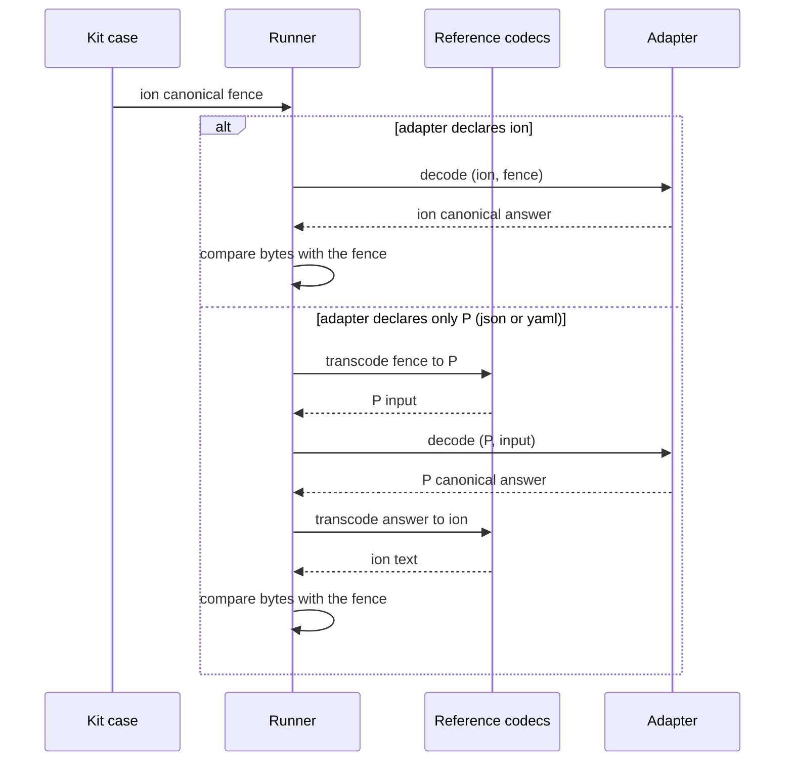

# The compatibility kit with Ion as the reference encoding

This draft changes how the Morphir Compatibility Kit (MCK) states a case. Today most cases spell one document once for each profile. The change makes Ion the kit's reference encoding and adds `ion` as a profile. Each case says one of two things. A **spelling case** says how a node shape is written in each format. A **semantic case** says what a document means, and it says it once, in Ion. The runner checks every other format by a round trip. The kit also gets an HTML report for a run, and CI shows each run's results.

A mismatch now reports a git-style unified diff, not only the first line that differs.

This is sub-project 1 of three. Sub-project 2 moves the existing 131 cases to the new form. Sub-project 3 is the Ion sweep of bead `morphir-vvgi.9`: Ion-only cases, the Ion diagnostics table, and removal of the hand-copied fixture in morphir-rust. Both depend on the primitives in this draft.

## Why

Three problems come from the same cause:

- **Repetition.** 105 of the 131 cases spell the same document twice, as `yaml canonical` and as `json canonical`. The runner compares strings line by line and never parses a document (`crates/morphir-mck/src/ir/compare.rs:14-46`). So every profile needs its own fence in every case.
- **A new profile costs a copy of the kit.** Ion is not a kit profile. `Profile` is the closed set `["json", "yaml"]` (`spec/ir/mck/protocol.schema.json:7`). morphir-rust tests Ion against 84 JSON fences that were copied by hand from the kit at one commit (`crates/morphir-common/tests/fixtures/ion/mck-canonical-cases.json`). Nothing checks that copy for drift.
- **Two jobs in one case.** A case such as `values-0003` shows the canonical spelling of a node in each format, and it also checks meaning. The deeper cases repeat the spelling but add only meaning.

## Today

`values-0003` from `spec/ir/mck/values.md`:

````markdown
## values-0003: Reference shorthand {node=Value}

```yaml canonical
Reference: morphir/SDK:basics#add
```

```json canonical
{ "Reference": "morphir/SDK:basics#add" }
```

```json accepted
"morphir/SDK:basics#add"
```
````

The runner sends each `canonical` and `accepted` fence to the adapter in its own profile and compares the answer with the canonical fence of that profile.

## Design

### Profiles

`Profile` becomes `ion | json | yaml` in the protocol schema, in the engine's `Profile` and `RecordProfile` types, and in the fence languages (`crates/morphir-mck/src/kit/syntax/info_string.rs`). An adapter declares the profiles it reads and writes in `capabilities.profiles`, as today. The Rust adapter declares `ion`. An adapter that does not declare `ion` never receives Ion input.

The change is additive. The protocol `contractVersion` stays `1`.

### Two kinds of case

A case's `kind` option names what it asserts. Options are set in a case options fence (see [Case options and fence directives](#case-options-and-fence-directives)).

| Kind | Asserts | Fences |
| --- | --- | --- |
| `spelling` | How one node shape is canonically written in each format | Only `canonical`, at most one per format. Each is pinned byte for byte. |
| `semantic` | What a document means: its canonical form, the spellings a reader accepts, and the diagnostic that refuses the rest | Exactly one `ion canonical`, plus any `accepted`, `rejected` and `file` fences in any format |

A spelling case may leave out a format. The runner then reports that format as `not-pinned`, not as a pass. A case without a `kind` option keeps today's behaviour, so the kit stays valid while sub-project 2 moves the cases.

`values-0003` as a spelling case, and a semantic case that uses the same shape (sketch):

````markdown
## values-0003: Reference shorthand

```yaml mck
node: Value
kind: spelling
```

```ion canonical
(ref 'morphir/SDK:basics#add')
```

```yaml canonical
Reference: morphir/SDK:basics#add
```

```json canonical
{ "Reference": "morphir/SDK:basics#add" }
```

## values-0031: A reference is read from its string shorthand

```yaml mck
node: Value
kind: semantic
```

```ion canonical
(ref 'morphir/SDK:basics#add')
```

```json accepted
"morphir/SDK:basics#add"
```
````

### Case options and fence directives

Today a case's options are keys in its heading (`## values-0003: Reference shorthand {node=Value}`), and a fence's options are keys in its info string (`json file path=… set=… mode=read`). Both grow long, and a heading is a poor place for data. This draft adds two forms. The old forms stay valid.

**Case options fence.** A fence whose info string is `yaml mck` holds the case's options as a YAML mapping. It keeps YAML syntax highlighting in any Markdown viewer. The runner never sends it to an adapter.

| Option | Meaning | Old form |
| --- | --- | --- |
| `node` | The node kind the case decodes | heading `node=` |
| `version` | The IR version | heading `version=` |
| `kind` | `spelling` or `semantic` | new |
| `status` | `pending` | heading `status=pending` |
| `compare` | `attributes` | heading `compare=attributes` |

A case has at most one options fence, and it comes before the case's data fences. New case options go into this fence, not into the heading.

**Fence directives.** A data fence may start with directive lines. Each line starts with `@`, then a name, then a value:

````markdown
```json file
@path pkg/my-org/my-project/domain/user.type
@set v3-library
@mode read
{ "formatVersion": "3.1.0", "name": "user", "def": { … } }
```
````

The directives carry the same options the info string carries (`path`, `set`, `mode`, `diagnostic`, `expect`, `warning`). No Ion, YAML or JSON document can start a line with `@`: JSON and Ion do not allow it, and YAML reserves it. So the runner can strip the directive lines before it sends the fence, and it never takes data for a directive. Short options may stay in the info string. When a fence gives the same option in both places, that is a check error.

Sub-project 2 moves the cases to the options fence and to directives where they read better. After that, heading keys become a `morphir mck check` warning.

### How the runner checks a semantic case

For each profile P that the adapter declares:

- **P is Ion:** the runner sends the Ion canonical fence and requires the answer to equal it byte for byte.
- **P is another format:** the runner transcodes the Ion reference to P and sends it. It then transcodes the adapter's P answer back to Ion, and requires the result to equal the Ion canonical byte for byte.



This check is about meaning. P's byte spelling is pinned only by spelling cases. For that reason, the kit does not take morphir-rust's YAML and JSON writers as the standard for every binding.

`accepted` and `rejected` fences run in their own language, as today. When the runner compares an adapter's answer to an `accepted` fence, it transcodes the answer to Ion and compares it with the Ion canonical. If the adapter does not declare the fence's language, the fence is `skipped` with a reason.

The runner transcodes in-process with the morphir-common codecs. The report states the codec version the runner used.

### Failures

| Condition | Record | Blamed on |
| --- | --- | --- |
| The Ion reference fence does not transcode | `kit-error`, with the codec diagnostic | the kit |
| The adapter's answer does not read in its own profile | `fail`, reason `answer-not-readable`, with the diagnostic | the adapter |
| The round-tripped Ion differs from the reference | `fail`, with a unified diff of the two Ion texts | the adapter |
| The adapter declares no profile the case can use | `skipped`, with the reason | none |

### Diffs for a mismatch

Today a mismatch reports only the first line that differs (`check_canonical`, `crates/morphir-mck/src/ir/compare.rs:37-46`):

```text
line 3 differs: expected   name: add got   name: plus
```

Every canonical mismatch now carries a git-style unified diff of the expected and actual text: spelling cases, semantic round trips, `accepted` fences and document-tree files. The diff has `---`/`+++` headers that name the case, fence and profile, three lines of context, and `@@` hunk headers (sketch):

```diff
--- expected values-0003 fence 0 (yaml canonical)
+++ actual   morphir-rust (yaml)
@@ -1 +1 @@
-Reference: morphir/SDK:basics#add
+Reference: "morphir/SDK:basics#add"
```

For a semantic round trip the diff compares the two Ion texts, and a note names the profile P that the answer came from. A document-tree mismatch has one diff for each file that differs, headed by the file's logical path.

Where the diff appears:

- **Report:** each failing record gains an optional `diff` member that holds the unified diff text. The first-line `reason` stays, so a short report still reads well.
- **Terminal:** `morphir mck run` prints the diff under each failure, coloured when the output is a terminal.
- **HTML:** each failing cell opens to the diff, with removed and added lines coloured.
- **CI job summary:** the first diffs, up to a size limit, in a fenced `diff` block; the full set is in the artifact.

The engine produces the diff with a line-diff library such as `similar` (none is in the workspace today). The diff is capped in size, and a capped diff says how many lines it left out.

### Grammar checks

`morphir mck check` enforces the new rules:

- A spelling case has only `canonical` fences, with at most one for each format.
- A semantic case has exactly one `ion canonical` fence.
- A `kind` value other than `spelling` or `semantic` is an error.
- A case has at most one `yaml mck` options fence, and it holds a YAML mapping of known options.
- An option set both in the options fence and in the heading is an error; so is a fence option set both as a directive and in the info string.
- A directive line with an unknown name is an error.

### Report and HTML

Each report record gains an optional `check` member: `spelling`, `semantic` or `round-trip`. It keeps `profile`. A report without `check` reads as `semantic`, which is today's meaning, so `report render` accepts old reports.

`morphir mck run --html <FILE>` writes the HTML report beside `--report`, through the renderer that `morphir mck report render` uses today. The HTML groups records by case and shows a profile matrix: one column for each of Ion, YAML and JSON, and each cell is pass, fail, skip or not-pinned.

### CI

CI already renders the HTML and uploads the JSON and HTML reports on every run: `mck-reports` for the TypeScript binding and `mck-report-morphir-rust` for the Rust binding (`.github/workflows/ci.yml:489-503`, `:529-547`). This draft adds:

- A job summary for each kit run: the counts, the failed case ids, and a link to the artifact. The step runs when the run fails too. A small renderer function writes the summary, and its tests check it.
- The run's transcript in the artifact, beside the JSON and HTML reports.

### Frozen baselines

The parity tests replay recorded transcripts (`crates/morphir-mck/tests/runner_parity.rs`). New checks send new requests. Each change records the Rust transcript again under the append-only rule in `spec/mck/baseline/README.md`: earlier records and exchanges stay unchanged and in order. The TypeScript transcript changes only when TypeScript receives new requests. With transcoding, the TypeScript adapter now runs semantic cases instead of skipping them, so its transcript grows too.

## Testing

- **Engine unit tests:** the grammar rules; transcoding in both directions; each failure kind, with a fake adapter; the unified diff for a canonical, a round-trip and a tree-file mismatch, and the size cap; `--html` output; an old report without `check` or `diff` still rendering.
- **Kit gates:** `mck:run-rust` with `ion` declared; `mck:run` for TypeScript, which runs semantic cases through transcoding.
- **Proof of the primitives:** this sub-project converts a handful of cases, for example `values-0003` into a spelling case and one semantic case. Both paths then run end to end before sub-project 2 moves the rest.

## Alternatives considered

- **Keep a canonical fence for each format in every case, and add the round trip only for Ion.** No fence is removed, and each format's spelling is pinned everywhere. It leaves the 105 duplicated cases and the per-node repetition in place.
- **Require every adapter to read Ion.** Simpler, because the runner does not transcode. But the TypeScript adapter, which does not read Ion ([finos/morphir-typescript#36](https://github.com/finos/morphir-typescript/issues/36)), would skip almost the whole kit.
- **Compare the adapter's answer with the reference codec's spelling in P, byte for byte.** Every case would pin every format's spelling. But the kit would take morphir-rust's writers as the standard for every binding.
- **Keep JSON as the reference until every adapter reads Ion.** JSON is the most familiar format to readers. But the kit wants to move to Ion anyway, and transcoding already removes the adapter requirement.

## Open questions

- **Which cases are spelling cases?** Sub-project 2 must list them from each profile's written rules: one case for each rule, not one for each node. That list is how the kit keeps the clarity of "this is how you encode this shape in this format".
- **How are Ion fences pinned byte for byte?** They depend on a canonical Ion text writer. The Ion draft (`docs/design/draft/ir/ion.md`) must say which writer settings (spacing, symbol quoting, struct order) are canonical before the first `ion canonical` fence is frozen.
