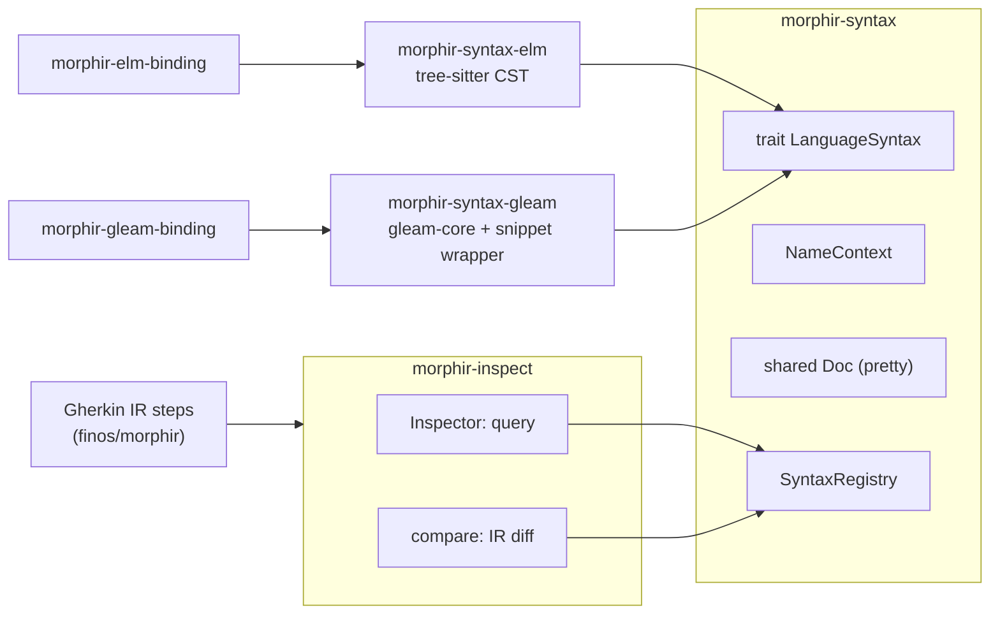

# Language syntaxes, IR inspection and IR comparison

This draft adds three capabilities to morphir-rust and a step vocabulary to the finos/morphir test features:

- **`morphir-syntax`**: a language-neutral trait for printing Morphir IR in a source language and for parsing and normalizing snippets of that language. Elm comes first (`morphir-syntax-elm`) and Gleam second (`morphir-syntax-gleam`). The bindings use these crates for code generation.
- **`morphir-inspect`**: a query API over any distribution (v3 or v4; JSON, YAML or Ion; single file or tree). It can compare what it finds with a snippet in any syntax.
- **IR comparison**, inside `morphir-inspect`: a structural diff of two distributions, of the same version or across versions, with facets that can be ignored, node addresses for each change, and a diff rendered through any syntax.
- **Gherkin IR steps** built on these, so a feature can say `the IR value "main#total" should have signature elm"List Order -> Decimal"`.

It is sub-project 4 of the work that starts in [The compatibility kit with Ion as the reference encoding](./mck-ion-reference.md). It does not depend on the kit changes.

## Why

- **The same problem is solved three times.** The Elm binding, the Gleam binding and the Avro extension each render a type in a target syntax, each with its own copy of the `pretty` crate and its own `Doc` type:
  - `crates/morphir-elm-binding/src/backend/print.rs:20`;
  - `crates/morphir-gleam-binding/src/backend/mod.rs:12`;
  - `crates/morphir-avro-extension/src/render/idl/syntax.rs:60`.

  The Gleam binding even has two paths that do not meet. `backend/pretty_printer.rs` prints the binding's own AST, and `backend/visitor.rs:215-304` writes IR types into a plain `String`.
- **Nothing prints an IR type for a human.** No IR type implements `Display`, and the CLI has no `ir show` command.
- **Tests assert on raw JSON.** The integration steps walk `document["distribution"]["Library"]["def"]["modules"]` and `module["Public"]` (`crates/integration-tests/tests/cli.rs:258-470`). They assert only names and counts, and they work only for a single-file v4 JSON `Library`.
- **Nothing compares two IRs.** A test that checks what a migration kept must compare fields by hand.

## Today

The Elm binding already has most of an Elm syntax:

- a real parser, a vendored tree-sitter grammar that yields a concrete syntax tree: `crates/morphir-elm-binding/src/frontend/parse.rs:37-44`, built by `build.rs:7-23`;
- a type AST: `src/ast.rs:66-133`;
- a type printer: `pub fn print_type(ty: &TypeExpr) -> String`, `src/backend/print.rs:77`;
- a clean IR-to-Elm pipeline: `decode` (`backend/decode/v4.rs:169`), then `raise` (`backend/raise.rs:195-278`, which decides spelling and imports), then `print`.

The Gleam binding parses with `gleam-core`, which parses only whole modules (`compiler-core/src/parse.rs:163`) and yields an AST with spans, not a lossless tree. Its IR-to-Gleam name mapping is in `backend/visitor.rs:218-260`: SDK `Int`, `String`, `List` and `Result` map to Gleam's own types, `Maybe` maps to `option.Option`.

`morphir-core` has no parser or printer dependency, by convention.

## Design



### morphir-syntax

This crate depends only on `morphir-core` and `pretty`. `pretty` moves into the workspace dependencies, so the bindings share one version.

```rust
// sketch
pub enum Snippet { Type, Signature, TypeDefinition, ModuleSpecification }

pub enum IrNode<'a> {
    Type(&'a v4::Type),
    Signature(&'a v4::ValueSpecification),
    TypeDefinition(&'a v4::TypeDefinition),
    ModuleSpecification(&'a v4::ModuleSpecification),
}

pub trait LanguageSyntax: Send + Sync {
    /// The id a step prefix names: "elm", "gleam".
    fn id(&self) -> &'static str;
    /// Prints an IR node in this language, or fails when the language cannot spell it.
    fn print(&self, node: IrNode<'_>, names: &NameContext) -> Result<Doc, SyntaxError>;
    /// Parses a snippet of this language and prints it canonically.
    fn normalize(&self, text: &str, kind: Snippet) -> Result<String, SyntaxError>;
}

pub struct NameContext { /* SDK short names, the local package and module, imports */ }
pub struct SyntaxRegistry { /* id -> Box<dyn LanguageSyntax> */ }
```

- v3 input is migrated to v4 before it reaches a syntax, so one printer serves both versions.
- `SyntaxError` names the language, the snippet kind and a location in the snippet.
- When a language cannot spell a node, `print` fails with a reason (for example, an IR construct that Gleam has no type for). A caller reports that reason and never guesses.
- `NameContext` decides how a name is printed. An SDK type gets its short name (`Int`, `List`). A type of the local module gets a bare name. Any other type gets an imported or qualified name, as the language spells it.

### morphir-syntax-elm

- The vendored tree-sitter grammar and its `build.rs` move here from `morphir-elm-binding`.
- `normalize` parses a snippet inside a small wrapper (for example `x : <signature>` for a signature), reads the tree, and prints it through the Elm printer. Two snippets that differ only in spacing or line breaks normalize to the same text.
- The printer is the binding's `raise` and `print`, moved here and generalized to take an `IrNode` and a `NameContext`.
- `morphir-elm-binding` depends on this crate. Its generated code keeps the same bytes, and its existing tests prove it.

### morphir-syntax-gleam

Gleam comes second, behind the same trait:

- `normalize` wraps a snippet as a small module (`type T = <type>`, or a function head for a signature), parses it with `gleam-core`, and lowers the result into a small Gleam type model.
- The printer maps IR to that model. It becomes the one place for the IR-to-Gleam type mapping, which today lives as string writes in `backend/visitor.rs`.
- Curried IR functions print as Gleam's multi-argument `fn(A, B) -> C` form.

### morphir-inspect: queries

This crate depends on `morphir-core`, on `morphir-common` (to read any format or layout) and on `morphir-syntax`.

```rust
// sketch
let ir = Inspector::open(path)?;                     // v3|v4, json|yaml|ion, file|tree
let total = ir.value("main#total")?;                 // ValueView
let spec = ir.module("api")?.specification();        // what the module exposes
let add = ir.dependency("morphir/sdk")?.value("basics#add")?;
inspect::matches(&registry, "elm", total.signature(), "List Order -> Decimal")?;
```

- A selector is `module#name` in the distribution's own package, or `pkg:module#name` anywhere.
- An unknown selector fails, and the error lists the nearest names.
- `matches` normalizes the expected snippet and prints the actual node through the same syntax. It compares the two texts. On a mismatch it returns both texts and a unified diff.

### morphir-inspect: comparison

```rust
// sketch
let diff = inspect::compare(&left, &right, &Compare::default()
    .ignore(Facet::Attributes)
    .ignore(Facet::Docs))?;
for change in diff.changes() {                       // Added | Removed | Changed | NotComparable
    println!("{} {}", change.kind(), change.address());
}
println!("{}", diff.render(&registry, "elm"));
```

- **Same version:** a structural walk over two v4 models. It pairs modules, types, values and dependencies by name, not by position, and compares each pair node by node.
- **Across versions:** both sides are brought to v4 first. A v3 side goes through the existing classic-to-v4 migration, a `Specs` included. A facet that only v4 can hold is reported as `NotComparable`, not as a change. Examples are attributes, annotations, and native or external bodies.
- **Facets that can be ignored:** `Attributes` (source positions and inferred types), `Docs`, `Annotations`, and `Access` (a public or private change).
- **Change address:** each change carries its node address from the [node-address draft](../../../spec/ir/node-addresses.md), for example `morphir://ir/pkg/acme/orders#/module/main/value/total/body/apply/argument`. So a change points at the exact sub-expression.
- **Output:**
  - the structured changes, for code;
  - a unified diff of each changed node, printed through a syntax;
  - JSON, for tools.

Assertion helpers for Rust tests:

```rust
// sketch
assert_ir_eq!(left, right, ignore = [Facet::Attributes]);   // panics with the rendered diff
diff.only(&[Changed("main#total"), Added("main#discount")])?;
```

### Gherkin IR steps

The steps live in a shared step module in finos/morphir. `crates/integration-tests` and `crates/morphir/tests` both register it.

```gherkin
@syntax:elm
Scenario: Migrate keeps the order module's public face
  When I run "morphir migrate orders.json --output out.json --target-version v4"
  Then the IR "out.json" should be a v4 Library "acme/orders"
  And the IR value "main#total" should have signature "List Order -> Decimal"
  And the IR value "main#total" should have signature gleam"fn(List(Order)) -> Decimal"
  And the IR type "main#order-status" should be defined as:
    """
    type OrderStatus
        = Pending
        | Shipped Date
    """
  And the IR module "api" should expose exactly:
    | kind  | name        | signature                     |
    | type  | Request     |                               |
    | value | createOrder | Request -> Result Error Order |
  And the IR dependency "morphir/sdk" should specify value "basics#add" as "Int -> Int -> Int"
  And the IR "out.json" should equal the IR "expected.json" ignoring attributes and docs
  And the IR "out.json" should differ from the IR "orders.json" only by:
    | change  | node          |
    | changed | main#total    |
    | added   | main#discount |
  And migrating the IR "orders.json" to v4 should keep every value signature
```

Rules:

- **Language of a snippet:** a snippet is `lang"…"` or a plain `"…"`. A plain snippet uses the scenario's default language, which the tag `@syntax:<id>` sets. With no tag and no prefix, the step fails with "name a syntax"; it never guesses.
- **Doc strings:** a doc string uses the default language, or its own content type (`"""elm`), which Gherkin already supports.
- **Tables:** the `signature` column uses the default language, and a cell may carry its own prefix.
- **The IR subject:** `the IR "<path>"` opens a file or a tree through `morphir-inspect`. Later steps without a path use the last IR opened.
- **Names:** a table shows names as the syntax spells them (`createOrder` in Elm). Selectors stay IR names (`main#total`).
- **Failures:** every mismatch prints a unified diff.

The seven raw-JSON steps in `crates/integration-tests/tests/cli.rs:258-470` keep their feature text but are rewritten on top of `morphir-inspect`. They then work for v3, YAML, Ion and trees too.

## Testing

- **morphir-syntax-elm:**
  - golden prints of each IR type shape: record, extensible record, tuple, function, SDK and local references, and a type variable;
  - `normalize` on messy spacing gives the same text;
  - the location in each `SyntaxError`.
- **morphir-elm-binding:** its existing tests pass unchanged after the move, so the generated Elm keeps the same bytes.
- **morphir-inspect:**
  - queries: the selectors, an unknown name listing the nearest names, and reading each format and layout;
  - `matches`, with a diff;
  - comparison: same-version changes, a v3-to-v4 comparison with `NotComparable` facets, each ignorable facet, node addresses, and the JSON output.
- **Steps:** one feature file that uses every step once and runs in CI with the other features, plus one scenario that must fail, to prove that a mismatch prints a unified diff.

## Delivery

1. morphir-rust: `morphir-syntax`, `morphir-syntax-elm`, and the move of `morphir-elm-binding` onto them.
2. morphir-rust: `morphir-inspect` queries.
3. morphir-rust: `morphir-inspect` comparison.
4. finos/morphir: the Gherkin steps, and the rewrite of the old steps.
5. Later: `morphir-syntax-gleam`, and moving `morphir-gleam-binding` onto it.

## Alternatives considered

- **One crate named `morphir-inspect` for everything.** A code generator does not inspect anything, so the language layer would carry the wrong name, and the bindings would depend on query code they do not use.
- **Put the syntaxes in `morphir-core`.** Core has no parser or printer dependency by convention, and the Elm grammar needs a C build.
- **Match signatures by parsing the snippet into IR and comparing IR.** This needs name resolution from each language back into IR (imports, aliases). Printing the actual node and normalizing the snippet needs only the printer and a parser, and the failure message is already in the language the author wrote.
- **Gleam first.** Gleam's parser takes only whole modules and yields an AST, so it needs a snippet wrapper and a new type model. Elm already has a concrete syntax tree, a type AST and a printer.

## Open questions

- **Value bodies.** This draft covers types, signatures, type definitions and module specifications. Printing value bodies (expressions) in a syntax is a larger step. The comparison already covers bodies through node addresses and the Ion or JSON spelling.
- **A CLI.** `morphir ir show <path> <selector> --syntax elm` and `morphir ir diff <a> <b>` would be thin commands over `morphir-inspect`. They are left for a later change.
