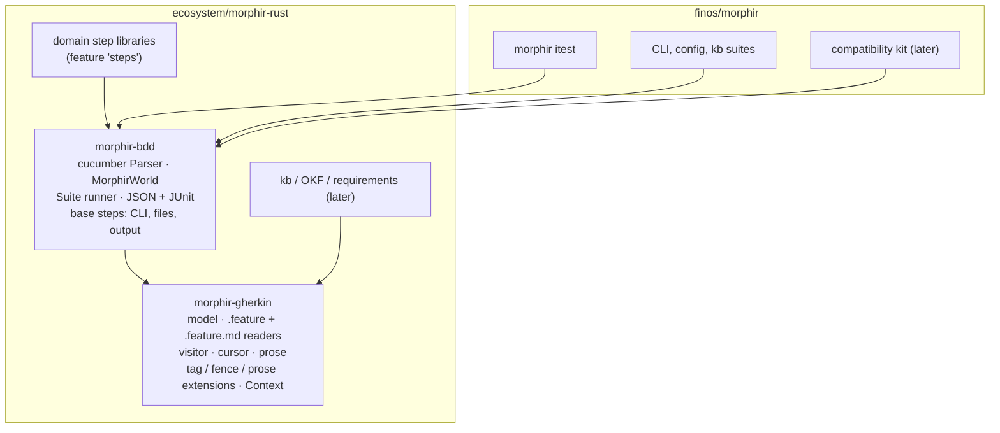

# A Gherkin foundation for Morphir verification

This draft adds two crates to morphir-rust and moves Morphir's black-box tests onto them:

- **`morphir-gherkin`**: a model of Gherkin documents read from `.feature` and `.feature.md` (Markdown with Gherkin) files. It gives every node a source span, and offers a visitor and a cursor. It keeps prose and fenced blocks as parsed Markdown, and it has extension points for tags, fences and prose that build a typed context. It does not depend on cucumber, so the knowledge base, OKF and requirement tools can use it without running anything.
- **`morphir-bdd`**: execution on cucumber-rs through that model. It provides one shared world type, step libraries that any crate can publish and reuse, one runner configuration with JSON and JUnit output, and base steps for CLI processes, files and output.

`morphir itest` becomes the user-facing runner for `morphir-bdd` suites, and itest's notebook support is removed. The compatibility kit's cases move from their custom Markdown grammar to `.feature` suites at the same time. Options everywhere are native Gherkin tags and step text. Later work builds on this foundation:

- [Language syntaxes, IR inspection and IR comparison](../ir/syntax-and-inspect.md), whose Gherkin steps use `morphir-bdd`;
- [The compatibility kit with Ion as the reference encoding](../ir/mck-ion-reference.md), which builds on the kit's Gherkin form;
- the Ion sweep of bead `morphir-vvgi.9`.

## Why

Morphir has three black-box testing systems that do not share code:

- **itest** is the `morphir itest` subcommand (`crates/morphir/src/commands/itest/`). It runs `scenarios.md` and `scenario.ipynb` files from `examples/` through real CLI processes, with `Command`, Rego `Assertion` and, on the `feat/itest-golden` branch, `Golden` steps.
- **Cucumber suites:** five feature files in finos/morphir and 21 in morphir-rust, on cucumber 0.23 and gherkin 0.16.
- **The compatibility kit:** its own Markdown case grammar and engine (`spec/ir/mck`, `crates/morphir-mck`). Its options live in headings (`{node=Value}`) and fence info strings, which no other tool reads.

The cucumber suites show the cost of that split:

- **Four custom mains, each configured differently:**
  - `crates/integration-tests/tests/cli.rs` filters with a closure;
  - `crates/morphir/tests/config_acceptance.rs` and `kb_acceptance.rs` call `World::run` directly;
  - `mck_run.rs` is a replay adapter.
- **Tags:** only `@wip` changes behaviour, and only in one binary. Every other tag is a label.
- **Duplicated step code:** `config_acceptance.rs:362-396` and `kb_acceptance.rs:51,120` each implement "run `morphir`, split the command line, isolate the environment". The shared helper `integration-tests::CliTestContext` is not reachable from `crates/morphir`.
- **Steps cannot be reused:** a step is bound to one concrete world type.
- **Raw JSON:** the IR steps in `crates/integration-tests/tests/cli.rs:258-470` walk raw JSON and work only for a single-file v4 JSON `Library`.
- **No Markdown:** cucumber-rs reads only `*.feature` (`cucumber-0.23.0/src/parser/basic.rs:115`), and `gherkin` 0.16 has no Markdown support.
- **Flattened descriptions:** `gherkin` 0.16 trims every line of a description and drops blank lines. A fenced block in a `.feature` description comes back as `"The feature text.\n```yaml morphir\nsyntax: elm\n```\nMore prose."`, which breaks indentation-sensitive content.

## Design



### morphir-gherkin: formats

**`.feature`** is parsed with `gherkin` 0.16 and lowered into the model. Two parts are read from the source instead, because `gherkin` 0.16 changes them:

- **Descriptions** (feature, rule, background, scenario, examples): the reader takes the raw lines by span, removes only their common indent, and parses them as Markdown. A fenced block in a description keeps every line, every blank line and its span.
- **Doc strings:** `gherkin` 0.16 returns the content type as the first line of the text and keeps the indent (`"ion\n      (ref 'morphir/SDK:basics#add')\n"`). The reader takes the content type from the opening delimiter (`"""ion` or ```` ```ion ````), and it takes the body lines by span, with the delimiter's indent removed, as the Gherkin reference parsers do.

When the model is lowered for cucumber, each step's `docstring` is the corrected body.

**Which format to use:** `.feature` is the default. It is what most platforms and tools read, and the compatibility kit uses it so that every binding's own tooling can read a case. `.feature.md` suits suites that are documentation first, such as itest examples, where prose and rendered Markdown matter more than tool reach.

**`.feature.md`** follows Cucumber's official Markdown with Gherkin (MDG) rules, so other Cucumber tools can read the files:

- `#`, `##` and `###` headings carry `Feature:`, `Rule:`, `Background:`, `Scenario:`, `Scenario Outline:` and `Examples:`;
- `*` or `-` list items are steps;
- a Markdown table under a step is its data table;
- a fenced block under a step is its doc string, and its language is the doc string's content type;
- tags follow the MDG rules.

This draft adds one rule. A fenced block that is not under a step is a **free fence**. It is passed to a fence extension by its info string. Every other Markdown block is prose. In a `.feature` file, a fenced block in any description is a free fence too.

### Options are tags and step text

Options use native Gherkin, so every Gherkin tool (editors, Cucumber's own tag filters, reporters) understands them without Morphir's extensions:

- **An option of a feature, rule, scenario or examples block is a tag.** A namespaced tag carries a value: `@syntax:elm`, `@node:Value`, `@version:4`. A plain tag is a flag: `@wip`, `@pending`, `@spelling`.
- **An option of one step's data is part of the step text**, for example `Given the tree file "pkg/acme/orders/domain/user.type":` or `Then stdout at "$.result" should match the golden file "out.json"`.

Free fences stay an extension point for data that has no Gherkin shape, but no suite in this draft needs them for options.

````markdown
# Feature: Migrate keeps a module's public face

`@syntax:elm`

The order module is the reference example. It **MUST** keep every exposed signature.

## Scenario: v3 to v4

* When I run "morphir migrate orders.json --output out.json --target-version v4"
* Then the IR value "main#total" should have signature "List Order -> Decimal"
* And the IR type "main#order-status" should be defined as:

  ```elm
  type OrderStatus
      = Pending
      | Shipped Date
  ```
````

The same data in a `.feature` file:

````gherkin
@syntax:elm
Feature: Migrate keeps a module's public face
  The order module is the reference example. It MUST keep every exposed signature.

  Scenario: v3 to v4
    When I run "morphir migrate orders.json --output out.json --target-version v4"
    Then the IR value "main#total" should have signature "List Order -> Decimal"
````

### morphir-gherkin: model

```rust
// sketch
pub struct Document { pub path: PathBuf, pub format: Format, pub feature: Option<Feature> }
pub enum Format { Feature, Markdown }

pub struct Feature {
    pub name: String, pub tags: Vec<Tag>, pub description: Description,
    pub background: Option<Background>, pub rules: Vec<Rule>, pub scenarios: Vec<Scenario>, pub span: Span,
}
pub struct Description { pub prose: Prose, pub fences: Vec<Fence> }   // in source order
pub struct Scenario { /* name, keyword, tags, description, steps, examples, span */ }
pub struct Step { pub keyword: Keyword, pub text: String, pub argument: Option<StepArgument>, pub span: Span }
pub enum StepArgument { DocString(DocString), Table(Table) }
pub struct Fence { pub info: FenceInfo, pub body: String, pub span: Span }
pub struct Prose { pub blocks: Vec<ProseBlock> }                        // parsed Markdown with spans
```

- Every node has a `Span`, which gives the byte range and the line and column in the original file.
- **Fence info string:** `<language> [key=value …]`. The fence body is kept exactly as written.
- **Prose:** paragraphs, lists, quotes and headings below the Gherkin levels. Inline content stays parsed: links, inline code, emphasis. The parser is `pulldown-cmark` 0.13, which itest and `morphir-okf` already use.

### morphir-gherkin: navigation

- **Visitor:** enter and exit callbacks for each node kind (`visit_feature`, `visit_rule`, `visit_scenario`, `visit_step`, `visit_fence`, `visit_prose_block` and more). By default each callback walks its children, as the traversal in `morphir-core` does.
- **Cursor:** a `NodePath` such as `feature/rule[1]/scenario[2]/step[3]`. It has `parent`, `children` and `siblings`, and `Document::at(span)` finds the node at a source position. It serves error messages and editor tooling.
- **Conversion:** `.feature.md` converts to `.feature` text, with a line map back to the Markdown source, for tools that read only plain Gherkin.

### morphir-gherkin: extensions and context

```rust
// sketch
pub struct Context { /* typed component map */ }
impl Context {
    pub fn insert<T: Component>(&mut self, value: T);
    pub fn get<T: Component>(&self) -> Option<&T>;
    pub fn get_mut<T: Component>(&mut self) -> Option<&mut T>;
}

pub enum Scope { Feature, Rule, Scenario }
pub enum Effect { Continue, Skip(String) }

pub trait TagExtension: Send + Sync {
    fn matches(&self, tag: &Tag) -> bool;
    fn apply(&self, tag: &Tag, scope: Scope, ctx: &mut Context) -> Result<Effect, ExtensionError>;
}
pub trait FenceExtension: Send + Sync {
    fn matches(&self, info: &FenceInfo) -> bool;
    fn apply(&self, fence: &Fence, scope: Scope, ctx: &mut Context) -> Result<(), ExtensionError>;
}
pub trait ProseExtension: Send + Sync {
    fn apply(&self, prose: &Prose, scope: Scope, ctx: &mut Context) -> Result<(), ExtensionError>;
}
pub trait Processor: Send + Sync {
    fn process(&self, doc: &Document, at: &NodePath, ctx: &mut Context) -> Result<(), ExtensionError>;
}

pub struct Extensions { /* ordered registries of the four kinds */ }
impl Extensions {
    pub fn context_for(&self, doc: &Document, scenario: &NodePath) -> Result<Context, Vec<ExtensionError>>;
}
```

- **Order:** extensions apply from the outside in: feature, then rule, then scenario. So a scenario's `@syntax:gleam` overrides its feature's `@syntax:elm`, and the same holds for free fences.
- **Errors:** every `ExtensionError` carries the `NodePath` and span of the tag, fence or sentence that caused it. A failing extension fails its scenario; it never fails silently.
- **Tags:** a tag that no extension claims stays a label. An extension may own a tag namespace (such as `@syntax:`). A tag in an owned namespace that the extension does not understand is an error, so a typo does not pass.
- **Owners:** extensions live with their owners. For example, `@wip` in `morphir-bdd`, `@syntax:<id>` in `morphir-syntax`, an RFC 2119 requirement extension in a later requirements crate, and a kb-link extension in `morphir-okf`.

### morphir-bdd: execution

- **Parser:** a custom cucumber `Parser` finds `*.feature` and `*.feature.md` files and reads them with `morphir-gherkin`. It lowers each document into a `gherkin::Feature` and keeps the original line numbers, so cucumber's messages point into the source file.
- **World:** one world type for every suite:

  ```rust
  // sketch
  #[derive(Debug, cucumber::World)]
  #[world(init = MorphirWorld::new)]
  pub struct MorphirWorld {
      pub context: Context,          // from extensions and from earlier steps
      pub scenario: ScenarioRef,     // the Document and NodePath of the running scenario
  }
  ```

  A before hook fills `context` with `Extensions::context_for`. Skip effects are decided when features are filtered, so a skipped scenario never starts.
- **Reusable steps:** any crate writes steps against `MorphirWorld` and reads the components it needs:

  ```rust
  // sketch, in morphir-inspect behind the cargo feature "steps"
  #[then(expr = "the IR value {string} should have signature {snippet}")]
  fn value_signature(world: &mut MorphirWorld, selector: String, snippet: Snippet) -> StepResult {
      let ir = world.context.get::<OpenIr>().ok_or(missing("an IR opened by `the IR \"<path>\"`"))?;
      let syntax = snippet.language_or(world.context.get::<DefaultSyntax>())?;
      inspect::matches(&REGISTRY, syntax, ir.value(&selector)?.signature(), snippet.text())
  }
  ```

  - cucumber-rs collects steps for each world type through `inventory`. Each step library exposes a `link()` function that a test binary calls, so the linker keeps the library's steps. The first implementation task is a spike that proves steps in another crate are collected. If they are not, `morphir-bdd` registers libraries explicitly through cucumber's step collection.
  - When a step needs a component that is missing, it fails and names the earlier step that provides that component.
- **Base step libraries:**
  - **CLI process:** run `morphir …` with an isolated `HOME`, `XDG_CONFIG_HOME` and secrets. This replaces the copies in `config_acceptance.rs` and `kb_acceptance.rs`. Captures become named components.
  - **Files:** a temporary directory, "a file X containing:", and file checks.
  - **Output:** stdout and stderr contains or equals, and JSON pointer checks. Every text mismatch prints a git-style unified diff.
- **Runner:** one configuration for every suite:

  ```rust
  // sketch
  morphir_bdd::Suite::new("cli")
      .features("tests/features")
      .extensions(Extensions::standard().with(SyntaxTags))
      .run_and_exit::<MorphirWorld>()
      .await;
  ```

  - **Tags:** a tag expression selects scenarios, from `--tags` or `MORPHIR_BDD_TAGS`.
  - **Output:** the console, plus JSON and JUnit in `.dev/out/bdd/<suite>.json` and `.xml`.
  - **CI:** uploads both files for every run, including a failed one, and adds a job summary with the counts and the failures.

### morphir itest

`morphir itest` becomes the user-facing runner for `morphir-bdd`. It runs `.feature` and `.feature.md` files under `examples/` through `Suite`, and it keeps today's options (`--tag`, `--filter`, `--list`, `--keep-temp`), its PASS and FAIL lines, and its exit code.

itest's step kinds become step libraries:

| itest today | Step library |
| --- | --- |
| `Command` with `captures` and `stdout_json` | the base CLI steps; captures are named components |
| Rego `Assertion` | `Then the result should satisfy the policy:` with a `rego` doc string, over `morphir-opa` |
| `Golden` with `select` and `line_endings` (branch `feat/itest-golden`) | `Then stdout at "<select>" should match the golden file "…" with <lf\|crlf> line endings`, or a doc string in place of the file; `select` and `line_endings` are step text |

- **Existing scenarios:** a reader for itest's `scenarios.md` format lowers each `##` section into the same model. The 19 existing example scenarios therefore run unchanged. New examples are written as `.feature.md`, and old ones move over when they are next touched.
- **Golden steps:** `feat/itest-golden` is rebased and landed first, so the golden step library starts from its `golden.rs`.
- **Notebooks:** itest's notebook support is removed. That covers `scenario.ipynb` discovery and running, and the `notebook` module in `crates/morphir/src/lib.rs`, which only itest uses. The one notebook example, `examples/elm/single-file/scenario.ipynb`, becomes a `.feature.md` file. Notebook support returns later with the VFS work on document trees and workspaces.

### Moving the existing suites

1. **The kit and itest, together:** the kit's cases become `.feature` suites (see [The compatibility kit on Gherkin](#the-compatibility-kit-on-gherkin)), and itest runs on `morphir-bdd`.
2. **finos/morphir:** the `cli`, `config_acceptance` and `kb_acceptance` mains move to `Suite` and `MorphirWorld`, with the base steps. Their feature text does not change.
3. **morphir-rust:** its 21 feature suites move crate by crate, starting with `morphir-tests`, the crate that already holds shared BDD tooling.

### The compatibility kit on Gherkin

The kit's 131 cases move from its custom Markdown grammar (`spec/ir/mck/*.md`) to plain `.feature` files. Plain Gherkin is read by more platforms and tools than Markdown with Gherkin, and every binding's own test tooling can read a kit case. A doc string's content type (`"""yaml`, `"""json`, `"""ion`) names the format of the document it holds. `values-0003` today:

````markdown
## values-0003: Reference shorthand {node=Value}

```yaml canonical
Reference: morphir/SDK:basics#add
```

```json canonical
{ "Reference": "morphir/SDK:basics#add" }
```

```json accepted
"morphir/SDK:basics#add"
```
````

The same case in `spec/ir/mck/values.feature` (sketch). A scenario outline states one check over several formats or inputs, and each `Examples` row runs as its own scenario:

```gherkin
@node:Value @version:4
Feature: Values

  Scenario Outline: values-0003 Reference shorthand
    Then its canonical <format> spelling is <spelling>
    And a reader of <format> accepts <accepted>

    Examples:
      | format | spelling                                  | accepted                 |
      | YAML   | Reference: morphir/SDK:basics#add         | Reference: morphir/SDK:basics#add |
      | JSON   | { "Reference": "morphir/SDK:basics#add" } | "morphir/SDK:basics#add" |
```

- **Mapping:** a case is a scenario, and the case id starts the scenario name. A case file is a feature. Heading keys become tags: `node=` → `@node:<Kind>`, `version=` → `@version:<n>`, `status=pending` → `@pending`, `compare=attributes` → `@compare:attributes`. Fence roles become steps: canonical, accepted (with an optional warning), rejected with a diagnostic or an expected node, and document-tree file sets (`Given the tree file "<path>":`, with `set` and `mode` in the step text). The converter writes a scenario outline where a case has one-line documents, with a row per format or per input, and a plain scenario with doc strings where a document spans several lines.
- **Steps:** the kit's steps are a step library in `morphir-mck`. Each step sends its request to the adapter over the existing protocol, so adapters do not change.
- **Commands:**
  - `morphir mck run` becomes a `Suite` over `spec/ir/mck/*.feature`. It adds the kit step library and the adapter, as a component started from `--adapter`.
  - It still writes the MCK report (v1 and v2) and the HTML report. Each step result maps to one report record.
  - `morphir mck check` validates the cases with the `morphir-gherkin` model alone, without an adapter.
- **Conversion:** a one-off converter rewrites every case file.
  - The old and the new engines then run side by side in CI until the new engine gives the same report records as the old one for every case and both adapters.
  - After that, the old grammar and its engine code are removed, and the frozen baselines are recorded again under the append-only rule.
  - The later kit changes build on the Gherkin form: Ion as the reference encoding, spelling and semantic tags, and the round trip ([kit draft](../ir/mck-ion-reference.md)).

## Testing

- **morphir-gherkin:**
  - Golden models of `.feature` and `.feature.md` files. They cover every Gherkin construct: rule, background, outline, examples, tags, doc string and table.
  - A fence with indentation-sensitive YAML in a `.feature` description keeps every line and blank line, with correct spans.
  - A doc string with a content type (`"""ion`, ```` ```yaml ````) gives the content type separately and a body without the delimiter's indent, including indentation-sensitive YAML.
  - Spans and `Document::at` return the right node for a given position.
  - The visitor visits nodes in the right order; the cursor's moves work.
  - Converting `.feature.md` to `.feature` gives the same `gherkin::Feature`, and the line map is correct.
  - Extension order and overrides, owned tag namespaces, and errors that carry spans.
- **morphir-bdd:**
  - The spike for linking steps across crates.
  - A suite whose steps come from two crates.
  - Skip effects.
  - Tag expressions.
  - The JSON and JUnit files.
  - A failing scenario that prints a unified diff.
  - The CLI base steps in an isolated environment.
- **The kit:**
  - The converter's output: every case of every file becomes one scenario, with the same checks.
  - Parity: the new engine gives the same report records as the old one for every case, against the Rust and TypeScript adapters.
  - `mck check` finds each rule violation in a `.feature` case file, with its span.
- **itest:**
  - Every existing `scenarios.md` example gives the same PASS and FAIL result through `morphir-bdd` as before.
  - `--list`, `--filter` and `--tag` give the same output as before.
  - The converted notebook example passes.

## Delivery

1. Rebase and land `feat/itest-golden`.
2. morphir-rust: `morphir-gherkin` (formats, model, navigation, extensions).
3. morphir-rust: `morphir-bdd` (the linking spike first, then the parser, world, runner and base steps).
4. finos/morphir, together:
   - the kit on Gherkin: the step library, `mck run` and `mck check` on the foundation, the converter, and the parity window;
   - `morphir itest` on `morphir-bdd`, with the `scenarios.md` reader, the step libraries, and the removal of notebook support.
5. finos/morphir: move the three cucumber mains onto `Suite`.
6. morphir-rust: move its feature suites, crate by crate.

Then the rest of [the kit draft](../ir/mck-ion-reference.md), [syntax and inspect](../ir/syntax-and-inspect.md), and the Ion sweep build on top.

## Alternatives considered

- **Our own runner.** It gives full control over scheduling and reporting. But it would rebuild cucumber-rs's runner, tag filters and writers. The model layer is separate from execution, so the runner can still change later.
- **The model layer only.** Each tool would keep its own execution, and the three testing systems would stay apart.
- **A Morphir-specific Markdown shape instead of MDG.** It would fit itest's `scenarios.md` more closely, but other Cucumber tools could not read the files. The `scenarios.md` reader covers the existing examples instead.

## Open questions

- **Step libraries across the two workspaces.** finos/morphir and morphir-rust are separate Cargo workspaces. A step library in morphir-rust is reachable from finos/morphir through the submodule path dependency, as other morphir-rust crates are. The spike should confirm that `inventory` collection also works across that boundary.
- **Tag expression syntax.** cucumber-rs's filter takes a closure. `morphir-bdd` needs a parser for Cucumber tag expressions (`@a and not @b`). `gherkin` 0.16 has a `tagexpr` module; the plan should check whether it is enough.
