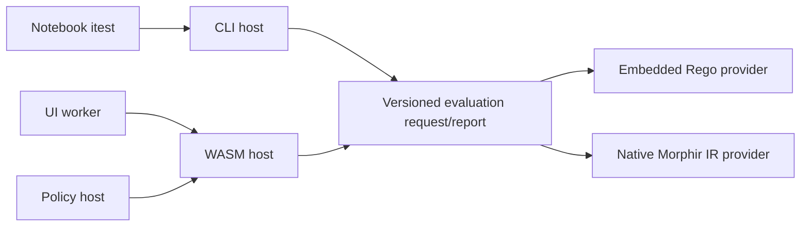

# Evaluation architecture and milestones

Milestone 0 provides a portable evaluation contract, an embedded Rego provider,
and a CLI host. Notebook integration scenarios use that public CLI boundary for
assertions. The target is a native Morphir IR evaluator available through the
same contract from the CLI, WASM, UI and policy hosts.

## Milestone 0: embedded Rego

`crates/morphir-evaluator` owns versioned requests, program representations,
provider identifiers, outcomes and the `Evaluator` trait. It depends on no CLI,
filesystem, process or Regorus types. `crates/morphir-opa` implements that trait
with pinned Regorus 0.11.0 and its `std` feature; default optional features are
disabled. `morphir eval` owns file loading and reporting.

```sh
morphir eval --request request.json --json
```

A complete request is:

```json
{
  "version": 1,
  "provider": "rego",
  "program": {
    "kind": "source",
    "language": "rego",
    "modules": [
      {"path": "example.rego", "source": "package example\nallow if { input.amount > 0 }"}
    ]
  },
  "entrypoints": ["data.example.allow"],
  "input": {"amount": 12},
  "timeout_ms": 1000
}
```

The report preserves entrypoint order:

```json
{
  "version": 1,
  "provider": "rego",
  "results": [
    {"entrypoint": "data.example.allow", "status": "value", "value": true}
  ]
}
```

Outcomes are `value`, `undefined`, or `error` with a message. A defined false
value is a valid evaluation result. The CLI returns success for values and
undefined results; evaluation errors return nonzero after printing the report.
Invalid requests fail before evaluation. `itest` applies its own assertion rule:
only a defined boolean true passes. A policy host must likewise specify its
own decision contract rather than treating CLI success as policy approval.

Requests reject unsupported versions, providers and source languages, empty or
duplicate module names/entrypoints, and timeout values outside 1–300000 ms.
The provider enables strict builtin errors and captures Rego `print` output so
it cannot corrupt JSON reports. Its feature profile is narrower than full OPA;
unsupported builtins fail explicitly. This integration makes no claim of complete
OPA compatibility or Rego-to-Morphir compilation.

`timeout_ms` is a cooperative execution budget per entrypoint. Module parsing
and host JSON I/O are outside it. `itest` additionally applies a wall-clock
process timeout to the entire evaluation command. These limits are not a
memory sandbox. Future browser and service hosts need their own termination
and resource boundaries.

The provider is registered natively by the CLI. Installed extension discovery,
MEP evaluation capability negotiation and a released WASM ABI are subsequent
milestones; they are not present merely because the evaluator API is portable.
The contract crate cross-compiles for `wasm32-unknown-unknown`. The current
Regorus adapter's native feature selection requires additional browser entropy
backend configuration through `rand`/`getrandom`; its clock, execution limits
and allowed nondeterministic operations also need host-specific validation.
Milestone 0 therefore does not ship a browser evaluator.

## Experimental classic V3 provider

The first native Morphir IR pilot accepts the exact string version
`"1.1.0-draft.1"` with `provider: "morphir_ir"`. Numeric `version: 1`
continues to identify the Rego contract above. The new request embeds a
complete classic V3 `Distribution` in `program.distribution` with
`program.kind: "morphir_ir"`, and carries 1–64 ordered `calls`. Each call has
a unique `id`, a canonical function `entrypoint`, and `arguments` containing
classic V3 `type` values paired with tagged runtime `value` objects. A complete
five-call fixture and its literal expected report live in
`spec/ir/semantics/v3/cases/evaluation/`.

The initial codec supports unit, boolean, signed 64-bit integer strings,
strings, lists, tuples, and fully named constructors. It rejects unsupported
input and output types rather than coercing them to JSON. Entrypoints,
argument arity and types, tagged values, and external dependency signatures
are validated before execution; invalid requests produce a diagnostic and no
report. The first executable SDK values are `basics#add` and `basics#equal`
with pinned two-Int signatures. The provider does not load packages from the
host environment.

Requests are bounded to 8,388,608 bytes and 64 JSON container levels. The
`limits` object requires `fuel` in 1–1,000,000 and `maxCallDepth` in 1–1024;
`timeout_ms` remains 1–300,000. Runtime checks fuel and depth per call and a
cooperative deadline across the batch. A runtime failure yields a result with
`status: "error"`, `code`, and `message`; other calls still produce their
ordered results. `morphir eval --json` prints that report and exits nonzero
when any call fails. This pilot covers V3 arity validation and is not a claim
that arbitrary classic V3 programs are evaluable.

## Target state



The CLI, Rego, and first classic V3 native pilot paths are implemented. The
WASM host and broader native Morphir IR support are follow-up work. Hosts load inputs, enforce permissions and budgets,
and present diagnostics. Providers evaluate already-loaded programs. Neither
notebook metadata nor UI code should encode another evaluator's semantics.

Future native provider work can expand the IR program and value ADTs after
review. Morphir runtime values require an explicit versioned wire
representation for constructors, tuples, records, numeric types and non-JSON
values; JSON transport is not permission to erase those distinctions.
Unsupported features must return diagnostics.

Keep pure evaluation separate from host capabilities. No implicit clock,
filesystem, network or process access belongs in the core. Native and WASM
hosts must supply equivalent deterministic primitives and enforce documented
fuel/depth limits. Any allowed effects require explicit capability injection.
The portable crate is the shared semantic boundary; the CLI subprocess is one
host, not the evaluator implementation.

## Fast-follow work

Beads epic **morphir-o6vm.9** tracks the target state:

| Task | Deliverable and acceptance |
| --- | --- |
| `morphir-o6vm.9.1` | Native Morphir IR semantic core, fixed independent value/error vectors, supported SDK operations and deterministic limits |
| `morphir-o6vm.9.2` | Native provider in `morphir eval` and notebook assertions; compile assertion source through real frontends and verify evaluation |
| `morphir-o6vm.9.3` | Versioned WASM ABI with ownership, cancellation and budgets; identical fixed vectors on native and WASM hosts |
| `morphir-o6vm.9.4` | UI worker and policy adapters using that API, with cancellation and decision/error integration coverage |
| `morphir-o6vm.9.5` | Extension SDK/manifest/registry negotiation for installed evaluators and supported program kinds |

The semantic core precedes native-provider and WASM integration. UI/policy
adapters depend on the WASM host. MEP negotiation can build on milestone 0's
contract without waiting for every Morphir operation.

Fixed semantic fixtures must establish behavior independently of the driver.
Then test real frontend compilation followed by native evaluation, and run the
same requests through CLI and WASM hosts. Keep false decisions, undefined
results and runtime failures distinct. Use the shared compatibility machinery
for cross-implementation claims rather than creating a second MCK runner.

See [notebook authoring](example-integration-tests.md) and the
[Regorus engine API](https://docs.rs/regorus/0.11.0/regorus/struct.Engine.html).
