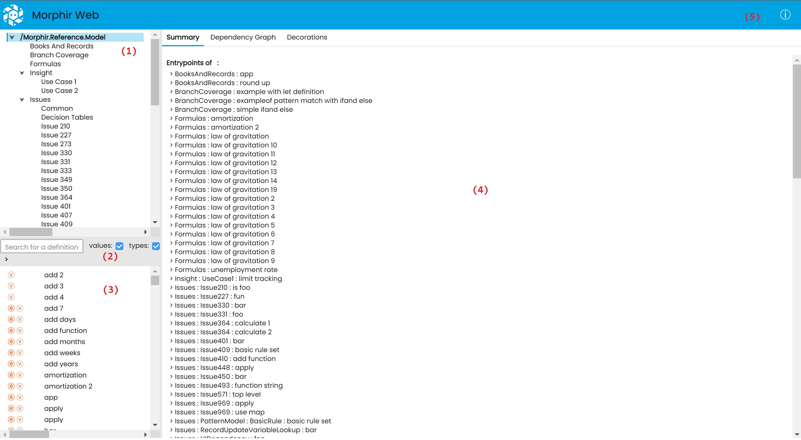
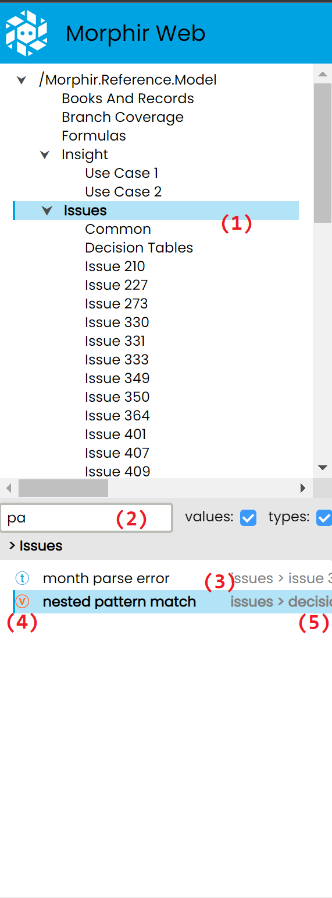
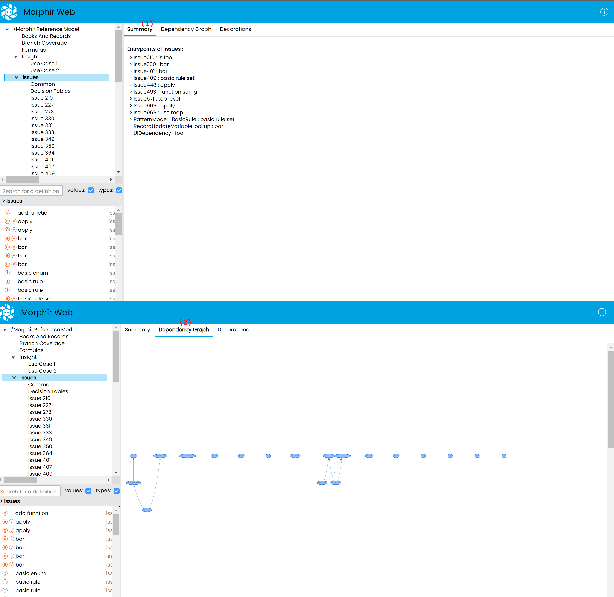
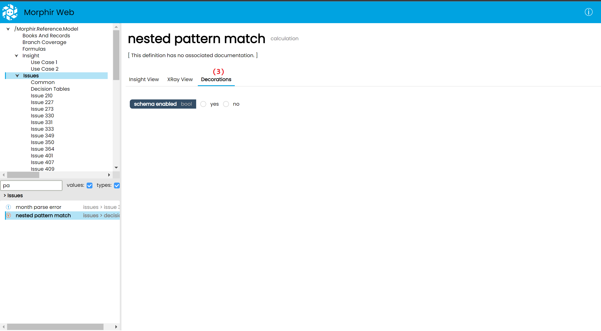
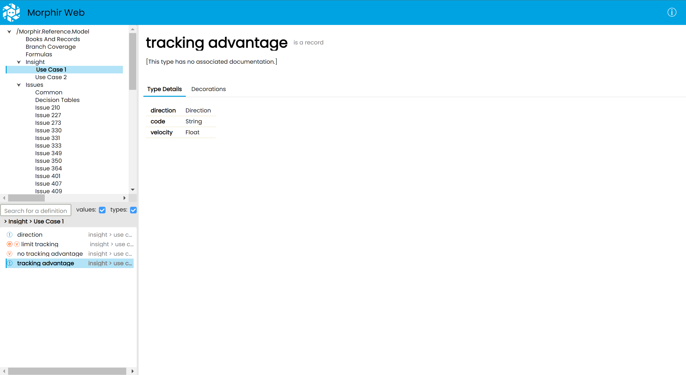
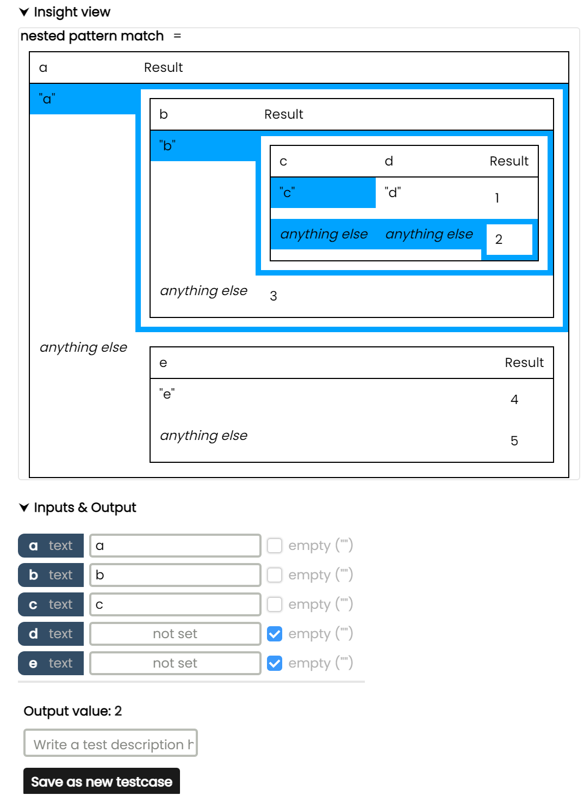
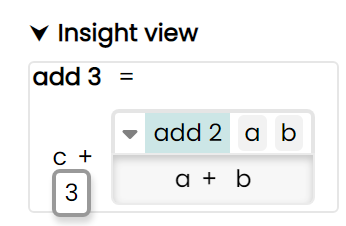
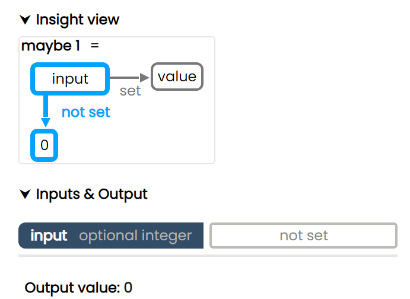
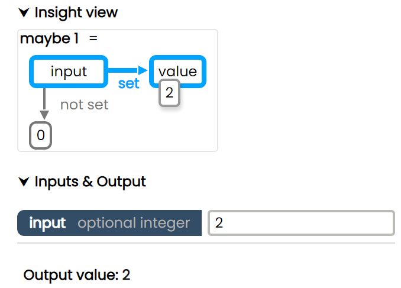
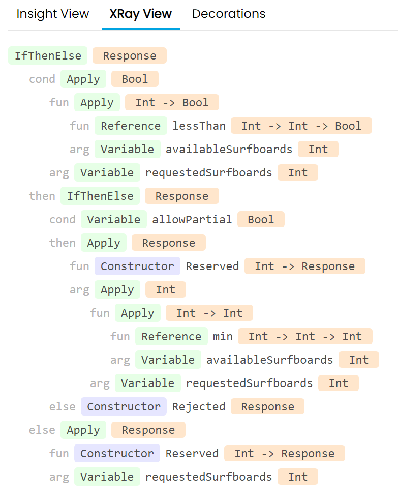

# Morphir Web UI

This document details the purpose of the various functions of the Morphir UI, and how to use them and navigate between them.

## Table of contents

1. [Introductions](#introductions)
2. [Overview of the UI](#overview-of-the-ui)
3. [Navigation](#navigation)
4. [Module details](#module-details)
5. [Definition details](#definition-details)
6. [The Insight View](#the-insight-view)
7. [The Xray View](#the-xray-view)
8. [Warnings and Errors](#warnings-and-errors)

## Introductions

The Morphir Web UI provides a way to browse, visualise, and test a specific Morphir model.  
This includes:

- Listing modules inside a Morphir package, and submodules and definitions (types and values) inside the modules
- See the most relevant functions (called entrypoints) of a selected module
- The ability to search for types or values by name
- Displaying documentation (when available), and different visualisations for a selected type or value
- The ability to test a function with different input, see how the data flows, what the output is, and save those test cases

## Overview of the UI

**(1)**: A tree view of modules  
**(2)**: Search bar to search for a definition by name within a selected subtree  
**(3)**: List of definitions in the selected subtree  
**(4)**: Details of the selected module or definition  
**(5)**: Button to open a popup showing the current version, and information about where to give feedback

## Navigation

The sidebar on the left is used to navigate the app. First the user needs to select a module in the top part, which will be highlighted in blue. **(1)**
After a module is selected, a list of definitions will be displayed in the bottom part, which the user can further narrow down using the search bar in the middle **(2)**, at which point a filtered list of definitions will be shown **(3)**. The `t` or `v` on the left indicates whether the definition is a type or value **(4)**, while it's exact position in the module subtree is indicated on the right in gray. **(5)**

The navigation is reflected in the URL, and vice-versa, so the user can share them, or save them to later recreate the exact nagivation state.

~

## Module details

When a Module is selected, the right side of the UI will display the details of that module.
This includes:  
**(1)** A **Summary** tab, which currently displays entrypoint functions, which are functions it is recommended the user starts with when trying to understand a Morphir model.  
**(2)** A **Dependency Graph** tab, which displays the dependencies between the definitions of the selected module in a graph format.

~

## Definition details

After selecting a type or value from the list on the bottom left, The "module details" view is replaced by a "definition details" view.  
This view displays the definition's name, what kind of definition it is (e.g a `value`, `calculation`, `record`, `custom type`, etc...), it's documentation (if available), and offers several ways to interact with the definition.
These are:  
**(1)** The **Insight view**, an interactive visualisation of a Morphir definition, which will have it's [own](#the-insight-view) section below  
**(2)** The **Xray view**, which shows how a given definition is internally represented inside a Morphir model  
**(3)** The **Decorations** tab, which can display editors for additional information, which is not stored inside the Morphir model

~

~

~

### Type details

In the case of types, since they describe the structure of some data instead of logic, we only have a static page showing the type's internal structure.

## The Insight view

The Insight view aims to provide the user with a user friendly, understandable, interactive visualisation of a given Morphir definition.  
It's made up of 3 sections:

- the visualisation itself (open by default)
- inputs and outputs, where the user can provide inputs for the function displayed by the visualisation, and see the output corresponding to those inputs
- a list of saved test cases

~

### Example #1 - Highlighting & pattern match

Here the here we can see a nested pattern match visualised as nested decision tables. The function has 5 inputs, named `a`, `b`, `c`, `d` and `e`.  
The user has defined the input named `a` as the string _a_, the input named `b` as the string _b_, and the input named `c` as the string _c_, while `d` and `e` are set to _empty string_. (In the case of strings, we can set an explicitly empty string input using the checkbox on the right. This is different from a missing or not set input.)  
Based on these inputs, the logic will take the path highlighted in blue, and give us the output: _2_  
The user then is able to save this scenario as a test case, after which it will be listed at the bottom, in the Test Cases section. The user can also click on one of these tast cases to load them back into the Insight view.

~

### Example #2 - Drilldown & value popup

The function in the below visualisation implements adding 3 numbers `c`, `a` and `b` together, by calling the `add2` function on `a` and `b`, and adding `c` to the output of that function.

~

The green highlight on `add2` means that it's a function call, which the user can "drill into", revealing it's internal logic, which in this case is simply `a+b`.

~

Whith another click, this drilldown panel can be closed.

~

Hovering over a variable also shows it's value in a small popup.

### Example #3 - Optional inputs

In some cases, some or all of the input parameters of a function can be optional.
In this case the user may see highlighting even without interacting with the inputs, as the function's logic is anticpating that specific inputs might be missing.  
In the below example, the output defaults to `0` if the input is missing. Otherwise it returns the value of the input.

  

## The Xray View

The Xray View is a non-interactive, "technical" view, which shows how a given value is represented internally in the Morphir model.  
It is accessible on the second tab of a definition details page.  
Below is an example of a function describing an algorithm which determines if we have enough surfboards to rent, first in Insight view, then in Xray view.

An in-depth description of how a Morphir model is structured internally is not in the scope of this documentation, but I will try to shed some light on how read this Xray view by explaining the first few lines.  
In a Morphir model, logic and data are represented by Morphir types and values arranged in a tree like-structure (an expression tree). In this function's case, the tree's root node is going to be an `if-else` statement **(1)**, which is of `Result` type. It's first child node is going to be it's condition, which is labeled `cond` **(2)**.  
The condition has two child nodes, a function, and an argument. The function can be thought of as _"Is `availableSurfboards` less than X"_ **(3)**, and it also has two child nodes, the `lessThan` function, and our `availableSurfboards` input `Variable`.
The whole thing can be read as: Take `availableSurfboards`, `Apply` the `lessThan` function to it, and then `Apply` this function to `requestedSurfBoards`, creating our condition _"Is `availableSurfboards` less than `requestedSurfBoards`"_ **(4)**.

## Warnings and Errors

After the Morphir Web UI loads, a notification might be displayed on the bottom.  
This can be either a warning (yellow), or an error (red) notification.

### Warnings

Warnings indicate that loading or saving some data (like test cases or decorations) has failed, however the core functionality of browsing the Moprhir model still works. Click on the _See Details_ link on the bottom right to see a technical explanation.

### Errors

Errors indicate that a critical issue which prevents the UI from loading, and renders the app unusable until the issue is fixed.

