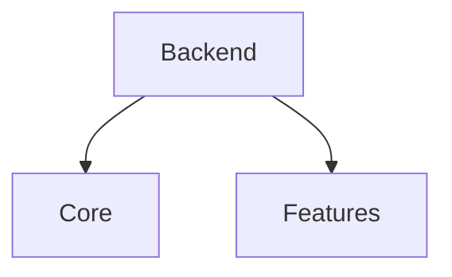

# Scala JSON-Codecs Backend Documentation

This document provides a description of the JSON codecs backend.
The Json Codecs Backend for Scala contains functions to generate Codecs from types in the IR.\
[Circe](https://circe.github.io/circe/) is used as the base JSON library.

The Scala backend is split into two aspects: \
1. **Core** - the core Scala codes representing the user business logic
2. **Feature** - the Codecs for each type defined in the input model

## 1. Elm Type to Scala Type Mapping
This section describes the mapping of Elm types to Scala Codec. It's important to note that all codecs generated from the Elm types
are Scala values defined in the Scala AST. The Codec files generated contains value declarations as lamda functions.
Below is an outline of how each type is mapped

#### Variable
Variable types in Elm are mapped to Scala Variables

#### Reference
Reference types in Elm are mapped to Scala Ref which uses the Elm path and name
to create a Scala Ref value

#### Tuple 
Not completed yet

#### Record
An Elm record type maps to Circe object which consists of a list of fields which are applied to
the Circe.json.obj function.

#### ExtensibleRecord
Similar to a record

#### Function
Functions are currently not mapped.

#### Unit
Functions are currently not mapped.

#### Custom Type Definition
Codecs for custom types are composed using helper functions.

## 2.  Scala Json Codecs Backend Functions
The following functions are defined in the Scala Json Codecs backend

#### MapModuleDefinitionToCodecs
This function takes a modules definition and generates the encoders and 
decoders for the types defined in that module

#### generateEncodeReference
Generates and encoder reference for the input type using the FQName

#### generateDecodeReference
Generates and decoder reference for the input type using the FQName

#### mapTypeDefinitionToEncoder
Type definition could be any of the following:\
_**Type Alias Definition**_ - maps to an encoder for record type \
**_Custom Type Definition_** - uses helper functions to build encoder for custom
types \\

#### mapTypeDefinitionToDecoder
Type definition could be any of the following:\
_**Type Alias Definition**_ - maps to an encoder for record type \
**_Custom Type Definition_** - uses helper functions to build encoder for custom
types \\

#### mapCustomTypeDefinitionToEncoder
Builds encoder for custom type using pattern matching

#### mapCustomTypeDefinitionToDecoder
Builds a decoder for custom type using pattern mathing on the type constructors.

#### composeEncoders
Builds an encoder for one member of a union type

#### composeDecoders
Builds a decoder for on member of a union type using for comprehension.

## 3. Conditionally Generate Codecs

Codecs can be generated conditionally by adding the --s flag to the 
morphir-elm gen command.
