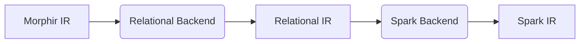
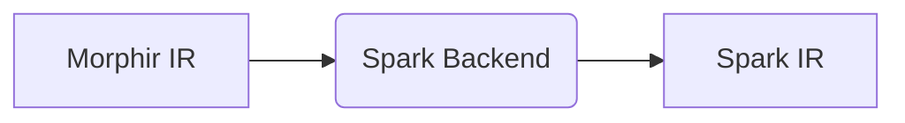
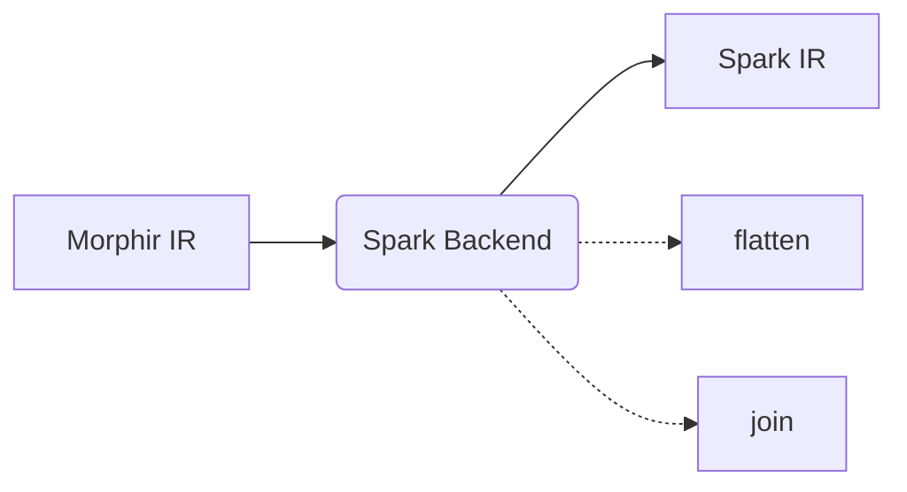

# Spark backend as a Special Form of Relational backend

## Context and Problem Statement

Given that Apache Spark's data model is an extended relational data model and most of the complexity in the backend will likely be related to the differences between the FP and the relational model (like flattening data structures, truning lookups into joins, ...), should we consider implementing the Spark backend as a special case of a Relational backend? This way we would be able to reuse the solutions we come up with in this process across a wide variety of backends including various relational databases or technologies like Apache Kafka SQL (any technology that is fundamentally relational).

## Decision Drivers

- Future potential/limitations
- Implementation effort

## Considered Options

- Map to Relational IR first, then to Spark IR
- Map directly to Spark IR
- Map directly to Spark IR, but implement flatten and joins as reusable functions

## Decision Outcome

Chosen option: "{option 1}", because {justification. e.g., only option, which meets k.o. criterion decision driver | which resolves force {force} | … | comes out best (see below)}.

### Positive Consequences <!-- optional -->

- {e.g., improvement of quality attribute satisfaction, follow-up decisions required, …}
- …

### Negative Consequences <!-- optional -->

- {e.g., compromising quality attribute, follow-up decisions required, …}
- …

## Pros and Cons of the Options <!-- optional -->

### Map to Relational IR first, then to Spark IR

- Good, because it makes the relational mapping reusable
- Bad, because the Relational IR limits the scope of Spark operations we can map to

### Map directly to Spark IR

- Good, because we can fully utilize Spark's capabilities to implement all possible Morphir features
- Bad, because we cannot reuse the solutions we come up with for flattening and joins

### Map directly to Spark IR, but implement flatten and joins as reusable functions

- Good, because we can fully utilize Spark's capabilities to implement all possible Morphir features
- Good, because we can reuse the solutions we come up with for flattening and joins

## Links <!-- optional -->

- {Link type} {Link to ADR} <!-- example: Refined by ADR-0005 in 0005-example.md -->
- … <!-- numbers of links can vary -->
