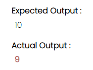
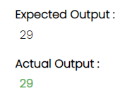

# Testing Framework Guide
The purpose of this document is how we can use Testing Framework within developer server.

## Prerequisites
- Morphir-elm package installed. Installation instructions: [morphir-elm installation](https://github.com/finos/morphir-elm/blob/master/README.md)
- Translate elm source into Morphir IR
- The function which you wanted to test using this framework must be present into the Morphir IR.

## How to use this framework
1. Create a file name `morphir-tests.json` if not present and put it into the same directory where `morphir.json` and `morphir-ir.json` file is present.
- This file is basically called TestSuite which is a dictionary with key as fully qualified name `FQName` of function and value as list of testcase `List TestCase`.
- For better understanding of data structure you can look this file [Test.elm](https://github.com/finos/morphir-elm/blob/master/src/Morphir/Correctness/Test.elm)   
-  A testcase structure looks like this
``` 
   type alias TestCase =
   { inputs : List RawValue
   , expectedOutput : RawValue
   , description : String
   }
```

#### Example: 
If we have a file with module name defined as:
```
module Morphir.Reference.Model.Issues.Issue410 exposing (..)
```

then our folder structure might be
```
exampleIR
|   morphir.json
|   |example
|   |   |Morphir
|   |   |   |Reference
|   |   |   |   |Model
|   |   |   |   |     |Issues
|   |   |   |   |     |       Issue410
```

- `Issue410` file has a function `addFunction` which takes 2 Int values and return 1 Int value.
```
   addFunction : Int -> Int -> Int
```

a) FQName for function
- `FQName` is a tuple of packagePath modulePath localName which describe the complete address of a function.
- `PackagePath` is complete path of Model directory from the directory where morphir.json file is present.
- `ModulePath` is complete path of file from Model directory.
- `LocalName` is function name within file itself.
- You can look at `morphir.json` file for better understanding of FQName where name is `packagePath` and exposedModule is `modulePath` for each elm source file.
```
Sample Format :
    [ PackagePath
    , ModulePath
    , LocalName
    ]
      
Example :
    [ [ [ "morphir" ], [ "reference" ], [ "model" ] ]
    , [ [ "issues" ], [ "issue", "410" ] ]
    , [ "add", "function" ]
    ]
```

b) Sample testcase for function
- `inputs` will always be a list. Values inside list could be Int, float, record, list , tuple or anything.
- `expectedOutput` depends on the return type of the function. Like wise Input it could also be anything.
- `description` will be a string in case you wanted to add any description for a testcase.
```
    { "inputs" : [ 4 , 5 ]
    , "expectedOutput" : 9
    , "description" : "Add"
    }
```

- For more details of encoding like how to encode `list, tuple, and record`
  [Encoding Decoding File](https://github.com/finos/morphir-elm/blob/master/src/Morphir/IR/Type/DataCodec.elm)
- This file has all the functions of encoding and decoding of elm data types.

c) Create a json object from FQName and Testcases
```
[
  [
    [ [ [ "morphir" ], [ "reference" ], [ "model" ] ]
    , [ [ "issues" ], [ "issue", "410" ] ]
    , [ "add", "function" ]
    ]
  ,
    [
      {
        "inputs" : [ 4 , 5 ],
        "expectedOutput" : 9,
        "description" : "Add"
      },
      {
        "inputs" : [ 14 , 15 ],
        "expectedOutput" : 29,
        "description" : "Add"
      },
      {
        "inputs" : [ 10 , 1 ],
        "expectedOutput" : 11,
        "description" : "Add"
      },
      {
        "inputs" : [ -10 , 1 ],
        "expectedOutput" : -9,
        "description" : "Add"
      }
    ]
  ]
]
```

2. Run the server into that directory where morphir.json file is present.
```
   morphir-elm develop  
```

3. Run the developer server into the root directory
```
   npm run dev-server-live
```

4. You need to call this API with a specific URL
- Structure of URL `http://localhost:8000/function/packagePath:modulePath:localName`
- Sample URL for Testing TestSuites
```
   http://localhost:8000/function/Morphir.Reference.Model:Issues.Issue410:addFunction
```
## Features
#### 1. Add TestCases
- You can add new testcase with empty input fields.

#### 2. Clone TestCases
- You can clone as many testcase as you wanted with default values of testcase whose clone testcase button you will click.

#### 3. Edit & Save TestCases
- You can edit and save inputs and expected output field values and actual output value will be change based on the new input values.

#### 4. Delete TestCases
- You can delete testcases anytime.

#### 5. Save Changes
- Every action performed in above scenarios will not affect the changes into morphir-tests.json file.
- In order to save it there you can use save changes button for saving testcases into json file.
  
#### 6. Easy Debugging
- This framework also allows user to match actual output with expected output.
- If the actual output will be in green color then it matches otherwise it would be red.
- It also shows the error if morphir interpreter is unable to evaluate your inputs.

#### 7. Build Integration
- We have also exposed a build integration command for testing your model.
- Use `morphir-elm test` and it will run all the test cases for all the functions all the test cases present in your morphir-tests.json file.
- If Test pass then it will show you all function with number of pass testcases output highlighted in green color.
- If Test fail then it will list you out all the functions with their fail test cases comparing difference in output highlighted in red color.

### Example
- Output is not matching 


- Output is matching
  
