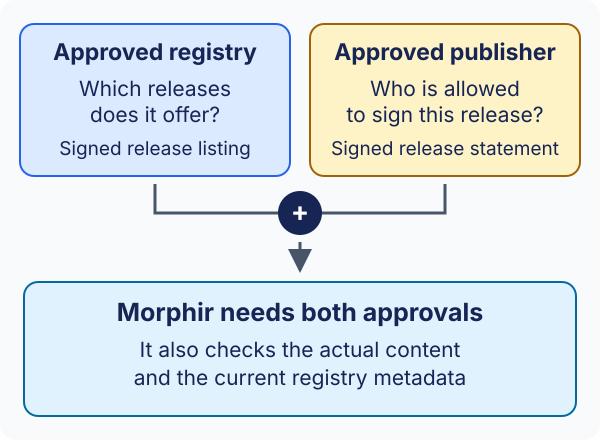

# Trust explained simply

You choose the sources you trust. Morphir checks that a Library agrees with that
choice before restoring it. Here are the moving parts, without the cryptography
lesson.

:::note Early access
The "today" column below describes **Morphir CLI v0.4.0-beta.5**. The target
experience is a direction for the feature, not a promise that every part is
available yet. Commands and configuration may change.
:::

## Two kinds of approval

An approved **registry** can tell Morphir which releases it offers. An approved
**publisher** can sign releases for the package names your policy allows.
Morphir requires both. Trusting the shop does not mean trusting every author,
and trusting an author does not mean accepting any shop's catalog.

For example, your policy could approve a publisher for `example.com/finance`.
That approval would cover `example.com/finance/eligibility`, not every package
everywhere.

## Five ideas to know

| Idea | Plain-language meaning |
| --- | --- |
| Trust policy | Your approved-source list: which registries and publisher keys may supply which package names. |
| Bootstrap root | The registry's first trusted key information. Think of an address book whose exact contents your administrator has already checked. |
| Signature | A checkable seal tied to a signing key. Morphir checks the seal and whether your policy allows that key for this release. |
| Fresh metadata | Registry information that is authenticated and has not expired. A pinned old package version can still be valid; the information about it must be fresh. |
| Trust state | Morphir's saved memory of accepted metadata. It helps stop an older registry view from being passed off as a newer one. |

The bootstrap root must match the independently supplied policy. Downloading a
root file and trusting it simply because it signs itself would let the registry
choose its own approval.

## What happens when I restore?

Morphir authenticates the registry's current view, checks publisher permission
and signatures, and verifies the bundle's declared files and dependencies.
It checks every Library in the locked graph before making the restored graph
available in the output directory.

If a required check fails, restore stops. An expired catalog or unreadable trust
state is a reason to investigate, not to accept the package with fewer checks.
Keep the established trust state; deleting it would discard information used
to protect you against rollback.

## What should everyday use feel like?

The target is that consumers can use approved Libraries without managing signing
keys for each package. Consumers do not need to create signing keys or manage
certificates to install a Library. Publishers and registry operators handle
signing and key protection.

| Area | Available today | Target experience |
| --- | --- | --- |
| Getting started | Supply a policy and trusted root, then explicitly run `trust init`. | Your organization or trusted tooling provisions approved sources with a clear onboarding flow. |
| Routine use | The CLI verifies signatures, permissions, freshness, and contents during resolve and restore. | Keep those checks automatic; consumers should not copy keys for each package. |
| Signing and publication | The consumer accepts prepared signed releases; public authoring and publication commands are missing. | Publishers and registry operators have tools for signing, renewal, and supported key changes. |
| Recovery | Uncertain or corrupt state is refused; automatic recovery is unavailable. | Recover from failures while keeping the record of what was trusted and preserving verification. |

More capable recovery and rules for using previously authorized packages are
[planned separately](https://github.com/finos/morphir/issues/912). Today's MVP
requires fresh metadata for each restore. Having files on disk is not a grant
of continued authorization, and this feature is not a runtime monitor of every
later use of those files.

## Try it without becoming a trust expert

The [installation walkthrough](installing-and-using.md) provides a prepared policy,
root, and registry so you can see the process. They use public test keys and are
only for the example. For your own registry, an administrator you trust must
provision the real policy and root.

You can leave the protocol details to the tooling. If you want them, the draft
[trust profile](https://github.com/finos/morphir/blob/v0.4.0-beta.5/spec/package/package-trust-profile.md)
explains registry verification with TUF and publisher signatures with DSSE.
