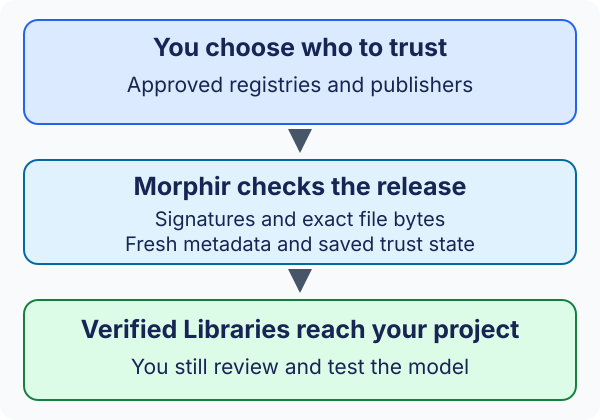

# Why package trust matters

Sharing a model also means relying on someone else's work. If `loan-rules` uses
an `eligibility` Library to help make a lending decision, it matters which
eligibility rules arrive in your project.

Package trust helps answer a practical question: **"Did I receive the release
I am allowed to use, from the sources I chose to trust?"**

:::note Early access
This introduction accompanies **Morphir CLI v0.4.0-beta.5**. The trust workflow
and its configuration may change. See [Trust explained simply](trust-explained.md)
for what works today and the experience we are working toward.
:::

## Think of a shared recipe book

Suppose your team shares recipes. You choose an author you trust and a shop you
trust to supply the book. Before using a recipe, you want to know that:

- The author is someone your team approved.
- The shop really offers that edition.
- Nobody changed the pages on the way to you.
- The shop's information is current enough to rely on.

Morphir applies similar checks to a Library. The publisher is like the author;
the registry is like the shop. You or your administrator choose the trusted
sources. A package cannot approve itself.

## Why check a local folder?

"Local" tells you where the files are. It does not tell you where they came from
or whether they still match the release you intended to use.

A copied file can be damaged or replaced. An old registry backup can advertise
an earlier view. Someone can put a different model under a familiar filename.
Trust checks help catch these problems before Morphir exposes the restored
Libraries to your project.

The early-access workflow assumes you control the local directories. It does
not yet defend against every attack by someone who controls your machine.

## A hash, a signature, and a lock do different jobs

A **hash** is a fingerprint of the file's bytes. It helps detect changes, but
someone who replaces a file could also supply a new fingerprint.

A **signature** lets Morphir check those release details against an approved
signing key. Approval still comes from your trust policy. A valid signature from
an unapproved key is not enough.

A **lockfile** records the exact releases selected for your project. It helps
repeat that selection. It does not decide who you trust or replace the checks
performed when you restore.

## What a successful check does not promise

Trust checks establish provenance, authorization, and integrity. In everyday
terms, they check the source, permission, and bytes.

They do not prove that an eligibility rule is fair, correct for your business,
free of mistakes, or suitable for a particular decision. Even an approved author
can write a bad recipe. You still need model review, tests, and whatever approval
your project requires.

The goal is to make those decisions on the model you actually meant to receive.
Continue with [Trust explained simply](trust-explained.md), or follow the
[installation walkthrough](installing-and-using.md).
