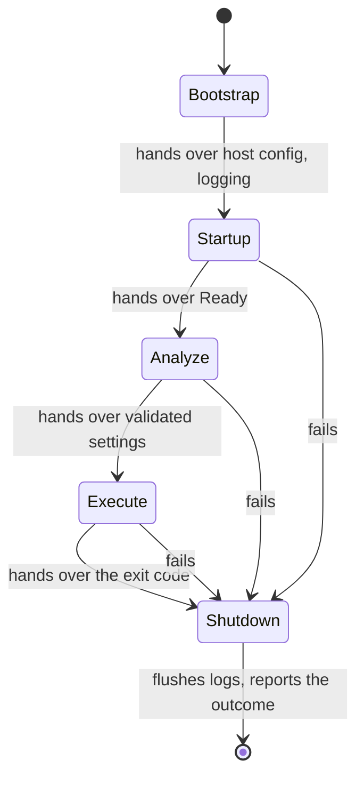

# Configuration and lifecycle

The Morphir CLI reads settings from files, from the environment and from the command line. It runs
as a sequence of phases, and each phase produces state the next one uses. This note is the
narrative home for both, because they are one design. Treating them separately is what allowed a
setting to be read before anything had been loaded.

## Status

Proposed. Nothing on this page has shipped. It records the model two decisions agreed on 2026-09-20,
and this note is where progress against it is tracked as parts land.

What is true today: seven configuration layers exist and work, the command line is not one of them,
each flag resolves its own precedence, and `MorphirSession` implements only `execute`. The sections
below describe the target, and say so where it matters.

## The problem this solves

A reader may set the same setting three ways:

```toml
# morphir.toml
[frontend.elm]
ordering = "source"
```

```sh
MORPHIR_FRONTEND__ELM__ORDERING=morphir-elm morphir compile
morphir compile --elm-ordering morphir-elm
```

The command line wins, then the environment, then the file. That ordering is foundational. A
developer adding a setting should not have to write it, and a reader should not have to check
whether a particular setting honours it.

Before this design, both had to. Each flag was wired by hand at the point it was used, so
precedence was restated per setting. Roughly fourteen places read `MORPHIR_*` variables directly
rather than through the configuration stack, including `logging.rs`, which spelled
`MORPHIR_LOGGING__LEVEL` as a literal string and so restated the environment layer's own key
mapping.

The result was a defect of a predictable kind. In GH #887 a standalone single-file compile ignored
the environment for the Elm frontend modes. The flag worked, so nothing looked broken. The cause
was that loading configuration and resolving a setting were separate steps, and one path resolved
without having loaded.

## How a setting resolves

Configuration is one ordered stack. A later layer overrides an earlier one.

| Precedence | Layer | Source |
| --- | --- | --- |
| 0 | Defaults | compiled in |
| 100 | System | `/etc/morphir`, `%PROGRAMDATA%\morphir` |
| 200 | Global | user-global configuration |
| 300 | Project | `morphir.toml` or `morphir.yaml` |
| 350 | WorkspaceMember | the selected member |
| 400 | UserOverride | personal override beside the project file |
| 600 | Environment | `MORPHIR_*` |
| 700 | CommandLine (proposed) | flags |

Layers 0 through 600 exist today. The command line is the layer this design adds, and it is the
only row in that table not yet implemented. See
[The command line is a configuration layer](/decisions/0001-the-command-line-is-a-configuration-layer.md)
for why, and for why Morphir keeps its own loader rather than adopting an external library.

Two properties follow. Precedence becomes a number rather than a rule each setting repeats. And
because the stack records which layer supplied each value, an error will be able to name the
surface that set it, which today it cannot:

```
frontend.elm.ordering is "alphabetical", which is not a mode this frontend knows;
it must be "source" or "morphir-elm"
  --> set by MORPHIR_FRONTEND__ELM__ORDERING
```

A flag will name its key where the flag is declared, because no rule derives
`frontend.elm.ordering` from `--elm-ordering`:

```rust
#[arg(long)]
#[config_key = "frontend.elm.ordering"]
elm_ordering: Option<String>,
```

## Where the stack lives

A run moves through phases. Each phase produces something, and the session carries it forward.
Every failure path reaches shutdown, whatever phase failed.



**Figure 1:** The proposed lifecycle. Notice that three arrows enter shutdown from failures, so
shutdown can begin holding only what bootstrap produced. That is why shutdown reads the state it
finds rather than expecting a completed run.

| Phase | Produces |
| --- | --- |
| Bootstrap | miette setup, host configuration, logging, `MORPHIR_HOME` |
| Startup | the command-line layer, the loaded stack, home, out root |
| Analyze | validated settings, so a bad value fails before work begins |
| Execute | the command's own output |
| Shutdown | flushed logs, the reported outcome, provenance on request |

Bootstrap exists because some callers run before argv is parsed. They cannot use a loader that
needs a working directory, and they can emit diagnostics that expect logging to exist already.
Bootstrap therefore reads defaults and the environment only. It is a stage of the lifecycle rather
than an exception to it.

Commands read settings from the state startup produced. No command loads configuration itself.
[The session owns the application lifecycle](/decisions/0002-the-session-owns-the-application-lifecycle.md)
records how that state is modelled and why command code cannot run without it.

## What this will change for a reader

Every setting will honour the same three surfaces, so the documentation for one need not restate
the rules for all. A malformed value will fail at startup with a message naming both the key and
the surface, rather than partway through a compile with a message naming only the file.

## Open questions

The out root is unresolved. `workspace.out_dir` is a path relative to the workspace root, validated
to stay inside it. The `--out-dir` flag and `MORPHIR_OUT_DIR` relocate the root outright and accept
an absolute path. They are two settings, not one key with three surfaces, and treating the flag as
an alias would drop the validation. Whether relocation should be expressible in a file at all is
still open, since it is process-scoped today by design.

Whether a setting registry earns its cost is also open. One declaration could generate the clap
argument, the typed model, the documentation table and the JSON schema. The per-setting types this
design introduces are the data such a registry would consume, so the option stays available without
being paid for now.

Logging is the largest piece not yet settled. starbase's tracing support overlaps `logging.rs` on
level, module filters, file output, rotation and NDJSON, but has no equivalent of the operation-id
correlation Morphir depends on for its own diagnostics. That comparison gets its own investigation
rather than riding along with this work.
