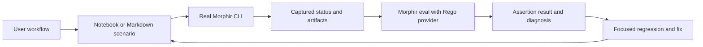

# Example-driven CLI validation

`morphir itest` recursively discovers `scenario.ipynb` or `scenarios.md` under categorized example
directories. Each document supplies prose, literal CLI commands and Rego
assertions. Project files remain on disk by default; optional file cells can
add inputs or provide an entire workspace. The driver copies the scenario
directory into a fresh workspace and
uses the same Morphir executable for workflow commands and `morphir eval`.

```sh
mise run test:examples -- --filter elm/single-file
mise run test:examples -- --list --tag language:elm
```

The [single-file Elm notebook](https://github.com/finos/morphir/blob/main/examples/elm/single-file/scenario.ipynb)
checks native type compilation, public record/custom-type structure, v3 task
results and an installed IR copy. The negative fixture proves malformed Elm
fails without publishing usable IR. Neither establishes native Elm function
lowering or native Morphir IR evaluation.

## Authoring and feedback

Scenario title, purpose and tags belong in notebook metadata. Markdown cells
explain intent. File cells carry logical paths and language metadata; paths are
separate from nbformat cell IDs. Command cells declare case names, captures and
timeouts. Assertion cells contain Rego modules and name the preceding command
and rule entrypoints. Rego assertions remain literal source in both formats. Golden assertions offer
exact text comparisons through the same evaluator pipeline.

For Markdown authoring, use `scenarios.md` with YAML frontmatter for shared
context and tags. Each top-level `##` heading starts an independent scenario
with a fresh workspace; `###` headings organize its steps. A heading may use
an explicit `{#id}` or derive an ID from its lowercase ASCII words. Select it
with `--filter 'category/example#id'`; directory filters select every scenario
under that directory. Keep one supported scenario document per directory.

Pair `yaml morphir:command`, `yaml morphir:assertion` and `yaml morphir:file`
metadata fences with the next language source fence. Prose, lists and subheadings
may appear between the pair. Do not place YAML inside the source fence. A new
scenario heading ends the association; dangling metadata fails. Unmarked fences
are documentation. The Markdown reader adapts into the same validation and
execution path as notebooks; there is no separate runner. The
[CLI basics example](https://github.com/finos/morphir/blob/main/examples/cli/basics/scenarios.md)
checks version reporting and command help in two independent scenarios.

On-disk workspaces are the default, not a requirement to embed project files in
the notebook. Optional `metadata.morphir.itest.workspace` selects a relative
project directory and exclusions with `kind: "directory"`, or deliberately
uses only inline inputs with `kind: "inline"`, retaining `kind: "notebook"`
as a compatible spelling. Markdown frontmatter accepts the same workspace
settings. Mixed disk and inline inputs are
supported, with collisions rejected. Commands run on temporary copies so the
example source tree is not changed.

Repeated tags require all selected dimensions. Categories may contain more
categories without driver edits. All selected commands and named assertions
must execute successfully; false, undefined, missing rules, malformed results
and empty assertions cannot make a scenario green.



**Figure 1:** Real CLI observations are checked by a reusable evaluator while the scenario document retains the intended behavior.

Start with the smallest missing behavior, write fixed expectations and run it
before changing implementation. Establish whether a failure belongs to source,
expectation, driver or CLI. Retain passing behavior and demonstrate that a wrong
expectation fails. Do not regenerate expectations from actual output or weaken
a structural check to a successful exit. Keep broken source in failure fixtures.

## Evaluator boundary and target state

Milestone 0 embeds Regorus through `morphir-opa`. `morphir-evaluator` owns a
versioned host-independent request/report and provider trait. Generic evaluation
returns values, undefined outcomes or errors. `itest` separately requires boolean
true. The provider receives already-loaded source and JSON input; it does not
own filesystem or process access. No external OPA executable is required.

The native Morphir evaluator is the next target, not a current feature. The
same boundary is intended for native IR programs, CLI hosting, a WASM ABI,
UI workers and policy hosts. Beads epic `morphir-o6vm.9` tracks semantic core,
CLI/notebook integration, native/WASM parity, UI/policy adapters and evaluator
capability negotiation. See the
[evaluation design and milestone table](https://github.com/finos/morphir/blob/main/docs/developers/evaluation.md).

The embedded Rego provider is registered natively. Installed evaluator discovery
and MEP negotiation remain follow-up work. Pin and test the engine profile;
Regorus integration does not claim all OPA builtins or Rego-to-Morphir compilation.

## Coverage and maintenance

MCK owns IR/package compatibility contracts. `itest` exercises CLI workflows
and reuses evaluator providers; it does not implement another compatibility kit.
Existing projects without `scenario.ipynb` or `scenarios.md`, old `scenario.md` and `test.yaml`
files remain unverified. Adopt classic JSON, TOML/YAML, workspaces and additional
frontends/backends incrementally with their own observable checks.

Driver tests cover discovery, notebook and Markdown parsing/materialization, tags, capture
semantics, isolation and process cleanup. CLI acceptance tests run positive and
negative examples and intentionally bad assertions. Provider fixtures test
evaluation independently. Changes under `examples/**` trigger the Rust CI job.

Use the [authoring guide](https://github.com/finos/morphir/blob/main/docs/developers/example-integration-tests.md)
for the complete contract and isolation limits. Agents use the
[local skill](https://github.com/finos/morphir/blob/main/.agents/skills/morphir-example-tests/SKILL.md).

### Adopted example coverage

The catalog now includes reference Elm single-file function lowering, a minimal
classic JSON project, native Elm TOML/YAML projects, two independently selected
workspace members, and Gleam compilation/generation. Workspace cases assert default selection, independent path/name selection, installed
IR copies and absence of the other member's output. Gleam checks generated
source and task provenance. These checks do not establish cross-package linking,
execution of generated code or native Morphir evaluation.

Reference Elm 0.1.0 is an explicit prerequisite for `suite:elm-reference`.
`mise run examples:prepare-elm -- /path/to/morphir-elm-extension` stages the supplied
host executable in ignored local fixture repositories. The scenario itself uses
CLI repository registration, installation and compilation; the helper is not a
second driver. CI reuses the pinned published executable. `suite:offline` requires
no prepared provider, and missing prerequisites fail rather than skip.

Installed WASM coverage uses `suite:wasm-backends`. The fetch task acquires pinned
bundles and `examples:prepare-backends` verifies and copies their bytes; scenarios
perform real repository init/add/publish/install commands. Avro record fields,
JSON Schema properties and OpenAPI schema components have fixed expectations,
with canonical task output compared to installed copies and compile provenance
checked. Main cases compile default v4; separate compatibility projects retain
explicit v3 coverage. Avro 0.1.2 and OpenAPI 0.1.1 refresh the guests that previously
rejected canonical v4 `Public` access wrappers. The upstream released-CLI gate
also exercises a fixed canonical v4 record alongside its v3 fixture, so the
release check covers both advertised versions. This coverage does not prove API
operation inference from functions.

The original two-module `morphir-elm-compat` project revealed two gaps: classic
configuration does not infer Elm, and the released extension rejects multiple
source documents. The minimal JSON case passes `--language elm`; the original
project records the exact multi-source rejection with `coverage:known-limitation`
and `kind:negative`. Beads `morphir-o6vm.15` tracks the required provider/config
work. Replace the rejection assertions with positive IR assertions when it lands;
never count that negative pass as successful multi-file compilation.

## Golden text coverage

Use golden assertions for whole generated files, inclusive 1-based line ranges,
or exact text between unique start/end markers. Keep expected files on disk
relative to the scenario document, or put literal expected text in a golden
cell/source fence. The driver freezes expectations before CLI execution,
selects actual text immediately after the referenced command, and evaluates
text equality plus successful exit through `morphir eval`.

Exact text is the default, including whitespace and final newlines. Optional
`line_endings: lf` normalizes CRLF after selection. Invalid selections, missing
files and ambiguous markers fail. A bounded diagnostic diff identifies changes;
`--keep-temp` retains the evaluator request containing both compared texts.
No automatic blessing occurs. The Gleam generation example checks complete
source, its function lines and marker-delimited body alongside existing Rego
checks for task provenance. These are CLI workflow assertions, not an MCK runner.
