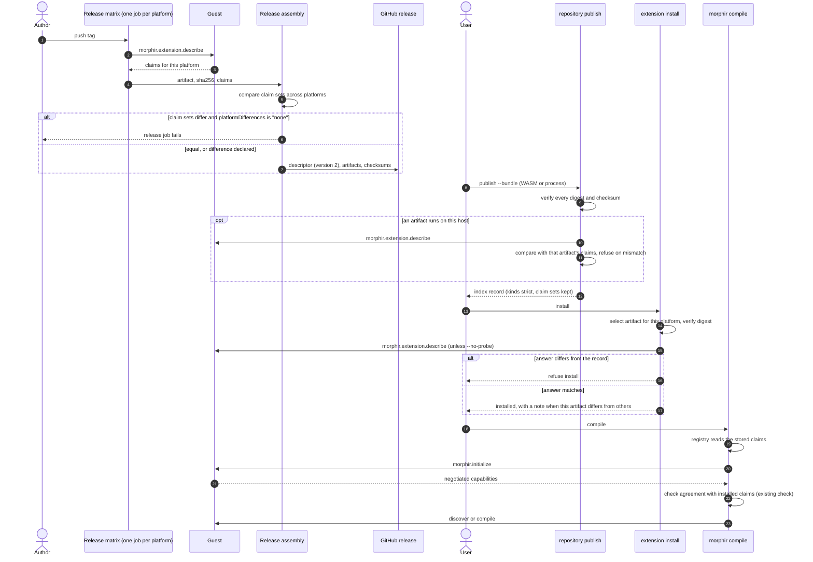

# Capability claims across the extension lifecycle

An extension's capabilities have one author: the extension itself. The extension claims them in one
JSON document, its **capability claim set**. Each entry in it is a **claim**. Release tooling asks for
the claim set with the protocol method `morphir.extension.describe` and stores the answer. Publication
keeps one claim set per artifact. Installation checks the claims against the artifact it selected. A
session compares them with what the extension reports at `morphir.initialize`. Nobody writes a
capability into a manifest by hand.

This note is the narrative home for that capability. The host side shipped in the Morphir CLI
`0.4.0-beta.5` and `0.4.0-beta.6` (source `changelog`). The extension side has not shipped: no extension
publishes a version-2 descriptor yet, so no installed record carries a claim set that its extension
reported. The working spec is finos/morphir#921 (source `spec`). Where #921 and this note disagree, this
note is newer: #921 still says "capability statement". The work started in step 5 of finos/morphir#917
(source `single-file-spec`), the spec for the single-file working thread finos/morphir#915 (source
`single-file-thread`). Four decision records fix the settled parts:

- [The guest authors its capability statement](/decisions/0003-the-guest-authors-its-capability-statement.md)
  records who writes the document and how each phase handles it.
- [Readers ignore unknown members unless critical](/decisions/0004-readers-ignore-unknown-members-unless-critical.md)
  records how hosts and extensions stay compatible, and how the change is released.
- [The describe fallback reports only what a session reports](/decisions/0006-the-describe-fallback-reports-only-what-a-session-reports.md)
  assigns the `-32014` refusal and limits what a fallback session can put in a claim set.
- [Extensions make capability claims](/decisions/0007-extensions-make-capability-claims.md) renames the
  document from capability statement to capability claim set, and moves the version-2 formats to their
  next draft.

Decisions 0003, 0004 and 0006 use the old name. Their substance still holds; decision 0007 replaces only
the vocabulary and the wire names.

## Terms

| Term | Meaning |
| --- | --- |
| host | The `morphir` CLI, or another program that starts an extension and talks MEP (the Morphir Extension Protocol) to it |
| guest | The extension program that the host runs: a native executable (`process` runtime) or a WASM module (`wasm` runtime) |
| capability claim set | The JSON document in which a guest describes itself: identity, capability kinds, capability details and requirements |
| claim | One entry in a capability claim set, such as a capability kind or the value of a capability member |
| capability kind | One value in the claim set's `extension.types` list, such as `frontend` or `workspace` |
| bundle descriptor | The JSON file that describes one release and lists its artifacts |
| index record | The entry that `morphir extension repository publish` writes into a repository index |
| installed record | The entry that `morphir extension install` writes into the user's installed catalog |
| probe | Start an artifact, send it `describe`, and compare the answer with stored claims |
| claim check | The record member `claimCheck`: `probed` when the writer probed the artifact, `unchecked` when it did not |

## The problem

Before `0.4.0-beta.5`, three places stated an extension's capabilities, and two of them had to agree
(source `spec`):

1. The guest reports them at `morphir.initialize`.
2. A person writes them in a release descriptor: `.github/extensions.toml` flags in finos/morphir-rust,
   and `extension.json` in finos/morphir-elm.
3. The host has parsers for the bundle descriptor, the index record and the installed catalog.

At every session the host compares the guest's report with the installed record built from the release
descriptor. When the capability kinds differ, the host refuses the session with "capability kinds
changed". So each new capability needed an edit to the descriptor, to the writer in each language, and to
the host parser.

The parsers made each change slower. Every one of them used `deny_unknown_fields`, so a released CLI
rejected a new key until a new CLI shipped. The `TRANSITIONAL_FIELDS` list in the `test:cli-release`
task existed to skip such keys. Both facts come from #921; this note did not check them against the
source files. The MEP draft already told receivers to ignore unknown object fields in protocol messages
(source `protocol`, as quoted in #921). The distribution formats did the opposite.

Step 5 of #917 found two more gaps:

- `morphir extension repository publish` accepted only a single-artifact WASM bundle (source `publish`).
  It also rejected any file in the bundle directory other than `release.json`, the artifact and its
  checksum.
- The Elm extension releases six process archives and one `.release.json` with an `artifacts[]` list.
  That shape is not the bundle format. No tool turns an Elm release into an installed record. The only
  installed Elm records come from hand-written index lines in tests.

`0.4.0-beta.5` closed the first gap: publish accepts a version-2 process bundle of raw executables
(source `changelog`, finos/morphir#941). The second gap is still open. The Elm release still uses its own
shape, and publish refuses archives.

[Elm extension delivery](/design/elm-extension-delivery.md) describes the second gap from the delivery
side, as the remaining process-bundle publication gap.

## The guest is the only author

Packaging asks the guest for its claim set and stores the answer unchanged. Every later reader either
carries the stored claims or compares them with a fresh answer from the guest. Stored claims cannot
drift from the guest, because the guest wrote them. With the compatibility rules below, a new capability
needs a change in the guest only. Decision
[0003](/decisions/0003-the-guest-authors-its-capability-statement.md) records this principle and the
four decisions that follow from it.

The host checks claims; it does not trust them blindly. That is the reason for the name. A claim is an
assertion that its author stands behind and that a reader can check, the same meaning the word has in
JWT and OpenID Connect. Decision [0007](/decisions/0007-extensions-make-capability-claims.md) records the
rename and the options it rejected.

A probe does not make a claim true. It proves that a record matches what the guest says. It does not
prove that the guest does what it says. That evidence comes from the Morphir Compatibility Kit, as
[Extensions declare IR capability sets](/decisions/0002-extension-capability-sets.md) records. The two
designs fit together: decision 0002 defines what a frontend puts inside `capabilities` about IR features,
and this note defines how that content travels. A future `lowers` member is one more member that readers
carry unchanged.

## The capability claim set

A claim set has the same content in every phase. This is the draft.2 spelling (source `spec`, renamed
by decision 0007):

```json
{
  "claimsVersion": "0.1.0-draft.2",
  "protocolVersions": ["0.1"],
  "extension": {
    "id": "morphir-elm",
    "name": "Morphir Elm frontend",
    "version": "0.3.0",
    "types": ["frontend", "workspace"]
  },
  "capabilities": {
    "frontend": {
      "languages": [{ "id": "elm", "fileExtensions": [".elm"] }],
      "irVersions": ["3"],
      "compile": true,
      "incremental": false,
      "multiDocument": false
    },
    "workspace": { "protocolVersions": ["0.1.0-draft.1"], "discover": true }
  },
  "requires": { "host": [">=0.4.0-alpha.7"] },
  "critical": ["requires.host"]
}
```

Readers treat its parts in four ways:

- Readers check the kinds in `extension.types` strictly. A kind that a reader does not know is an error.
- Readers carry every member of `capabilities` unchanged. A reader uses the members it knows and ignores
  the rest.
- `critical` lists member paths that change meaning. A reader that does not understand a listed path
  refuses and names that path.
- `requires.host` is a list of single SemVer comparators over the host version, such as `[">=0.4.0-alpha.7", "<0.5.0"]`, all of which must hold. A host outside the range refuses, and its message names the
  range. Single comparators parse the same way in the Rust `semver` crate and in `@std/semver`.

#921 states these rules without a reason for the split between strict kinds and lenient members. Our
reading, which is an assumption: a kind decides which operations the host may call, so a guess is
unsafe. A member inside a known kind refines an operation the host already knows, so to ignore it loses
only the refinement.

The first draft, `0.1.0-draft.1`, named the version member `statementVersion`. Hosts `0.4.0-beta.5` and
`0.4.0-beta.6` read and write only that draft. The workspace protocol version inside `capabilities`
stays `0.1.0-draft.1`, because the rename does not touch the workspace discovery protocol.

## `morphir.extension.describe`

`describe` is an MEP request that returns the capability claim set (source `spec`):

| Field | Value |
| --- | --- |
| Kind | request |
| Allowed | before `morphir.initialize`, and in any later state before shutdown |
| Params | `{ "protocolVersions": ["0.1"] }`, the protocol versions the caller understands |
| Result | the capability claim set |
| Side effects | none; the guest must not read a workspace, open a network connection, write files, or depend on environment values other than those the host passes |

After `describe`, the caller may send `morphir.exit` without a session. `describe` is optional for
guests. A guest that does not implement it answers `-32601` (method not found), or refuses the request
with `-32014` (not initialized) because it came before `initialize`. In both cases the host falls back to `initialize`, the
`initialized` notification, `morphir.extension.capabilities`, `shutdown` and `exit`, and reads what it can from that
session. The Rust SDK answers `describe` with this fallback behind it (finos/morphir-rust#223).

A session is not compared with a claim set for equality. The initialization result carries one
negotiated protocol version and the capabilities of that session, and a session may offer less than
its claims. It **agrees with** the claim set when the identity is equal, the negotiated protocol is
one of the claim set's `protocolVersions`, every capability kind it reports is among the claim set's
`types`, and every member it reports has the claim set's value. A claim set rebuilt from a fallback
session lists only the negotiated protocol and has no `requires` or `critical`
([0006](/decisions/0006-the-describe-fallback-reports-only-what-a-session-reports.md)).

## Lifecycle phases

Publish, install, update and uninstall stay host operations. The guest takes part in them only through
`describe`, so it cannot change anything while a host publishes or installs it.

| Phase | Who acts | What the guest answers | Guest side effects |
| --- | --- | --- | --- |
| package | release tooling, once per platform | `describe` | none |
| publish | `repository publish`, for each artifact that runs on the publishing host | `describe` | none |
| install | `extension install`, for the artifact it selected | `describe`, skipped with `--no-probe` | none |
| session | host | `initialize`, whose result must agree with the claim set | none until the host calls an operation |
| operate | host | compile, generate, discover, validate, transform | only through host functions or inside the sandbox |
| shutdown | host | `shutdown`, then `exit` | release resources |

Each record says how its writer checked the claims. `claimCheck` is `probed` when the writer ran the
artifact and its answer matched, and `unchecked` when it did not, for example after `--no-probe`.
`probeSource` says whether the probe used `describe` or fell back to a session (`session-fallback`).
In the `0.4.0-beta.5` host, install probes process artifacts only. A WASM install keeps its claims
unchecked (test `wasm_keeps_declared_statement` in `crates/morphir/tests/cli_integration/extension_probe.rs`).

### What a probe means per runtime

A probe starts the artifact and sends `describe`. What that start costs depends on the runtime:

- For a `process` artifact, the host spawns the native executable under the same launch rules as a
  session. It clears the environment except for an allow-list, sets the working directory, applies a
  request timeout and kills the process on drop. There is no operating-system sandbox, so the process
  has the user's rights. It has the same rights at first compile. The probe moves the first execution
  from first compile to install. `--no-probe` exists for users who do not accept that.
- For a `wasm` artifact, the host instantiates the module in the WASM engine. The module is
  memory-isolated and has no direct file or network access.

## Bundle descriptor, version 2

A release has one descriptor, with one entry per artifact. Each entry carries the claim set that its
artifact returned from `describe` on its platform (source `spec`, renamed by decision 0007):

```json
{
  "schemaVersion": "2.0.0-draft.2",
  "extensionId": "morphir-elm",
  "shortId": "elm",
  "version": "0.3.0",
  "gitCommit": "…40 hex…",
  "platformDifferences": "none",
  "artifacts": [
    {
      "platform": "aarch64-apple-darwin",
      "runtime": "process",
      "filename": "morphir-elm-extension-0.3.0-aarch64-apple-darwin.tgz",
      "sha256": "…",
      "claims": { "…": "as returned by describe on that platform" }
    }
  ]
}
```

- A WASM bundle is the case with one artifact and no `platform`.
- `platformDifferences` is `"none"` or `"declared"`. When the probed claim sets differ across artifacts
  and the value is `"none"`, the release job fails. That catches an accidental platform bug, and forces
  the author to write down an intended difference.
- A bundle directory holds the descriptor, every artifact it lists, and one checksum per artifact.
  Nothing else.

Artifacts of one release may differ because a WASM artifact and a process artifact of the same release
can have real differences. A single shared claim set would hide them. The index record therefore keeps
every claim set. A merged claim set would claim a capability that some installed artifact lacks.

The index record and the installed catalog use the same member, `claims`, and the same
`schemaVersion`, `2.0.0-draft.2`. Their first draft, `2.0.0-draft.1`, named the member `statement` and
the check member `statementSource`, with the values `declared` and `probed`. The filename in the example
is an archive, as #921 drew it. The `0.4.0-beta.5` publish refuses archives and accepts one raw
executable per platform (source `changelog`).

## The flow

Figure 1 shows the flow from a tag to a compile. Each phase that starts the guest sends only `describe`
until the session.



**Figure 1:** Partly implemented. The steps from `publish --bundle` onward shipped in `0.4.0-beta.5`
(finos/morphir#940, #941). The release matrix and release assembly steps are proposed: no extension
release job asks its guest for claims yet. The guest is asked for its claims at package, publish and
install time, and every stored copy comes from one of those answers. The two `alt` blocks are the
failure paths a release author and a user can meet.

#921 also draws the flows before `0.4.0-beta.5`. In the WASM flow the packager copies hand-written flags
into `release.json` and never asks the guest, so the first comparison happens at `initialize`. In the
Elm flow publication stops at `publish --bundle`, because the release uses another schema and publish
refused process bundles.

## Compatibility rules

Decision [0004](/decisions/0004-readers-ignore-unknown-members-unless-critical.md) records the first five
rules (source `spec`). Decision [0007](/decisions/0007-extensions-make-capability-claims.md) adds the
sixth.

1. Must-ignore unless critical. At every boundary (bundle descriptor, index record, installed record,
   claim set, `describe` result) a reader ignores an optional member it does not understand. It refuses
   a member listed in `critical` that it does not understand.
2. Schema ranges. A host reads the current released major and the previous released major of each format, plus the exact drafts it lists. A publisher writes the highest version
   that the oldest host it targets can read.
3. Minimum host. An extension that needs a newer host states `requires.host` and lists it in `critical`.
4. `describe` is optional. On `-32601`, or on `-32014` before `initialize`, the host falls back to a
   session.
5. Old records are converted. The host turns a record without a claim set into one built from its flat
   keys, with `claimCheck` `unchecked` rather than `probed`. Install and the first session verify it as
   usual.
6. Draft.1 is read and converted. A reader accepts a draft.1 claim set, descriptor, index record or
   catalog: `declared` becomes `unchecked`, and a `statement.` critical path becomes `claims.`. A writer
   emits only draft.2. A record that mixes draft.1 and draft.2 names or versions is refused.

Rule 1 brings the distribution formats in line with what the MEP draft already says for protocol
messages. Rule 6 exists because `0.4.0-beta.5` and `0.4.0-beta.6` wrote draft.1 records into Morphir
homes and index repositories, and those records must keep loading. The reverse does not hold: hosts
`0.4.0-beta.6` and earlier cannot read draft.2. A draft promises no compatibility with another draft,
so decision 0007 accepts that break.

## Release paths

With the rules in place, most changes ship on one side alone (source `spec`):

| Path | What must hold | Gate |
| --- | --- | --- |
| Host only | The new host reads every supported older descriptor, record and guest (rules 2, 4, 5) | A host compatibility suite: the new CLI publishes, installs and compiles with the latest released bundle of each first-party extension |
| Extension only | The extension works with the released host it targets, or states `requires.host` (rules 1, 3) | `test:cli-release` against the pinned CLI, extended to the Elm process bundle |
| Both | The host releases first, then the extension; never both at the same time | The host suite passes, the host releases, the extension pin moves, then `test:cli-release` passes |

Only a critical change needs the "Both" path. The host compatibility suite exists: CI runs the pinned
released bundles in `.config/published-extension-bundles.toml` through every CLI change
(finos/morphir#943).

### The bootstrap host release

Hosts released before these rules followed none of them, so one host release had to come first. That
release is `0.4.0-beta.5` (finos/morphir#947). It implements rules 1 to 5 and still reads version-1
descriptors and records. An install from a version-1 index record keeps the version-1 catalog shape, so
an older CLI can still read a shared Morphir home (source `changelog`).

The bootstrap host met the removal condition of three transitional mechanisms from #915. All three are
gone:

| Mechanism | Removed by |
| --- | --- |
| The `TRANSITIONAL_FIELDS` skip in `test:cli-release` | finos/morphir-rust#232, which checks bundles against `0.4.0-beta.5` |
| `compile_wire_request`, which sent process and WASM frontends the legacy top-level `documents` | finos/morphir#956, shipped in `0.4.0-beta.6` |
| The legacy compile envelope decoder in the Rust SDK | finos/morphir-rust#249, which accepts only the `sources` envelope |

The `0.4.0-beta.6` change broke frontends released before the `sources` envelope existed. The changelog
names them and the releases that replace them (source `changelog`).

## Work in flight and what remains

Three items were in flight when this note was first written. Their outcomes:

- The morphir-elm branch `feat/mep-workspace-discovery` wrote `workspaceDiscovery: true` as a flat
  version-1 key. It merged as finos/morphir-elm#1291 and shipped in the Elm extension `v0.3.0`; `v0.3.1`
  also serves workspace discovery. The CLI pinned `v0.3.0` in `0.4.0-beta.4` (source `changelog`). Rule 5
  converts the flat key, so the version-1 record works with the bootstrap host.
- The MEP draft documents (sources `protocol` and `distribution`, pinned before the change) now describe
  `describe`, capability claims and version 2. finos/morphir#922 added them, and decision 0007 renamed
  their vocabulary.
- `multiDocument`, added in step 5 of #917, is still in no installed record. An installed provider
  therefore always reads as single-document. Claim sets fix that without a new record field, but only
  once an extension publishes a version-2 descriptor that carries them.

The remaining work is on the extension side, tracked as the beads epic `morphir-o7m2`:

1. Rename the vocabulary and wire names to capability claims (decision 0007), before any extension
   publishes a version-2 descriptor.
2. Convert the Elm extension's `.release.json` to a version-2 descriptor.
3. Have every first-party bundle publish a version-2 descriptor with claim sets, so `multiDocument` and
   later members reach installed providers.

## Alternatives rejected

Each row is argued in the decision record named in its last column.

| Option | Why not | Decision |
| --- | --- | --- |
| Keep adding boolean keys to the descriptor | Every capability needs a descriptor key, a writer in each language, a host parser change and a CLI release | [0003](/decisions/0003-the-guest-authors-its-capability-statement.md) |
| Probe only at publish | A process release has platforms that the publisher cannot run; the artifact that runs is only on the user's machine | [0003](/decisions/0003-the-guest-authors-its-capability-statement.md) |
| Reuse `initialize` for the probe | A session is heavier than a probe needs, and "no side effects" would be a convention instead of the contract of a method | [0003](/decisions/0003-the-guest-authors-its-capability-statement.md) |
| One claim set shared by every artifact | Hides real differences, for example between a WASM and a process artifact of one release | [0003](/decisions/0003-the-guest-authors-its-capability-statement.md) |
| A merged claim set in the index record | Claims a capability that some installed artifact lacks | [0003](/decisions/0003-the-guest-authors-its-capability-statement.md) |
| No install probe | A mismatch shows up only at first compile | [0003](/decisions/0003-the-guest-authors-its-capability-statement.md) |
| Keep strict parsers and skip new keys in tests | Every new key still needs a CLI release before an extension can use it | [0004](/decisions/0004-readers-ignore-unknown-members-unless-critical.md) |
| Keep the name "capability statement" | "Statement" does not say that an author stands behind it or that the host checks it | [0007](/decisions/0007-extensions-make-capability-claims.md) |
| Rename after extensions adopt version 2 | Every first-party bundle would publish the old names and then change them | [0007](/decisions/0007-extensions-make-capability-claims.md) |
| Alias the new names inside draft.1 | A draft matches only exactly, so one version cannot have two spellings | [0007](/decisions/0007-extensions-make-capability-claims.md) |

## Unresolved

These questions are open in #921. The `requires.host` syntax is settled: it is a list of single SemVer
comparators, which the Rust `semver` crate and `@std/semver` parse the same way.

1. What canonical form do two claim sets take before a reader compares them (key order, number
   spelling)?
2. Does publish also probe WASM artifacts, which it can always run, and should that be required?
3. Should the artifact's provenance or signature cover the claims once publisher authenticity exists?
   This is open question 4 of the distribution design (source `distribution`).
4. Can a process probe get an operating-system sandbox where one is available, for example a restricted
   profile on macOS or a namespace on Linux?

What would change the position: if a host cannot keep reading version-1 or draft.1 records, the
single-side release paths do not hold, and decision 0004 reopens. If a process probe turns out to need
more than `describe` to give a useful answer, the no-side-effects contract of decision 0003 reopens. The
first released version of the claim set or the records removes the draft.1 reader, as decision 0007
states.

## Related documents

- [Elm extension delivery](/design/elm-extension-delivery.md) is the narrative home for how the Elm
  extension reaches users. Its process-bundle publication gap closes under this design.
- [Extensions declare IR capability sets](/decisions/0002-extension-capability-sets.md) defines the IR
  feature content that a frontend claim set will carry, and how the MCK verifies it.
