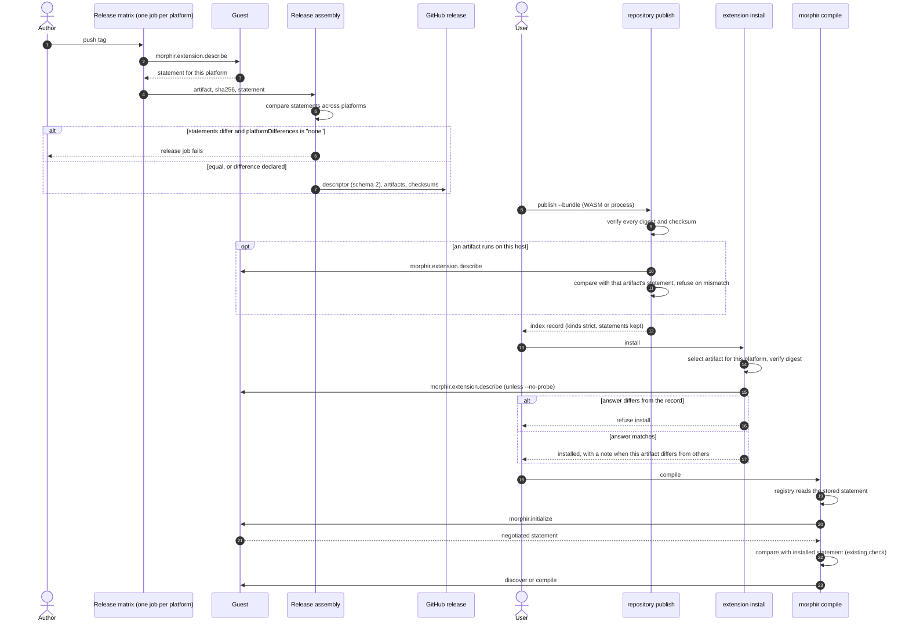

# Capability statements across the extension lifecycle

An extension's capabilities have one author: the extension itself. The extension states them in one
JSON document, the capability statement. Release tooling asks for that statement with a new protocol
method, `morphir.extension.describe`, and stores the answer. Publication keeps one statement per
artifact. Installation checks the statement against the artifact it selected. A session compares it
with what the extension reports at `morphir.initialize`. Nobody writes a capability into a manifest by
hand.

This note is the narrative home for that capability. Its status is proposed: nothing here has shipped.
The working spec is finos/morphir#921 (source `spec`). Where #921 and this note disagree, #921 is newer
until this note is updated. The work started in step 5 of finos/morphir#917 (source `single-file-spec`),
the spec for the single-file working thread finos/morphir#915 (source `single-file-thread`). Two
decision records fix the settled parts:

- [The guest authors its capability statement](/decisions/0003-the-guest-authors-its-capability-statement.md)
  records who writes the statement and how each phase handles it.
- [Readers ignore unknown members unless critical](/decisions/0004-readers-ignore-unknown-members-unless-critical.md)
  records how hosts and extensions stay compatible, and how the change is released.

## Terms

| Term | Meaning |
| --- | --- |
| host | The `morphir` CLI, or another program that starts an extension and talks MEP (the Morphir Extension Protocol) to it |
| guest | The extension program that the host runs: a native executable (`process` runtime) or a WASM module (`wasm` runtime) |
| capability statement | The JSON document in which a guest describes itself: identity, capability kinds, capability details and requirements |
| capability kind | One value in the statement's `extension.types` list, such as `frontend` or `workspace` |
| bundle descriptor | The JSON file that describes one release and lists its artifacts |
| index record | The entry that `morphir extension repository publish` writes into a repository index |
| installed record | The entry that `morphir extension install` writes into the user's installed catalog |
| probe | Start an artifact, send it `describe`, and compare the answer with a stored statement |

## The problem

Today three places state an extension's capabilities, and two of them must agree (source `spec`):

1. The guest reports them at `morphir.initialize`.
2. A person writes them in a release descriptor: `.github/extensions.toml` flags in finos/morphir-rust,
   and `extension.json` in finos/morphir-elm.
3. The host has parsers for the bundle descriptor, the index record and the installed catalog.

At every session the host compares the guest's report with the installed record built from the release
descriptor. When the capability kinds differ, the host refuses the session with "capability kinds
changed". So each new capability needs an edit to the descriptor, to the writer in each language, and to
the host parser.

The parsers make each change slower. Every one of them uses `deny_unknown_fields`, so a released CLI
rejects a new key until a new CLI ships. The `TRANSITIONAL_FIELDS` list in the `test:cli-release` task
exists to skip such keys. Both facts come from #921; this note did not check them against the source
files. The MEP draft already tells receivers to ignore unknown object fields in protocol messages
(source `protocol`, as quoted in #921). The distribution formats do the opposite.

Step 5 of #917 found two more gaps:

- `morphir extension repository publish` accepts only a single-artifact WASM bundle (source `publish`).
  It also rejects any file in the bundle directory other than `release.json`, the artifact and its
  checksum.
- The Elm extension releases six process archives and one `.release.json` with an `artifacts[]` list.
  That shape is not the bundle format, and publish refuses process bundles anyway. No tool turns an Elm
  release into an installed record. The only installed Elm records today come from hand-written index
  lines in tests.

[Elm extension delivery](/design/elm-extension-delivery.md) describes the second gap from the delivery
side, as the remaining process-bundle publication gap.

## The guest is the only author

Packaging asks the guest for its statement and stores the answer unchanged. Every later reader either
carries the stored statement or compares it with a fresh answer from the guest. A stored statement
cannot drift from the guest, because the guest wrote it. With the compatibility rules below, a new
capability needs a change in the guest only. Decision
[0003](/decisions/0003-the-guest-authors-its-capability-statement.md) records this principle and the
four decisions that follow from it.

A probe does not make a statement true. It proves that a record matches what the guest says. It does
not prove that the guest does what it says. That evidence comes from the Morphir Compatibility Kit, as
[Extensions declare IR capability sets](/decisions/0002-extension-capability-sets.md) records. The two
designs fit together: decision 0002 defines what a frontend puts inside `capabilities` about IR features,
and this note defines how that content travels. A future `lowers` member is one more member that readers
carry unchanged.

## The capability statement

A statement has the same content in every phase (source `spec`):

```json
{
  "statementVersion": 1,
  "protocolVersions": ["0.1"],
  "extension": {
    "id": "morphir-elm",
    "name": "Morphir Elm frontend",
    "version": "0.3.0",
    "types": ["frontend", "workspace"]
  },
  "capabilities": {
    "frontend": {
      "languages": [{ "id": "elm", "fileExtensions": [".elm"] }],
      "irVersions": ["3"],
      "compile": true,
      "incremental": false,
      "multiDocument": false
    },
    "workspace": { "protocolVersions": [1], "discover": true }
  },
  "requires": { "host": ">=0.4.0-alpha.7" },
  "critical": ["requires.host"]
}
```

Readers treat its parts in four ways:

- Readers check the kinds in `extension.types` strictly. A kind that a reader does not know is an error.
- Readers carry every member of `capabilities` unchanged. A reader uses the members it knows and ignores
  the rest.
- `critical` lists member paths that change meaning. A reader that does not understand a listed path
  refuses and names that path.
- `requires.host` is a semver range over the host version. A host outside the range refuses, and its
  message names the range.

#921 states these rules without a reason for the split between strict kinds and lenient members. Our
reading, which is an assumption: a kind decides which operations the host may call, so a guess is
unsafe. A member inside a known kind refines an operation the host already knows, so to ignore it loses
only the refinement.

## `morphir.extension.describe`

`describe` is a new MEP request that returns the capability statement (source `spec`):

| Field | Value |
| --- | --- |
| Kind | request |
| Allowed | before `morphir.initialize`, and in any later state before shutdown |
| Params | `{ "protocolVersions": ["0.1"] }`, the protocol versions the caller understands |
| Result | the capability statement |
| Side effects | none; the guest must not read a workspace, open a network connection, write files, or depend on environment values other than those the host passes |

After `describe`, the caller may send `morphir.exit` without a session. `describe` is optional for
guests. A guest that does not implement it answers `-32601` (method not found), or refuses the request
because it came before `initialize`. In both cases the host falls back to `initialize`,
`morphir.extension.capabilities`, `shutdown` and `exit`, and reads the same information from that
session.

## Lifecycle phases

Publish, install, update and uninstall stay host operations. The guest takes part in them only through
`describe`, so it cannot change anything while a host publishes or installs it.

| Phase | Who acts | What the guest answers | Guest side effects |
| --- | --- | --- | --- |
| package | release tooling, once per platform | `describe` | none |
| publish | `repository publish`, for each artifact that runs on the publishing host | `describe` | none |
| install | `extension install`, for the artifact it selected | `describe`, skipped with `--no-probe` | none |
| session | host | `initialize` returns the same statement, negotiated | none until the host calls an operation |
| operate | host | compile, generate, discover, validate, transform | only through host functions or inside the sandbox |
| shutdown | host | `shutdown`, then `exit` | release resources |

### What a probe means per runtime

A probe starts the artifact and sends `describe`. What that start costs depends on the runtime:

- For a `process` artifact, the host spawns the native executable under the same launch rules as a
  session. It clears the environment except for an allow-list, sets the working directory, applies a
  request timeout and kills the process on drop. There is no operating-system sandbox, so the process
  has the user's rights. It has the same rights at first compile. The probe moves the first execution
  from first compile to install. `--no-probe` exists for users who do not accept that.
- For a `wasm` artifact, the host instantiates the module in the WASM engine. The module is
  memory-isolated and has no direct file or network access.

## Bundle descriptor, schema 2

A release has one descriptor, with one entry per artifact. Each entry carries the statement that its
artifact returned from `describe` on its platform (source `spec`):

```json
{
  "schemaVersion": 2,
  "extensionId": "morphir-elm",
  "shortId": "elm",
  "version": "0.3.0",
  "gitCommit": "…40 hex…",
  "platformDifferences": "none",
  "artifacts": [
    {
      "platform": "aarch64-apple-darwin",
      "runtime": "process",
      "filename": "morphir-elm-extension-0.3.0-aarch64-apple-darwin.tgz",
      "sha256": "…",
      "statement": { "…": "as returned by describe on that platform" }
    }
  ]
}
```

- A WASM bundle is the case with one artifact and no `platform`.
- `platformDifferences` is `"none"` or `"declared"`. When the probed statements differ across artifacts
  and the value is `"none"`, the release job fails. That catches an accidental platform bug, and forces
  the author to write down an intended difference.
- A bundle directory holds the descriptor, every artifact it lists, and one checksum per artifact.
  Nothing else.

Artifacts of one release may differ because a WASM artifact and a process artifact of the same release
can have real differences. A single shared statement would hide them. The index record therefore keeps
every statement. A merged statement would claim a capability that some installed artifact lacks.

## Proposed flow

Figure 1 shows the proposed flow from a tag to a compile. Each phase that starts the guest sends only
`describe` until the session.



**Figure 1:** Proposed, not implemented. The guest is asked for its statement at package, publish and
install time, and every stored copy comes from one of those answers. The two `alt` blocks are the
failure paths a release author and a user can meet.

#921 also draws today's flows. In the WASM flow the packager copies hand-written flags into
`release.json` and never asks the guest, so the first comparison happens at `initialize`. In the Elm
flow publication stops at `publish --bundle`, because the release uses another schema and publish
refuses process bundles.

## Compatibility rules

Decision [0004](/decisions/0004-readers-ignore-unknown-members-unless-critical.md) records these five
rules (source `spec`):

1. Must-ignore unless critical. At every boundary (bundle descriptor, index record, installed record,
   statement, `describe` result) a reader ignores an optional member it does not understand. It refuses
   a member listed in `critical` that it does not understand.
2. Schema ranges. A host reads schema `N` and `N-1` of each format. A publisher writes the highest schema
   that the oldest host it targets can read.
3. Minimum host. An extension that needs a newer host states `requires.host` and lists it in `critical`.
4. `describe` is optional. On `-32601`, or on a refusal before `initialize`, the host falls back to a
   session.
5. Old records are converted. The host turns a record without a statement into a statement built from
   its flat keys, and marks it `declared` rather than `probed`. Install and the first session verify it
   as usual.

Rule 1 brings the distribution formats in line with what the MEP draft already says for protocol
messages.

## Release paths

With the rules in place, most changes ship on one side alone (source `spec`):

| Path | What must hold | Gate |
| --- | --- | --- |
| Host only | The new host reads every supported older descriptor, record and guest (rules 2, 4, 5) | A host compatibility suite: the new CLI publishes, installs and compiles with the latest released bundle of each first-party extension |
| Extension only | The extension works with the released host it targets, or states `requires.host` (rules 1, 3) | `test:cli-release` against the pinned CLI, extended to the Elm process bundle |
| Both | The host releases first, then the extension; never both at the same time | The host suite passes, the host releases, the extension pin moves, then `test:cli-release` passes |

Only a critical change needs the "Both" path.

### The bootstrap host release

Released hosts follow none of these rules, so one host release has to come first. It is a host-only
release that implements rules 1 to 5 and still reads schema-1 descriptors and records. Until it ships,
extensions keep writing the flat schema-1 keys. After it ships and the pins move, extensions adopt
statements and schema 2.

The same release meets the removal condition of three transitional mechanisms from #915: the legacy
compile envelope in the Rust SDK, `compile_wire_request` in the CLI, and the `TRANSITIONAL_FIELDS` skip.
All three retire when the pins move. The bootstrap host is the release that carries steps 5 and 6 of
#917.

## Consequences for work in flight

- The morphir-elm branch `feat/mep-workspace-discovery` writes `workspaceDiscovery: true` as a flat key.
  That is the old shape, but it is correct under schema 1, and the bootstrap host converts it (rule 5).
  The branch keeps the key. Its pull request waits until #921 is agreed.
- `multiDocument`, added in step 5 of #917, is in no installed record today. An installed provider
  therefore always reads as single-document. Statements fix that without a new record field.
- The MEP draft documents (sources `protocol` and `distribution`) do not yet describe `describe`,
  statements or schema 2. #921 names them as the durable home for this design.

## Alternatives rejected

Each row is argued in the decision record named in its last column.

| Option | Why not | Decision |
| --- | --- | --- |
| Keep adding boolean keys to the descriptor | Every capability needs a descriptor key, a writer in each language, a host parser change and a CLI release | [0003](/decisions/0003-the-guest-authors-its-capability-statement.md) |
| Probe only at publish | A process release has platforms that the publisher cannot run; the artifact that runs is only on the user's machine | [0003](/decisions/0003-the-guest-authors-its-capability-statement.md) |
| Reuse `initialize` for the probe | A session is heavier than a probe needs, and "no side effects" would be a convention instead of the contract of a method | [0003](/decisions/0003-the-guest-authors-its-capability-statement.md) |
| One statement shared by every artifact | Hides real differences, for example between a WASM and a process artifact of one release | [0003](/decisions/0003-the-guest-authors-its-capability-statement.md) |
| A merged statement in the index record | Claims a capability that some installed artifact lacks | [0003](/decisions/0003-the-guest-authors-its-capability-statement.md) |
| No install probe | A mismatch shows up only at first compile | [0003](/decisions/0003-the-guest-authors-its-capability-statement.md) |
| Keep strict parsers and skip new keys in tests | Every new key still needs a CLI release before an extension can use it | [0004](/decisions/0004-readers-ignore-unknown-members-unless-critical.md) |

## Unresolved

These questions are open in #921:

1. What canonical form do two statements take before a reader compares them (key order, number
   spelling)?
2. Which semver range syntax does `requires.host` use, and how does it match prerelease versions?
3. Does publish also probe WASM artifacts, which it can always run, and should that be required?
4. Should the artifact's provenance or signature cover the statement once publisher authenticity exists?
   This is open question 4 of the distribution design (source `distribution`).
5. Can a process probe get an operating-system sandbox where one is available, for example a restricted
   profile on macOS or a namespace on Linux?

What would change the position: if the bootstrap host release cannot keep reading schema-1 records, the
single-side release paths do not hold, and decision 0004 reopens. If a process probe turns out to need
more than `describe` to give a useful answer, the no-side-effects contract of decision 0003 reopens.

## Related documents

- [Elm extension delivery](/design/elm-extension-delivery.md) is the narrative home for how the Elm
  extension reaches users. Its process-bundle publication gap closes under this design.
- [Extensions declare IR capability sets](/decisions/0002-extension-capability-sets.md) defines the IR
  feature content that a frontend statement will carry, and how the MCK verifies it.
