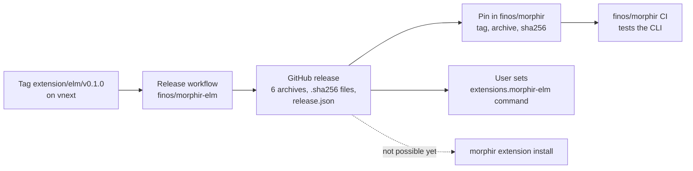

# Elm extension delivery

The `morphir-elm` extension is delivered as a process extension: one executable per platform, released
from finos/morphir-elm on its own tag. finos/morphir pins a released archive and tests its CLI against
it. Users cannot yet install the extension with `morphir extension install`; that part is open. This
note is the narrative home for that capability. It says what is done, what is next, and where the
supporting documents are.

## The capability

The capability is: a user or a CI job gets a working Elm frontend for the `morphir` CLI without
building it from source, and knows which version it has.

`morphir-elm` is the default Elm frontend. It is the Elm compiler from finos/morphir-elm, compiled to
JavaScript and wrapped into one executable with `bun build --compile`. The CLI starts that executable
and talks to it over standard input and output with MEP, the Morphir Extension Protocol (JSON requests
such as `compile`). That makes it a process extension. The other extension kind, a WASM extension, is
one `.wasm` file that the CLI loads in-process.

[Two Elm frontend providers](/decisions/0001-two-elm-frontend-providers.md) records why `morphir-elm`
stays the default while `morphir-elm-native`, a Rust frontend compiled into the CLI, is opt-in.

## Delivery path



**Figure 1:** How the extension moves from a tag to its consumers. Solid edges exist. The dashed edge
is blocked.

### Done: a release on its own tag

finos/morphir-elm#1286 (source `elm-release-pr`) merged into `vnext` on 2026-09-18. `vnext` is the
branch for this work, and the release workflow refuses a tag whose commit is not on it (source
`elm-release-workflow`).

The extension has its own version, in `cli2/mep/extension.json` (source `elm-extension-metadata`). It
does not follow the morphir-elm package version. The extension reports that version to the CLI, and
the CLI refuses an extension whose reported version differs from the version it was discovered with.
One file therefore feeds the tag check, the release descriptor and the running extension.

A tag `extension/elm/v<version>` starts the workflow. Bun cross-compiles the executable for the six
platforms the `morphir` CLI is released for, on one Linux runner. The workflow then runs the extension
test suite against the packaged executable on Linux x64, macOS arm64 and Windows arm64, and publishes
a GitHub release. The release holds one archive and one `.sha256` file per platform, and a
`release.json` descriptor with `runtime: "process"` and one artifact per platform.

The tag `extension/elm/v0.1.0` was pushed on 2026-09-18. Its first workflow run failed before it built
anything: the workflow ran the unit tests before the step that creates the files they import.
finos/morphir-elm#1287 moved the tests after the build, and a second run for the same tag published
the release on 2026-09-18. It holds 13 files: six archives, six `.sha256` files and the descriptor.
The release is not marked as latest, so `v2.100.0` stays the latest morphir-elm release.

### Done: finos/morphir pins the release

finos/morphir CI used to build the Elm extension from the `ecosystem/morphir-elm` submodule in a
`Build Elm extension` job, because no published artifact existed. The four WASM bundles already
followed a different rule: CI downloads the bundles pinned in
`.config/published-extension-bundles.toml` and checks each against a `sha256` recorded in the
repository (source `bundle-pins`).

The Elm extension now follows the same rule. The pin file has an `[executables.elm]` entry with the
repository, the tag, the `x86_64-unknown-linux-gnu` archive and the archive's `sha256`. The fetcher
downloads the archive, checks the digest, unpacks the executable, and CI passes its path to the tests
in `MORPHIR_ELM_EXTENSION_BIN`. The build job is gone, and a bump of the morphir-elm
submodule no longer starts the Rust jobs. bd issue `morphir-xgd9.10` tracks the same work for the
Scala extension, which has not started.

The rule behind both is an ownership split. The repository that owns an extension checks that its
extension works with the released CLI. finos/morphir checks that a CLI change does not break the
extensions users already have.

### Open: install through the CLI

`morphir extension repository publish` refuses any bundle that is not WASM (source `publish`). A user
therefore downloads the archive for their platform and points the CLI at the executable:

```toml
[extensions.morphir-elm]
command = "/path/to/morphir-elm-extension"
enabled = true
```

The release descriptor already carries what a process install needs: a platform, an archive and a
digest per artifact. The CLI resolver already selects a process artifact by platform. The missing part
is publication and installation of process bundles in finos/morphir-rust. Nobody has scoped that work.

## Related documents

- [A JavaScript runtime mode for extensions: exploration](/design/js-extension-runtime-exploration.md)
  compares ways to replace the per-platform executable with one portable JavaScript artifact. Its
  position is to stay with the process extension for now. finos/morphir#857 tracks the measurement
  that would revisit it.
- [Two Elm frontend providers](/decisions/0001-two-elm-frontend-providers.md) decides which Elm
  frontend is the default.

## Unresolved

- Three of the six executables have never run. The workflow tests three platforms natively.
  `aarch64-unknown-linux-gnu`, `x86_64-apple-darwin` and `x86_64-pc-windows-msvc` are built only.
- Process-bundle install has no owner and no issue.
- This capability has no Intent document yet. The work so far was tracked in bd (`morphir-xgd9.10`) and
  in GitHub pull requests.
- If `morphir-elm-native` reaches value-lowering and type-inference parity, decision 0001 is revisited,
  and the need to deliver a second Elm frontend as a separate artifact may end.
