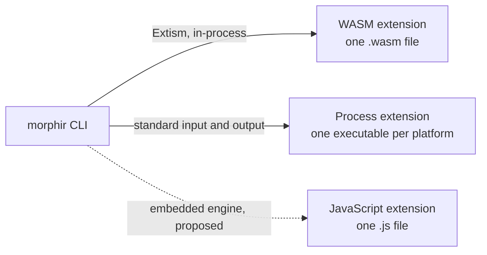

# A JavaScript runtime mode for extensions: exploration

The Elm extension stays a process extension for now. A JavaScript runtime inside the `morphir` CLI is
possible, and it would make JavaScript extensions portable and installable. We judge that no engine
that is cheap to embed runs the Elm compiler at an acceptable speed. The one engine we judge fast
enough would add an estimated 68 to 90 percent to the CLI binary.

This note belongs to one capability: delivering the Elm extension so that it is portable and
installable. [Two Elm frontend providers](/decisions/0001-two-elm-frontend-providers.md) is the other
document in that story, and finos/morphir#857 (source `issue`) tracks the follow-up. The note records
the options compared on 2026-09-18, so the next person does not repeat the survey. The size figures
are measured. No speed or fuel figure is measured; each one is marked as a judgement where it appears.

## Context

The CLI hosts two kinds of extension. A WASM extension is one `.wasm` file that the CLI loads through
Extism, a library for running WebAssembly plugins. A process extension is a separate executable that
the CLI starts and talks to over standard input and output. Both speak MEP, the Morphir Extension
Protocol: JSON requests such as `compile` and `generate`.

**Figure 1:** The two extension kinds the CLI hosts today, and the proposed third kind. The dashed edge
does not exist.

The Elm frontend `morphir-elm` is a process extension. Its compiler is the Elm-to-JavaScript output of
morphir-elm, and `bun build --compile` wraps it into one executable per platform (source `elm-mep`).
That shape has three costs:

1. It needs one build per platform. The morphir-elm workflow builds three targets (source
   `elm-mep-workflow`), while the CLI ships six (source `cli-release-workflow`).
2. `morphir extension repository publish` refuses any bundle that is not WASM (source `publish`), so
   users cannot install the extension through the CLI. They point `[extensions.morphir-elm] command`
   at a binary.
3. finos/morphir CI builds the extension from the submodule source, because no published artifact
   exists to download. finos/morphir#856 replaced that pattern for the four WASM bundles only.

A JavaScript extension format would remove all three: one artifact, installable, and downloadable by
pin. The question is which engine would run it.

## The constraint that decides it

We assume the Elm compiler is compute-bound, because it parses and type-checks whole packages. Nobody
has profiled it for this note. JavaScript engines split
into two groups for that kind of work. An engine with a JIT (a compiler that turns hot JavaScript into
machine code while it runs) is fast. An interpreter is slower by a wide margin. The judgement used
here, not measured, is 10 to 50 times slower for compiler-style code. LLRT, an interpreter-based
runtime, states the same limit about itself. Its README says tasks with "hundreds of thousands or
millions of iterations" show "notable performance drawbacks compared with JIT-powered runtimes"
(source `llrt`).

The WASM host also sets hard limits per request: 1,000,000,000 fuel, a 30 second timeout and 256 MB of
memory (source `container`). Fuel is the WASM runtime's count of executed instructions. For scale, the
`morphir-rust` extension (the Rust language frontend) needs up to 153 million fuel for a 4.6 KB input,
according to the comment beside that constant.

## Options

The engines named below are QuickJS (a small C interpreter), Boa, Nova and Brimstone (engines written
in Rust), V8 (the engine in Chrome and Node), SpiderMonkey (the engine in Firefox) and JavaScriptCore
(the engine in Safari). Javy and `extism-js` are tools that package QuickJS and a script into one WASM
file. Apart from the entries with a source, the rows rest on the crates' public documentation as read
on 2026-09-18, and they are unverified here.

| Option | Engine | JIT | Host change | Judged fit |
| --- | --- | --- | --- | --- |
| `extism-js` or Javy | QuickJS inside WASM | No | None | Works today, slowest |
| `rquickjs` | QuickJS, native | No | New runtime, small | Portable, slow |
| `llrt_core`, `llrt_modules` | QuickJS, native | No | New runtime, small | `rquickjs` plus Node-style modules; labelled experimental by its authors |
| `boa_engine` | Boa, pure Rust | No | New runtime, small | Easiest build, slowest native option |
| Nova, Brimstone | Pure Rust | No | New runtime | Not ready; Brimstone's author says it is not for production |
| `deno_core` | V8 | Yes | New runtime, large | The fast in-process option we would pick |
| `mozjs` | SpiderMonkey | Yes | New runtime, large | Also fast; judged a harder build with thinner documentation |
| Bun | JavaScriptCore | Yes | None possible | Not embeddable |

### JavaScript inside WASM

morphir-elm already builds one Extism plugin from Elm output: the interpreter (source
`elm-interpreter-wasm`). The build compiles Elm to JavaScript, patches it for the embedded engine, and
wraps it with `extism-js`. The patches show the cost of the approach. The build delays Elm start-up,
makes `_Process_sleep(0)` synchronous, and rewrites deep `&&` chains because the engine has a small
recursion limit. The published `interpreter.wasm` is 18.1 MB.

The same pattern would wrap the Elm compiler, and the host would need no change. The compiler code in
`cli2/mep/` takes its sources and dependencies from the request and reads no files. Only the 52-line
entry point (source `elm-mep-entry`) and the framing module depend on process input and output. The
framing module splits the byte stream on standard input into MEP messages. The risk is the budget: an
interpreter, running inside WASM, under a fuel limit. We judge it likely that a real project exceeds
the limit. That is the first thing a measurement would settle.

### Native QuickJS

`rquickjs` binds QuickJS, a small C engine, into Rust. It offers `set_memory_limit`,
`set_max_stack_size` and an interrupt handler, which map to the memory, recursion and timeout controls
the WASM host has today. It can compile a module to bytecode, so the host could compile an extension
once on first run and cache the bytecode under Morphir Home, the directory where the CLI keeps
installed extensions and caches. That cache saves parse time only. QuickJS
has no JIT, so a "compile on first run" step does not make execution faster.

We assume that removing the WASM layer makes QuickJS 1.5 to 3 times faster than the same engine inside
WASM. It still leaves the interpreter gap to V8.

### V8 through `deno_core`

`deno_core` embeds V8, defines host functions as Rust operations, and gives the guest no file or
network access unless the host adds it. It supports start-up snapshots, so an initialised Elm compiler
could load warm. We judge it the practical way to run the Elm compiler at about Node speed.
`mozjs` also has a JIT, but we judge its build harder.

The cost is size and build risk. V8 adds an estimated 30 to 40 MB to the binary (not measured here).
The `v8` crate downloads a prebuilt library per target. We assume its support for Windows ARM64 and
musl is weak; the crate's target list was not checked for this note. Both matter because the CLI
releases for six targets.

### Bun

Bun moved from Zig to Rust in 2026. The Bun blog states that v1.3.14 is the last Zig version and
v1.4.0 the first Rust version (source `bun-rust`). The engine is still JavaScriptCore, a C++
dependency, and the post describes no crate or in-process embedding interface. Bun remains a program
to start as a child process, which is what the process extension already does.

## Size of the CLI today

The figures come from the `v0.4.0-beta.1` GitHub release. `gh release view` reports archives between
17.6 MB and 20.2 MB. The `morphir` binary inside `morphir-0.4.0-beta.1-aarch64-apple-darwin.tgz` is
44.2 MB, as `ls -l` reports it. The release profile sets `opt-level = 3`, `lto = true` and `codegen-units = 1`
(source `release-profile`). It optimises for speed, and it sets neither `strip` nor `panic = "abort"`.
Running `strip` on that binary gives 37.4 MB, about 15 percent smaller. We did not try
`opt-level = "s"`.

Against that base, `rquickjs` adds about 1 MB and Boa a few MB (both estimates; source `boa` for the
engine). The V8 estimate of 30 to 40 MB is 68 to 90 percent of the current binary.

## Position

Considered and rejected for now:

- JavaScript inside WASM, because we judge the fuel and time budget too small for the Elm compiler, and
  nobody has measured it.
- Native QuickJS or Boa. The engine is small to embed, but a new runtime brings a sandbox, limits and
  a third artifact kind to maintain. We judge that too much for an engine that is too slow for the one
  extension that needs it.
- V8, because it adds an estimated 68 to 90 percent to the binary, and we assume it puts two of six
  release targets at risk.
- `mozjs`, because it has the same size cost as V8 with a build we judge harder.
- Nova and Brimstone, because neither is ready for production use.
- Bun, because it cannot be embedded.

The process extension keeps full Elm support at native speed, and its three costs have cheaper fixes.
morphir-elm can publish the executables it already builds as release assets, which lets finos/morphir
CI download a pinned binary instead of building one. Install through the CLI needs process-bundle
publication in morphir-rust. Both fixes are tracked as bd issue `morphir-xgd9.10`.

[Two Elm frontend providers](/decisions/0001-two-elm-frontend-providers.md) says to revisit the default
Elm frontend once `morphir-elm-native`, the Rust frontend compiled into the CLI, reaches value-lowering
and type-inference parity. Our reading, which that record does not state, is that the native frontend
then becomes the default. If so, a JavaScript runtime added for Elm alone has a short useful life.

## Unresolved

No speed or fuel claim in this note is measured. We estimate that one to two days of work would replace
the judgements with numbers. The measurement runs the Elm compiler on the morphir-elm reference model
and records time, memory and fuel under four engines:

- `extism-js` inside the current WASM host
- native `rquickjs`
- `boa_engine`
- Node, as the V8 baseline

These findings would change the position:

- QuickJS compiles a real project inside the host limits. Native `rquickjs` then becomes the cheap way
  to a portable, installable Elm extension.
- A second JavaScript or TypeScript extension is planned. The runtime then serves more than Elm, and
  its cost is shared.
- Bun or another JIT engine ships a supported Rust embedding interface.
- `morphir-elm-native` reaches value and type-inference parity. The Elm case for a JavaScript runtime
  then disappears.
