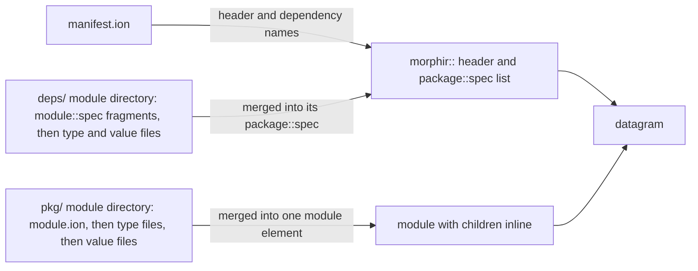

# Amazon Ion IR format

An unreleased draft adds a third physical format for Morphir IR, [Amazon Ion](https://amazon-ion.github.io/ion-docs/),
beside JSON and YAML. The draft uses one Ion spelling for two layouts. A single file holds one distribution as a
datagram of annotated elements. A document tree holds the same elements, one file per path, and the path supplies the
names. Both layouts cover IR v3 and IR v4. This page is the narrative home for that capability. The normative text is
the draft [`docs/design/draft/ir/ion.md`](https://github.com/finos/morphir/blob/main/docs/design/draft/ir/ion.md).

## Status: unreleased

Nothing on this page has shipped. The codec is in [finos/morphir-rust#233](https://github.com/finos/morphir-rust/pull/233),
and [issue 946](https://github.com/finos/morphir/issues/946) tracks the plan. The spelling contract is `ionVersion`
`0.1.0-draft.1`. A draft version matches only that exact string. Any change to the spelling can therefore break a file
written today.

The IR v4 specification pages and schemas describe the JSON and YAML trees only, and IR v4 itself is still being
stabilized (see [IR v4 stabilization](/ir-v4-stabilization.md)). The Ion tree is not part of that specification. The
Morphir Compatibility Kit (MCK) is the shared test suite that every IR binding runs, and its protocol schema still
lists only the `json` and `yaml` profiles.

When a release ships the codec, the release author adds a Capability page and records the release here. Until then,
this knowledge base describes the format as intent, not as behaviour a user can rely on.

## Delivery

This repository has no intent bundle yet, so issue 946 carries the plan. Table 1 maps its steps to their state on the
`feat/amazon-ion-ir` branches.

| Step in issue 946 | State on the branch |
| --- | --- |
| 1. Draft specification | Written in `docs/design/draft/ir/ion.md`, with the tree section added |
| 2. Format registration | Done. The plan kept the tree JSON or YAML; the Ion tree was added later at a maintainer's request |
| 3. v3 round trip | Done for a library without dependencies |
| 4. v4 nodes | Partly done. A v4 library reads and writes; the other kinds and most nodes remain |
| 5. Fixtures and diagnostics | Partly done. Two v4 fixtures and one v3 fixture round-trip; the listed diagnostics are not all asserted |

**Table 1:** Plan steps against the branch state as of finos/morphir-rust#233.

## Context

JSON and YAML trees carry the IR as a JSON value tree. That shape is exact but verbose, and it has no place for a node
tag other than a wrapper object. Ion has two features that fit the IR. An *annotation* is a symbol written before `::`
that tags a value, as in `public::def::module::{ ... }`. An *S-expression* is a parenthesized list whose head can name
a node, as in `(apply f x)`. [Ion Schema](https://amazon-ion.github.io/ion-schema/) uses annotations the same way.

Three constraints shape the design. Each one was adopted in the design discussions
([938](https://github.com/finos/morphir/discussions/938) for v3, [942](https://github.com/finos/morphir/discussions/942)
for v4):

- A reader builds the same IR value that the JSON codec builds from the corresponding document, for v3 and v4.
- An author can write a distribution by hand without deep nesting.
- The document tree uses the paths the JSON and YAML trees use, so tools that walk a tree keep working.

The choice of Ion itself came from a maintainer request. This note does not compare Ion with other encodings such as
CBOR, and it treats that choice as an assumption.

## The single-file spelling

A single file is a datagram: a `morphir::` header, then packages, modules, types and values as top-level elements,
then `morphir_footer::{}`. The draft also lets a reader accept the same content collapsed into one `morphir::` record.
The datagram and the record are inverse forms of one file. A writer that starts from the IR emits the datagram. The
branch reads the record for v3 only.

Annotations name the node, in the order access, role, kind: `public::def::alias::type`, `public::spec::opaque::type`,
`public::def::value`. Grouping headers put the noun first: `package::spec`, `module::spec`. Names are canonical strings
such as `example/finance` or `morphir/SDK:basics#int`, as
[decision 0001](/decisions/0001-name-canonicalization-and-initialism-encoding.md) defines them. Value expressions are
S-expressions whose head is the IR node, and `apply` stays binary.

Elements merge additively. An inline `types` list inside a module combines with top-level types that name the same
module, in document order. A `module::spec` or `package::spec` may repeat, and its fragments merge. One
`public::def::module` owns a definition module. A name defined twice after the merge is refused.

The draft holds the full element table, the value heads, and the v4 additions: native hints, external bodies,
incompleteness, and document literals.

## The document tree

An Ion tree uses the JSON tree's paths with the `.ion` extension. Each file holds single-file elements, and the path
is the scope. A dependency sits under `deps/<package>/@/`, where the bare `@` is the version segment of
[decision 0015](/decisions/0015-dependency-directories-are-nested-with-a-version-segment.md).

| File | Holds |
| --- | --- |
| `manifest.ion` | The `morphir::` header, then one `package::spec::{ name }` per dependency |
| `pkg/<package>/<module>/module.ion` | The module element, then any of its types and values |
| `pkg/<package>/<module>/<stem>.type.ion` | One type |
| `pkg/<package>/<module>/<stem>.value.ion` | One value |
| `deps/<package>/@/<module>/...` | The same three kinds of file, holding specifications |

**Table 2:** What each file of an Ion tree holds.

The path supplies the package, the module, and a node's name, so a file may omit `package`, `module` and `name`. A name
that is present must match the path. A type or value inside `module.ion` states its name, because no path names it.

The path budget is the most characters a tree path may use, and a stem that does not fit is cut
([decision 0012](/decisions/0012-one-legacy-name-grammar-and-one-file-stem-definition.md)). A cut stem keeps a prefix of
the name, then `__` and the first eight hex digits of the SHA-256 digest of the full stem. A cut stem no longer spells
the name, so that file keeps its `name`. A reader checks the stated name against the cut stem by that prefix and
digest.

A reader turns the tree into one datagram and hands it to the single-file decoder. Figure 1 shows which files feed
which part of the datagram.

**Figure 1:** Proposed (unreleased) reading of an Ion tree: each directory merges into one element of the datagram.

The datagram order is the header, each dependency, each module in path order, and then a footer. Inside a module
directory the module file comes first, then the type files, then the value files, each in path order. Children merge by
the single-file rules. A type or value defined twice after the merge is refused. A dependency directory holds
`module::spec` fragments, which may repeat. A `pkg/` directory holds exactly one `public::def::module` or
`private::def::module`.

On the branch, the writer runs the other way. It builds the single-file datagram and takes it apart. `module.ion`
receives only the module header. Each type and each value gets its own file, and every name the path supplies is
removed. The branch sink holds the whole distribution until the stream ends, so an Ion tree does not stream module by
module as a JSON tree does.

### Names that look like tree files

A module, type or value may be named `manifest` or `module`. The distribution manifest is only the tree root's
`manifest.ion`. A module's own file is only the `module` leaf of its directory. A node file always ends in `.type` or
`.value`. An escaped name holds only lowercase letters, digits, `-` and `_`, so it cannot contain those suffixes or a
`/`.

| Name | Path |
| --- | --- |
| Module `manifest` in package `example` | `pkg/example/manifest/module.ion` |
| Type `manifest` in module `manifest` | `pkg/example/manifest/manifest.type.ion` |
| Type `module` in module `manifest` | `pkg/example/manifest/module.type.ion` |
| Module `manifest/module` | `pkg/example/manifest/module/module.ion` |
| Type `con` in module `module` | `pkg/example/module/con_.type.ion` |

**Table 3:** Names that look like tree files, and the paths they take.

`con` is a Windows device name. Decision 0001's escape appends `_` to such a stem, and a reader removes it. A
`module.ion` directly under the package directory is refused, because a module path has at least one name. The test
`modules_and_types_named_like_tree_files_round_trip` in `crates/morphir-common/tests/ion_document_tree.rs`
(finos/morphir-rust#233) writes and reads back every row of Table 3.

## Alternatives considered

The first Ion tree kept the JSON tree's file schema. It wrote each file as the JSON profile's canonical text, which is
valid Ion, through the kit's layout writer and reader. It was rejected because an Ion tree file then shared nothing
with the single-file spelling. An author had to learn two Ion shapes for one format, and the tree used none of Ion's
annotations. The annotated tree replaced it before any release (discussions 938 and 942 record both).

Annotated structs for values, with no S-expressions, were rejected because a value tree of nested structs is as
verbose as the JSON form. Scheme-style juxtaposition for application (`(f x y)`) was rejected because the IR's `Apply`
is binary, and a reader would have to guess the nesting. A `group` field for arbitrary grouping was rejected because
package and module names already group elements.

Ion is not a kit profile, for the single file or for the tree. The kit's profiles turn text into a JSON value tree,
and annotated elements are not that tree. The Ion codec in morphir-rust owns both layouts and shares only the path
grammar with the kit.

## Coverage on the branch

The codec's tests on the branch show this coverage. No release promises it. The tree covers what the single-file codec
covers, because it reads through the same decoder.

| IR | Read and written |
| --- | --- |
| v3 | A library with modules, alias and custom types, and values; no dependencies |
| v4 | A library with specification dependencies |
| v4 | Alias and draft-incomplete type definitions; opaque and alias type specifications |
| v4 | Value definitions with an expression body or a native body with any hint except `platformSpecific` |
| v4 | Expressions that are a float literal or a hole whose reason is an unresolved reference |

**Table 4:** What the branch decoder and encoder accept.

The branch CLI writes an Ion tree as v4 only. A v3 Ion tree works through `DocumentTreeSink` and `DocumentTreeSource`
in `morphir-common`, which is the transport API the CLI itself calls.

## Unresolved

- The v4 `specs` and `application` distribution kinds, external and incomplete value bodies, `platformSpecific`
  hints, document literals, and every v4 value head except `float` and `hole` are in the draft but not implemented.
- v3 dependency specifications are in the draft but not implemented.
- A tree orders modules, and the members inside a module, by path. A v3 module's member order therefore changes on a
  round trip. If a consumer depends on member order, the tree needs an order list, and that list would bring back the
  listing the design avoids.
- Whether a v4 package specification carries Morphir annotations is open in
  [issue 944](https://github.com/finos/morphir/issues/944). The Ion spelling follows that decision.
- `ionVersion` stays a draft until the first morphir CLI release that ships the codec. That release fixes the contract
  under
  [morphir-cli decision 0003](https://github.com/finos/morphir/blob/main/kb/bundles/morphir/morphir-cli/decisions/0003-semver-is-the-default-contract-versioning-scheme.md).
  How `ionVersion` sits beside `formatVersion` in a reader's support table is not yet written into
  [Format-version support and revisions](/format-version-support.md).
