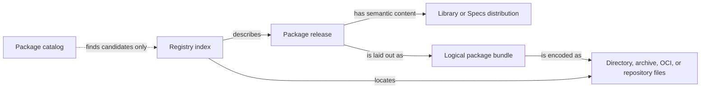
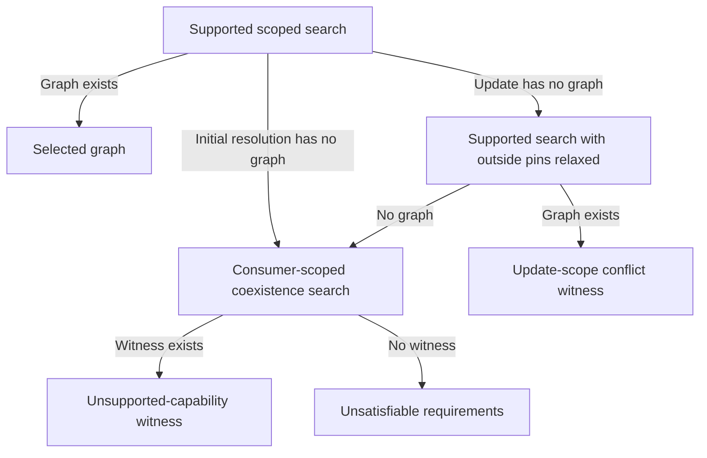

# Morphir model package system

## Summary

Morphir needs a package system for reusable, language-neutral model functionality that does not depend on the Elm package manager or any one implementation language. The package system must work across Morphir implementations, support distributed and enterprise repositories, preserve reproducibility and provenance, and coexist with the existing Morphir IR distribution model.

This design keeps three artifact domains distinct:

1. Model packages
2. Executable extensions
3. Installable tools

They may share acquisition, caching, content addressing, signature verification, delegation, and storage components where the semantics match. Their manifests, dependency rules, installation state, and runtime behavior remain separate.

The core design is:

- Published model packages are IR-first.
- A package has an authority-bearing logical path independent of its repository.
- An exact release is `PackagePath + SemVer`.
- Package paths do not gain Go-style major-version suffixes.
- Core IR definitions and references remain package-release-version-free. Packaging selects releases; distributions supply dependency binding context.
- Common use cases have one implicit binding per dependency IR Package name in each consumer. Explicit multi-binding support follows in the graph-aware stage.
- Exact versioned release nodes and dependency edges allow incompatible releases to coexist.
- Human authoring configuration, exact locks, and published release manifests are separate documents.
- Package distributions are semantic IR values; package bundles are transport-neutral logical content layouts.
- Library releases provide implementations. Contract releases provide specifications for externally supplied implementations.
- Application distributions are portable model closures. Target-specific provider bindings remain separate.
- Registry indexes are separate from package content and may be implemented by local directories, static Git or HTTPS, OCI, or hosted services.
- Namespace delegation, release signing, immutable content, complete locks, and a package suite in the Morphir Compatibility Kit (MCK) are required parts of the system.

The package system keeps semantic content, logical packaging, transport, and discovery separate.



**Figure 1:** A package release keeps one identity while its semantic distribution, logical bundle, and transport encoding remain distinct.

## Motivation

Morphir packages currently inherit assumptions from source-language package managers, local file dependencies, and monolithic `morphir-ir.json` workflows. This causes several problems:

- A language-neutral model cannot use a language-specific package manager as its ecosystem contract.
- Existing package names do not establish decentralized ownership.
- A package identity is often conflated with its Git repository, registry, or archive URL.
- Existing Distribution dependency maps are not complete package-manager metadata.
- Legacy FQNames and dependency maps do not distinguish multiple releases of one package path.
- A single JSON file, document tree, archive, Git checkout, and registry entry are often all described as a "distribution" even though they have different responsibilities.
- Local source overrides can accidentally appear to be published immutable releases.
- Tools implemented in different languages lack a shared resolution and diagnostic contract.

The desired user experience combines useful properties from Deno and JSR, Gleam, Go, Cargo, MoonBit, and content-addressed artifact systems without copying any one system wholesale.

## Research inputs

### Morphir discussions and repository history

The design incorporates the following FINOS Morphir discussions:

- [Distributions, versioning, and migrations](https://github.com/finos/morphir/discussions/55) explains that Distribution was introduced above Package to supply identity and dependency context, while version policy was deferred to package management.
- [Package Manager for Morphir](https://github.com/finos/morphir/discussions/88) proposes package-management abstractions with pluggable existing package systems rather than a language-specific dependency.
- [Package Management](https://github.com/finos/morphir/discussions/146) describes publishing, consuming, and versioning Morphir IR and related schemas.
- [Static vs. dynamic linking for Morphir IRs](https://github.com/finos/morphir/discussions/160) identifies the need for transitive interface and implementation loading, tree shaking, and version-conflict handling.
- [More granular IR format](https://github.com/finos/morphir/discussions/203), [Morphir file based layout](https://github.com/finos/morphir/discussions/214), and [Enhancing the Morphir IR](https://github.com/finos/morphir/discussions/289) establish that a logical Distribution can be represented as one document or a document tree.
- [Adding Bundle as another Distribution kind](https://github.com/finos/morphir/discussions/211) proposes a full package-definition closure comparable to a fat JAR or JavaScript bundle.
- [Add a new Distribution case known as Application](https://github.com/finos/morphir/discussions/218) refines Bundle into a reusable Library versus executable Application distinction, including entry points, SDK handling, tree shaking, equivalence, and compatibility.
- [Making the IR more composable](https://github.com/finos/morphir/discussions/220) records the composability cost of globally fully qualified references.

Relevant repository history includes the May 2023 change to include dependency specifications in a Distribution and the June 2023 change to treat the generated top-level value as a Distribution rather than generic IR.

### Existing Morphir designs

The design reconciles:

- `docs/spec/draft/packages.md`
- `docs/spec/draft/distribution.md`
- `docs/design/draft/ir/packages.md`
- `docs/design/draft/ir/distributions.md`
- `docs/design/draft/daemon/packages.md`
- `docs/design/draft/daemon/dependencies.md`
- `docs/spec/morphir-toml/morphir-toml-specification.md`
- `wit/morphir-ir/packages.wit`
- `wit/morphir-ir/distributions.wit`
- `ecosystem/morphir-scala/kb/bundles/intent/0013-pluggable-package-resolution-and-materialization.md`
- `ecosystem/morphir-scala/kb/bundles/morphir/morphir-scala/design/package-url-package-management.md`
- `ecosystem/morphir-scala/kb/bundles/morphir/morphir-scala/design/moonbit-package-management.md`
- [finos/morphir-scala#932](https://github.com/finos/morphir-scala/issues/932)

The older umbrella draft treats a package as a compiled IR archive and proposes npm, Maven, and GitHub Releases as backends. The newer Scala design separates identity from source, uses exact verified materialization, and proposes a small registry capability with Git-file and local-directory implementations. This design retains the IR-first package boundary while adopting the newer identity, source, lock, and verification separation.

### Current IR and MCK integration, 2026-09-16

The [MCK overview](https://github.com/finos/morphir/blob/main/spec/mck/README.md) defines one kit with domain suites.
The IR suite exists at `spec/ir/mck/`. The draft package suite at `spec/package/mck/` executes
normalization, byte digests, schemas, and closed Library-set integrity through the shared TypeScript core.
The Rust `morphir-package` library implements the same bounded operations independently.
Its package adapter uses the shared driver; the IR adapter remains the default mode.

This reconciliation uses Morphir commit `2cd0dcd0e0236a38e577eff90fad67339aa42449` and its pinned morphir-typescript commit
`46197e289b437038427f964cca6f1f54c03044a1`, which includes decision 0015 and qualified-module naming tests.
[Morphir PR #810](https://github.com/finos/morphir/pull/810) has merged with the YAML/tree specification and kit changes.
[Morphir PR #812](https://github.com/finos/morphir/pull/812) then clarified module naming and extended its generated fixtures.
[Morphir PR #813](https://github.com/finos/morphir/pull/813) validates tracked IR fixtures and refreshes the Rust and TypeScript pins.

| Recent work | Consequence for packages |
| --- | --- |
| [Morphir PR #809](https://github.com/finos/morphir/pull/809) runs MCK through in-process and executable adapters and checks IR vocabulary coverage | Extend the existing MCK infrastructure. Running one codec through two transports does not meet the two-independent-implementation exit criterion. |
| [TypeScript PR #6](https://github.com/finos/morphir-typescript/pull/6) adds the driver, protocol, embedded kit, provenance lock, and release machinery | Pin driver and kit revisions separately. Reuse provenance and adapter components where they fit package operations. |
| [TypeScript PR #7](https://github.com/finos/morphir-typescript/pull/7) tightens protocol validation | Contract version 1 rejects unknown fields. Package operations and suite-aware reports need explicit versioned evolution. |
| [TypeScript PR #8](https://github.com/finos/morphir-typescript/pull/8) implements YAML and document trees, including reader-only cases | Reuse IR codecs and logical-path handling for supported payloads. Package verification still owns release metadata, signatures, content digests, and safe materialization. |
| [Decision 0015](https://github.com/finos/morphir/blob/8d1a3d8d499c2d9ca94b89c32e0c60e1ecca5f96/kb/bundles/morphir/morphir-ir/decisions/0015-dependency-directories-are-nested-with-a-version-segment.md) and [TypeScript PR #9](https://github.com/finos/morphir-typescript/pull/9) add the dependency `@` boundary and reject duplicate dependency names | Reuse the specified layout. A bare version slot carries no release identity; package versioning and multiple-release graphs still need explicit model support. |
| [Morphir PR #812](https://github.com/finos/morphir/pull/812) and [TypeScript PR #10](https://github.com/finos/morphir-typescript/pull/10) distinguish package-relative Module names from `package:module` and test the qualified-name corpus | Default exports derive from the module-relative path. Dependency slots select packages independently; concatenating package and module paths with `/` is ambiguous. |
| The current Distribution model has Library, Specs, and Application variants, with dependencies keyed by IR Package name | These are the semantic payloads. Exact versioned dependency slots, Contract release metadata, and package-instance graphs remain package-system work. |

TypeScript's embedded `kit.lock.json` pins Morphir commit `94d5cc864683a6a5f15dc90d92b70fa605f4da47`.
Cross-implementation comparisons must pin the kit content and required capabilities, including when an embedded kit
and a checkout have different provenance revisions. A capability that an adapter skips is not tested by a successful run.

The latest TypeScript naming tests consume `qualifiedModuleNameCases` from the generated naming corpus. That corpus
remains separate from the embedded MCK Markdown cases. Package checks must declare and supply every required fixture
source; an optional-fixtures test mode cannot establish coverage for a corpus it did not load.

The naming-corpus drift check passes at this baseline with morphir-rust pinned to
`933fcf580b9bfe191f0218964a588027fb86c2d6`. This resolves the fixture drift previously reported in bead `morphir-klsu`.
That task retains verification of Rust test coverage; matching fixtures and passing TypeScript tests do not establish Rust coverage.

The npm libraries and downloadable MCK executables use host-language package and tool distribution mechanisms.
Their release machinery does not make them Morphir model-package releases. Model packages, executable extensions,
and installable tools continue to have distinct contracts.

### External package ecosystems

- [JSR packages](https://jsr.io/docs/packages) and [publishing](https://jsr.io/docs/publishing-packages) separate a scoped package release from declared exported entry points.
- [Deno configuration](https://docs.deno.com/runtime/reference/deno_json/) supports import maps and explicit dependency-facing names.
- [Gleam configuration](https://gleam.run/documentation/gleam-toml-reference/) and [module use](https://gleam.run/writing-gleam/) separate package requirements from imported modules and local aliases.
- [Go modules](https://go.dev/ref/mod) use authority-like module paths, one selected version per module path, and source replacement independent of the declared requirement. This design does not adopt Go's major-version path suffix.
- [Cargo package IDs](https://doc.rust-lang.org/cargo/reference/pkgid-spec.html), [dependency aliases](https://doc.rust-lang.org/cargo/reference/specifying-dependencies.html), and [registries](https://doc.rust-lang.org/cargo/reference/registries.html) demonstrate exact versioned graph nodes, multiple-version coexistence, local aliases, and source-aware resolution.
- MoonBit separates a versioned publishing module from packages inside it and supports package import aliases. Its current resolver groups requested versions into compatibility sets and can retain incompatible major versions of one module as separate exact graph nodes. The useful lesson is contextual version-aware dependency edges, not MoonBit's exact compatibility policy or implementation.
- [.NET reference assemblies](https://learn.microsoft.com/en-us/dotnet/standard/assembly/reference-assemblies) provide public API metadata without usable implementations and may act as contracts implemented by multiple platforms.
- [F# signatures](https://learn.microsoft.com/en-us/dotnet/fsharp/language-reference/signature-files) and [OCaml module interfaces](https://ocaml.org/docs/modules#interfaces-and-implementations) provide the semantic precedent for a specification that implementations satisfy.
- [Package URL](https://github.com/package-url/purl-spec) is an interoperability identifier. It is not a dependency solver, namespace authority, export model, or source-substitution model.

## Goals

- Publish and consume reusable Morphir model packages outside source-language package managers.
- Define stable authority-bearing package identity independent of source and registry.
- Support Library and Contract package releases.
- Support exact reproducible resolution with multiple incompatible releases where necessary.
- Support useful source import aliases and public module exports.
- Support local, Git, vendored, offline, static HTTP, OCI, and hosted-registry workflows.
- Define immutable transport-neutral package content with integrity and provenance.
- Preserve a gradual migration path for existing Morphir IR and `morphir.json` projects.
- Define shared diagnostics and the language-neutral MCK package suite.
- Permit shared infrastructure with extensions and tools only where semantics agree.

## Non-goals

- Unify model packages, executable extensions, and installable tools into one artifact schema.
- Make npm, Maven, OCI, Git, or any hosted registry part of package identity.
- Use PURL version ranges, qualifiers, or subpaths as Morphir dependency or export semantics.
- Require source code in a published model package.
- Treat generated code as the normative model package payload.
- Prove behavioral equivalence for arbitrary model implementations.
- Require all Morphir implementations to migrate IR formats at once.
- Define a central package catalog as part of deterministic resolution.
- Copy MoonBit's AGPL implementation or registry schema.

## Design principles

1. Keep identity, requirement, source, resolution, materialization, and import names distinct.
2. Make published semantics IR-first and immutable.
3. Keep semantic Distribution types separate from physical package transport.
4. Make exact dependency edges explicit in locks and Application distributions.
5. Preserve stable package names across incompatible versions.
6. Prefer explicit typed variants over overloaded strings and boolean flags.
7. Fail closed for authority, integrity, and signature failures.
8. Make ordinary builds consume locks without silent re-resolution.
9. Keep local development flexible without allowing snapshots to impersonate releases.
10. Specify observable behavior with schemas and MCK cases, not one reference implementation.

## Domain model

```text
PackagePath
    + exact SemVer
    = PackageReleaseId

PackageRelease
├── LibraryRelease
│   ├── normative LibraryDistribution
│   └── derived SpecsDistribution
└── ContractRelease
    └── normative SpecsDistribution

PackageRequirement
├── PackagePath
└── VersionConstraint

DependencySlot
├── local stable slot name
└── PackageRequirement

ResolvedGraph
├── PublishedReleaseNode(PackageReleaseId, source, digests, metadata)
├── UnpublishedSnapshotNode(snapshot identity, source, digests, provenance)
└── ResolvedDependencyEdge(from node, slot, to node)

ApplicationDistribution
├── root package
├── exact resolved model graph
├── Library implementations
├── Contract requirements
└── entry points

ApplicationBinding
└── ContractReleaseId + SpecsDigest -> executable provider + artifact digest
```

### Core distinctions

| Concept | Responsibility |
| --- | --- |
| Morphir package | Logical named collection of reusable modules |
| Package release | Immutable versioned Library or Contract release |
| Distribution | Typed semantic IR value: Library, Specs, or Application |
| Package bundle | Canonical logical content layout for one release |
| Transport encoding | Directory, archive, OCI, or repository-specific envelope |
| Package registry | Publication and deterministic resolution authority |
| Package catalog | Non-authoritative search and discovery view |

## Artifact-domain separation

Model packages, extensions, and tools have different semantics:

| Concern | Model package | Extension | Tool |
| --- | --- | --- | --- |
| Normative content | Morphir IR | Executable capability provider | User-launched executable/application |
| Dependency graph | Model requirements and exact release edges | Host/protocol/runtime requirements | Platform/install/update requirements |
| Primary operation | Resolve for compilation, analysis, linking | Select, load, negotiate, invoke | Install, select active release, launch |
| Runtime state | Package materialization and model graph | Loaded provider instances | Installed and active tool release |

Shared components may include:

- Source descriptors
- Content-addressed storage
- Safe archive extraction
- Transport adapters
- Hashing and signature primitives
- TUF-style delegation machinery
- DSSE/in-toto-style signed statement envelopes

The shared components do not imply a shared manifest, resolver, registry catalog, or lifecycle command.

## Package identity and namespace authority

### Package path

`PackagePath` is an authority-bearing logical name. Example:

```text
finos.org/morphir/finance/loan-rules
```

The `finos.org` prefix establishes the authority. It is not the package download URL and need not serve the package bytes.

The final specification must define a canonical grammar, case normalization, Unicode policy, reserved segments, maximum lengths, and a filesystem-safe registry mapping. Case-colliding names must be rejected or encoded so a registry is portable to case-insensitive filesystems.

### Package release ID

```text
PackageReleaseId = PackagePath + exact SemVer
```

Example:

```text
finos.org/morphir/finance/loan-rules@2.1.3
```

Repository URL, registry URL, Git commit, mirror, content digest, local alias, and export path are not components of the Package release ID.

### Authority discovery and delegation

An authority may expose a well-known HTTPS document:

```text
https://finos.org/.well-known/morphir-packages.json
```

It provides signed, versioned delegation metadata mapping namespace prefixes to registry indexes and publication keys. HTTPS establishes initial control of the authority name. Signed metadata enables offline verification, key rotation, and mirrors.

Enterprise and offline configuration may explicitly pin the same metadata and redirect acquisition to approved mirrors. A mirror acquires no publication rights from serving byte-identical content.

Locks retain the authority-delegation digest and registry snapshot needed to explain and reproduce a resolution.

## PURL interoperability

Package release identity remains a native domain value. Once an official Morphir PURL type is registered, an exact release can map reversibly to an external PURL such as:

```text
pkg:morphir/finos.org/morphir/finance/loan-rules@2.1.3
```

Proposed mapping:

| PURL component | Morphir value |
| --- | --- |
| type | `morphir` |
| namespace | All PackagePath segments except the final segment |
| name | Final PackagePath segment |
| version | Exact release SemVer |

PURL is for SBOM, provenance, catalog, vulnerability, and generic repository interoperability. It does not represent:

- Version constraints
- Dependency slots
- Import aliases
- Registry or source selection
- Resolved graph edges
- Public exports
- Unpublished snapshots

PURL `subpath` is a physical location inside package content. It must not encode a logical Morphir export path.

PURL registration follows, rather than blocks, the first working package format and registry.

## Release kinds and distributions

### Library release

A Library release provides reusable Morphir implementations.

- Normative payload: one Library distribution
- Derived payload: a Specs distribution
- Dependency metadata: Package requirements in the release manifest
- Build reproduction: exact dependency graph in the package lock

### Contract release

A Contract release provides a Morphir specification whose implementation is external.

- Normative payload: one Specs distribution
- No claim of Morphir implementation
- Runtime or executable providers bind to the exact Package release ID and Specs digest
- Suitable for SDK primitives, FFI contracts, platform APIs, and runtime-provided functions

This is operationally analogous to a .NET contract/reference assembly and semantically analogous to an ML-family module signature.

Changing a package between Library and Contract release kinds is structurally significant and normally requires a major release.

### Specs distribution

For a Library release, Specs is a derived projection with the same package identity and version. It is not independently versioned.

For a Contract release, Specs is normative.

### Application distribution

An Application distribution is a portable linked model artifact, not a reusable dependency release. It contains:

- Root package identity or snapshot
- Exact resolved model graph
- Required Library implementations
- Exact Contract requirements and Specs digests
- Declared entry points

It may contain multiple releases of the same Package path and may contain explicitly marked unpublished snapshots.

"Standalone" means a complete model closure with explicit environment contracts. It does not mean that platform executable providers are embedded in the model distribution.

### Application binding

An Application binding is target-specific and separate from the model graph:

```text
ContractReleaseId + SpecsDigest -> ProviderReleaseId + ArtifactDigest
```

Analysis and code generation may consume a portable Application distribution. Execution requires a complete compatible binding. Different target bindings do not change the Application model identity.

## Requirements, dependency slots, and references

### Package requirement

A requirement contains:

```text
PackageRequirement {
    packagePath: PackagePath,
    versionConstraint: SemVerConstraint
}
```

Prerelease versions are eligible only when the constraint explicitly admits them.

### Dependency slot

A dependency slot is a stable local name within one consuming package:

```toml
[dependencies.rules]
package = "finos.org/morphir/finance/loan-rules"
version = ">=1.6.0, <2.0.0"
```

The slot `rules` is not the canonical package identity. Different slots may directly request different releases of the same Package path.
Ordinary projects do not need to name slots explicitly. One dependency IR `PackageName` has one implicit binding within
each consuming package. Publication records its association with a Package requirement; the resolver selects the exact target.
Directly consuming multiple bindings for that same IR name requires an explicit distinction, introduced with the graph-aware capability.

### Reference model

Core IR definitions and references do not carry package release versions. An IR `PackageName`, such as `morphir/SDK`,
is distinct from an authority-bearing packaging `PackagePath`, such as `finos.org/morphir/sdk`. Package metadata records
their association explicitly. Neither authority nor release version is inferred from an existing IR name.

Existing Library FQNames remain usable when their owning distribution gives each dependency name one unambiguous binding.
The future graph-aware representation must distinguish local and external references and support the equivalent of:

```text
LocalReference(ModulePath, LocalName)
ExternalReference(DependencySlot, PackageExportPath, LocalName)
```

The lock maps the dependency slot to an exact release node. The target release export table maps the export path to a Module path. A linked Application may lower these references to exact package-instance references.

The future graph-aware IR representation may use explicit package-instance IDs or graph-relative dependency edges. It must not depend on source locations.

These are semantic requirements, not new constructors or an accepted wire format. Explicit reference targets and
scoped aliases encoded in FQNames remain alternative representations. Reusing the FQName encoding would still change
its semantics and require binding-aware interpretation of references inside dependency specifications.

The current v4 codec represents external references as FQNames containing an IR Package name. Stage 0 fixes the
binding invariants and baseline capability boundary. The exact graph-aware reference encoding and its supported format
release must be settled before Stage 3 implementation, but do not block the Stage 1 packaging workflow.
Adding slots to a manifest does not make the existing v4.0.0 payload capable of distinguishing ambiguous references.

### Concrete binding cases

The following package and releases are hypothetical. The names and reference fragments use canonical v4 IR syntax.
Both releases of packaging `PackagePath` `example.com/finance/money` declare IR `PackageName` `example/finance`.
Module `amount` exposes an opaque type named `amount` and a function named `round`.

```json
{ "Reference": "example/finance:amount#round" }
```

This is a `Value.Reference`. Its FQName has package `example/finance`, package-relative module `amount`, and local name `round`.
A `Type.Reference` with no arguments uses the compact encoding `"example/finance:amount#amount"`.

| Case | Resolution behavior | Required capability |
| --- | --- | --- |
| Billing requires `>=1.4.0,<2.0.0`; reporting requires `>=1.6.0,<2.0.0` | Share one eligible release when the complete graph permits it | Single-binding baseline within supported payload limits |
| Billing requires `>=1.4.0,<2.0.0`; reporting requires `>=2.0.0,<3.0.0` | Each consumer binds its unchanged FQName to its selected release | Graph-aware coexistence |
| One migration package deliberately consumes both release lines | Separate `legacy-money` and `current-money` bindings distinguish intended targets | Explicit direct multi-binding |

Version selection resolves the first two cases within the stated capabilities. It cannot infer different intended
targets from two identical references in the same consumer. The third case needs an explicit reference distinction;
the resolver still selects the exact version for each binding. A lower-capability reader reports the limitation rather
than choosing an arbitrary target or silently renaming packages.

The type checker resolves references through their binding context before comparing declaration identities.
Opaque types from different target declarations are not interchangeable merely because their FQName text matches.
Conversely, two slots resolving to the same target instance and declaration do not create different types.
Transparent aliases and structural types retain their own equivalence rules. SemVer eligibility alone does not prove type compatibility.

## Exports and imports

### Default exports

By default, every public module in the package specification receives a Package export path derived by a canonical encoding of its Morphir Module path. The default is based on logical IR structure, not source or bundle filesystem layout.

`ModuleName` is relative to its package, such as `domain/users`. `QualifiedModuleName` combines the IR Package name
and Module name with `:`, such as `finos/models:domain/users`. The pairs `a:b/c` and `a/b:c` name different modules;
joining both halves with `/` loses that distinction. A dependency slot selects the package release, and its export
table maps the export path to a package-relative Module path. The dependency tree's `@` marker is a storage boundary
and never becomes part of an export name or canonical PackagePath.

### Custom exports

Authoring configuration supports convention and explicit modes:

```toml
[exports]
mode = "convention"
exclude = ["LoanRules.Internal.**"]

[exports.aliases]
"." = "LoanRules"
eligibility = "LoanRules.Eligibility"
types = "LoanRules.Types"
```

```toml
[exports]
mode = "explicit"

[exports.aliases]
"." = "LoanRules"
eligibility = "LoanRules.Eligibility"
```

Publication:

1. Enumerates public Module paths.
2. Generates convention export paths when enabled.
3. Applies exclusions.
4. Adds declared aliases.
5. Rejects ambiguous paths, missing targets, private targets, and collisions.
6. Stores the complete expanded export table in release metadata.

Consumers never regenerate a published export table.

A frontend may present native import syntax. For the baseline it emits ordinary FQNames with unambiguous dependency bindings.
Graph-aware frontends preserve explicit dependency distinctions and package-export selection in the supported reference representation.

An export alias controls visibility and resolution. It does not yet guarantee that moving nominal Morphir types between underlying Module paths is non-breaking.

## Version resolution

### Selected policy

The bounded [Library resolution contract](../../../../spec/package/resolution-contract.md) fixes the initial `flat-library`
profile in MCK package contract `0.1.0-draft.2`. Each selected PackagePath has one release, each IR PackageName has
one unambiguous target, and every selected node is reachable from the fixed root. Cycles are rejected.
Requirements use inclusive-minimum, exclusive-maximum intervals over stable three-component versions.
Prereleases, build metadata, and advanced multi-binding are outside this profile.

| Operation | Selection policy |
| --- | --- |
| Exact replay | Validate the supplied lock and metadata, then preserve its releases and bindings. Never select replacements. |
| Initial resolution | Search complete valid graphs and choose the first under canonical graph ordering. |
| Scoped update | Maximize requested target versions, preserve old non-target releases where possible, then apply canonical graph ordering. |

Canonical graph ordering compares sorted release lists by PackagePath ascending and numeric version descending,
with shorter prefixes first. An earlier-sorting dependency path can therefore outweigh a newer release on a
different path. Selecting each locally highest release is not sufficient; transitive conflicts require backtracking.

### Resolver objectives

An update unlocks its requested targets and their transitive dependencies in the old lock. Existing paths outside
that closure retain exact releases if reachable. A newly introduced edge cannot unpin one of those paths.
Every consumer's interval remains binding, including consumers outside the update closure. Exact requests apply
to the new selection, not to validation of the old lock.

Requested targets must remain reachable. Their version list, ordered by PackagePath, is maximized first.
Next, minimize old non-target paths whose version changes or which disappear. A newly added path counts zero.
Canonical graph ordering breaks remaining ties. The [fixed update cases](../../../../spec/package/mck/fixtures/resolution/updates.json)
cover target freshness, preservation, exact requests, and shared dependencies.

For example, a newer `example.com/finance/loan-rules` release may require eligibility to change from `1.2.0` to
at least `1.3.0`. Target freshness wins over preserving `1.2.0`. If the requested loan-rules release already
admits `1.2.0`, preservation wins over an optional transitive upgrade.

### Resolution approach and delivery boundary

Resolution separates binding identity from version selection. An implicit binding is sufficient for ordinary references;
explicit slots distinguish deliberate multi-binding. Neither form embeds the selected SemVer in the core reference.

The caller supplies a complete finite candidate universe. Missing catalogs are incomplete input; declared empty
catalogs have no candidates. Completeness follows dependencies of every reachable candidate, even candidates that
selection will reject. The separate root record is known without a catalog; an omitted root-path catalog means
no additional releases. Supplied root-path alternatives matter only when a dependency reaches that path.

After validation, a failed scoped search checks whether relaxing outside-scope pins admits a supported graph.
Such a graph explains an update-scope conflict. Otherwise, a consumer-scoped coexistence witness can explain an
unsupported capability. Only failure of both searches establishes unsatisfiable requirements in the supplied universe.
Witnesses disclose relaxed pins and never authorize installation or automatic scope expansion. Execution failures,
including exhausted resources, remain distinct from domain rejections.

Figure 2 shows this diagnostic order after validation and candidate completeness checks.



**Figure 2:** Domain diagnosis distinguishes a restricted update scope from unsupported coexistence before declaring the supplied requirements unsatisfiable.

The [resolution schemas and fixed MCK cases](../../../../spec/package/mck/README.md) define these observable results.
This metadata projection is not the full `morphir.lock`, and it does not verify payload bytes or type compatibility.
The separate integrity contract remains `0.1.0-draft.1`; its digest domain and existing operations are unchanged.
Shared-driver checks exercise TypeScript and independent Rust implementations at merged upstream commits.
[Parent PR #820](https://github.com/finos/morphir/pull/820) landed the integration with passing CI.
The [MCK suite](../../../../spec/package/mck/README.md#landed-resolution-evidence)
records exact pins and bounded evidence; this is not a stable package-system compatibility release.

Stage 1 supports one implicit binding per dependency IR name in each consumer, within the supported payload's limits.
It does not promise multiple incompatible releases in a flat dependency map. Stage 3 adds graph-aware coexistence
and explicit direct multi-binding. The future reference encoding is a Stage 3 prerequisite, not a blocker for Stage 1.
The [release-version decision](../morphir-ir/decisions/0017-package-release-versions-belong-to-distribution-bindings.md)
preserves the current bare `@` directory boundary without requiring release versions in core IR.

Registry completeness, yanked or revoked releases, acquisition, trust, full locks, and public-specification
compatibility remain outside this bounded resolution contract. Stage 0 is not complete.

### Lock

The Package lock is a complete graph, not a flat version map. It records:

- Root package or snapshot
- Every published release node
- Every unpublished snapshot node
- Every resolved dependency edge and slot
- Release kind
- Source descriptors
- Package and transport digests
- Dependency and export metadata digests
- Authority-delegation and registry-snapshot digests
- Signature-verification evidence
- IR and package-format capabilities
- Compiler/frontend provenance for snapshots

Normal builds fail when authoring requirements and the lock disagree. They do not silently rewrite the lock.

## Local, Git, workspace, and vendored development

### Root-only overrides

Requirements remain semantic:

```toml
[dependencies.rules]
package = "finos.org/morphir/finance/loan-rules"
version = "^2.1"
```

The workspace root may redirect them:

```toml
[workspace.overrides.rules]
path = "../loan-rules"
```

or:

```toml
[workspace.overrides.rules]
git = "https://github.com/example/loan-rules.git"
revision = "4bd1c8..."
```

Overrides are root policy and never propagate through a published release's metadata.

### Unpublished package snapshot

Modified local or Git source compiles into an explicit immutable IR-first snapshot containing:

- Declared Package path
- Immutable source revision or source-tree digest
- Frontend/compiler identity and version
- Canonical Library or Specs distribution
- Package content digest
- Dependency graph and provenance

The snapshot does not claim a published Package release ID. Branches and tags may be author input, but the lock records an immutable commit.

A vendored byte-identical published bundle retains its original Package release ID and uses the vendor directory as an alternate Source descriptor. Modified vendored content becomes a snapshot.

Applications may link snapshots and retain their provenance. Publishing a reusable Library release requires every dependency edge to resolve to a published immutable release. Publication may re-resolve and verify against published content rather than trusting a workspace substitution.

## Authoring configuration, lock, and release manifest

### Authoring configuration

`morphir.toml` or its supported YAML serialization remains the human-facing configuration. Package-related fields extend the existing Configuration model. It may also contain non-publishable workspace, frontend, task, workflow, toolchain, source, cache, and credential settings.

### Package lock

`morphir.lock` is resolver-generated and records the exact complete graph. It is intended to be checked into source control for applications and reproducible package builds.

### Package release manifest

Publication emits a normalized machine-oriented manifest inside the package bundle. It contains only portable information:

- Package release ID and release kind
- Package format and required capabilities
- IR payload format and layout
- Package requirements and dependency slots
- Complete export table
- Normative and derived content references
- Package content digest inputs
- Compatibility report reference
- License and selected descriptive metadata
- Provenance and attestation references

It excludes:

- Workspace paths and overrides
- Git branches
- Credentials and secret references
- Tasks and workflows
- Local cache configuration
- Frontend invocation details except immutable provenance attachments

Package consumers never evaluate the author's Morphir Configuration model.

## Package bundle and transport

### Logical bundle

Illustrative layout:

```text
package bundle
├── release manifest
├── package lock
├── library/
│   └── normative Library distribution, when kind=library
├── specs/
│   └── derived or normative Specs distribution
├── source/
│   └── optional source attachment
├── compatibility/
│   └── compatibility report
└── attestations/
    ├── provenance
    ├── signatures
    └── SBOM
```

Exact filenames and serialization choices remain schema-level decisions. The logical roles are normative.

An IR document-tree `manifest` describes one Distribution payload. The Package release manifest describes the outer
release, including its exact identity and content. The two manifests have separate schemas. Decision 0015 specifies
`pkg/<escaped-package-path>/<escaped-module-path>/...` for the own package and
`deps/<escaped-package-path>/@<version>/<escaped-module-path>/...` for dependencies.
The current model has no dependency release version, so it writes bare `@` and rejects populated slots such as `@1.2.0`.
It also rejects a dependency path missing the slot and duplicate dependency names in the manifest.

The boundary lets package `a` with module `b/c` coexist with package `a/b` with module `c` at distinct paths:
`deps/a/@/b/c/...` and `deps/a/b/@/c/...`. Decision 0015 reserves the slot for future version information.
Populating it requires a follow-on distribution/layout contract; it does not require SemVer in core definitions or FQNames.
The current bare-slot rule remains unchanged. The directory grammar alone does not supply exact graph nodes,
release authority, or multiple-version linking. `pkg/` needs no slot because the Distribution contains one own package.

### Encodings

The same logical bundle may be encoded as:

- Unpacked directory
- Deterministic Morphir archive
- OCI artifact
- Repository-specific file set

No transport encoding changes package identity.

### Content digests

Two digest domains are required:

1. Package content digest: digest of the normalized release manifest and its canonical sorted declared-content file digests.
2. Transport digest: digest of one archive, blob, or other acquired byte stream.

Repacking the same normalized manifest and declared payload bytes may change the transport digest but not the Package content digest.

JSON, YAML, single-document, and document-tree payloads can represent the same Distribution while containing different
files or bytes. That semantic equivalence does not establish equal Package content digests. Hash exact declared payload
bytes without parsing, rewriting, or profile/layout conversion. Normalize release-manifest metadata separately.
Reformatting an IR payload changes its file digest and, after updating the declaration, its Package content digest.
The MCK IR suite's canonical text comparison is useful evidence for codecs, but is not a package-digest algorithm.

The [first Stage 0 contract](../../../../spec/package/library-contract.md) specifies this policy with a
restricted `0.1.0-draft.1` profile. Its aggregate hashes a domain prefix followed by normalized manifest bytes,
which include declared paths and file digests. Implementations must also verify those declarations against actual
payload bytes. The marker, ASCII normalization domain, and aggregate encoding remain experimental draft details.

The MCK embedded-kit content hash identifies its fixture file map. It is a reuse candidate for hashing components,
not an adopted Package content-digest specification. Package rules still need manifest normalization, declared-content
boundaries, path safety, and test vectors for the signed release. The draft covers metadata normalization and initial
digest cases; transport/materialization safety and signed release contracts remain open.

The release manifest contains content references and file digests, but not the Package content digest itself. The Package release statement binds the release ID, release-manifest digest, and resulting Package content digest. The release statement is therefore outside the content-digest calculation. Later attestations may refer to the Package content digest without changing the release and may be carried beside the logical bundle in a transport envelope.

Canonicalization must define path normalization, ordering, Unicode handling, duplicate-path rejection, symlink policy, executable bits if relevant, and digest algorithm agility. Archives must reject absolute paths, parent traversal, collisions, unsafe links, and resource-exhaustion attacks.

## Registry and content acquisition

### Registry capability

The resolver consumes a storage-neutral capability with operations equivalent to:

```text
listVersions(PackagePath)
readRelease(PackageReleaseId)
readStatus(PackageReleaseId)
locateContent(PackageReleaseId) -> SourceDescriptor+
```

Resolution metadata is available without downloading package content.

### Initial backends

1. Local directory registry
2. Static Git or HTTPS registry index

Later adapters:

- OCI registry
- Hosted package API
- Enterprise artifact repositories

The static index may use one independently readable history per Package path, following the useful scaling property of MoonBit's Git-backed index. The exact JSON, JSONL, or tree schema is not inherited from MoonBit and must be specified independently.

### Content sources

A release record may list several typed sources, for example:

- Verified HTTPS archive
- OCI manifest and blobs
- Local verified bundle
- Immutable Git object containing a bundle
- Vendored verified tree

The registry index provides identity, requirements, digests, and Source descriptors. The content service provides bytes. The client owns download limits, digest verification, safe extraction, staging, cache publication, and materialization.

### Catalog

Search and browsing use a separate, potentially aggregated Package catalog. Catalog results do not establish authority and do not participate in deterministic resolution.

## Trust and publication

### Signed layers

```text
Authority delegation
    authorizes namespaces, indexes, and publication keys

Package release statement
    binds PackageReleaseId, release manifest, and Package content digest

Registry status statement
    binds index snapshot and mutable release status

Optional attestations
    describe build provenance, SBOM, review, or policy evidence
```

Public and private registry publication requires a Package release statement signed by an authorized key. Private registries use explicitly configured trust roots but follow the same verification model.

Unsigned unpublished snapshots are permitted only under explicit development policy and are marked in locks and diagnostics.

TLS and transport digests protect acquisition. They do not establish package publication authority. Mirrors do not require publication keys.

The implementation should reuse reviewed standards and libraries for signatures and delegation. It must not invent cryptographic primitives.

### Consumer key-management requirement

Ordinary package consumption must not require routine manual key or certificate management.
Consumers need independently provisioned public trust configuration, not private signing keys,
a GPG keyring or X.509 certificates. Organizations or trusted tooling may provision the configuration.
After provisioning, clients perform verification and supported authenticated root updates automatically.
Packages, locks and self-signed roots cannot grant themselves authority.

Publishers and registry operators still manage signing authority, key protection, metadata renewal,
rotation and recovery. The package publication operation accepts caller-signed bytes rather than holding keys.
The [trust profile](../../../../spec/package/package-trust-profile.md#consumer-key-management-requirement)
records this separation as a requirement. Onboarding commands and managed signing integrations remain unimplemented.
This requirement does not select GPG support, add certificate infrastructure or weaken verification on failure.

### Approved local Library profile

The first complete-lock profile covers published Libraries in a local-directory registry, using unpacked bundles.
Unpublished package snapshots, workspace overrides, remote sources, and archive transports follow separately.
These are approved design choices, not shipped package operations or a completed wire specification.

The portable `morphir.lock` retains the existing draft.2 graph. Its additional sections record resolution policy,
logical registry snapshot pins, one acquisition entry per release, and digest-pinned evidence references.
Filesystem roots, credentials, and verification timestamps remain outside the lock.
Evidence references require the corresponding documents locally for offline replay; the lock is not an offline bundle.

[The Update Framework](https://theupdateframework.io/docs/metadata/), or TUF, supplies registry authentication.
Its targets metadata authenticates package records and release-statement files and carries package-specific release status.
Snapshot metadata binds a consistent targets view; timestamp metadata establishes freshness during refresh.
The logical registry snapshot is that authenticated view, not another signed-index protocol.
The lock pins exact metadata digests, not only revision numbers.

Trust configuration authorizes a repository for explicit PackagePath namespaces.
For example, `example.com/finance` covers `example.com/finance/eligibility`, but not `example.com/finance-other`.
Matching uses path components. A source directory or package-supplied field cannot expand that authority.

Package release statements use [DSSE](https://github.com/secure-systems-lab/dsse/blob/master/protocol.md),
an envelope that authenticates a payload type and exact bytes, with Ed25519 as the first signature algorithm.
The versioned Morphir statement binds release identity to manifest and Package content digests.
Publisher keys require explicit namespace authorization, separately from TUF signing roles.
A key ID is only a lookup hint. Signatures remain outside the existing Package content digest.

The [tool trust profile](../../../../docs/spec/tool-release-metadata/index.md) provides related design and implementation experience.
Reuse domain-neutral trust components where their semantics fit, without adopting tool descriptors, inventory, or lifecycle rules.
Using TUF and DSSE avoids defining new signature framing and repository-security protocols.

| Operation | Approved authorization policy |
| --- | --- |
| Resolve, update, or first restore on a machine | Require valid unexpired TUF metadata and publisher authorization; local metadata can satisfy this |
| Replay previously authorized local packages | Reverify exact bytes and applicable signatures; allow continued use under durable local authorization if current policy permits |
| Known revocation or withdrawn trust | Reject, including offline |
| Required fresh status unavailable | Fail without implicit fetching, weaker policy, or version substitution |

Prior authorization belongs to durable client security state, alongside trusted roots, rollback protection, and known revocations.
It is not a field in the portable lock, a cache-directory name, or an ordinary verification report.
Copying a lock and package bytes to another machine does not transfer this authorization.
Fresh metadata may authorize the same exact locked release without rewriting the lock.

Expiry alone does not erase prior local authorization. This is Morphir continued-use policy, not acceptance of expired metadata by TUF.
Every replay applies current trust policy and known revocations; offline operation cannot promise knowledge of unseen revocations.
Requiring fresh metadata for every replay was rejected because it would stop otherwise authorized offline builds at repository expiry.
Treating a portable lock as permanent authorization was rejected because it would bypass fresh authorization on a new machine.

Publication stages and verifies immutable content before publishing signed metadata. TUF timestamp publication is the final commit point.
Concurrent writers serialize that update and check the expected previous revision. An interrupted publish must not advertise a partial release.
Identical republication is idempotent; conflicting content under an existing release identity is rejected. Republishing never clears revocation or yank status.

The candidate [local Library contract](../../../../spec/package/local-library-contract.md) now proposes draft.3 lock, record and statement schemas.
Its unsigned worked shapes preserve the existing two-Library names and digests but do not establish authentication.
The accompanying [trust profile](../../../../spec/package/package-trust-profile.md) defines candidate namespace policy,
root continuity, signed status, publisher thresholds, and durable offline-authorization rules.
The candidate specifies security-state persistence, resource limits, staged materialization,
publication recovery and diagnostic witnesses. A durable in-flight security-update marker prevents
failed revocation persistence from silently restoring permission to reuse an older grant after restart.
The candidate low-level publication operation accepts a caller-signed successor metadata set,
verifies it against the prior view, and reserves and commits those exact bytes. Signing remains
outside that operation, so implementations need not share a TUF serializer.
The [candidate MCK definitions](../../../../spec/package/mck/README.md#candidate-local-registry-contract)
cover wire inputs, trust, exact replay, publication, filesystem safety, bounds and recovery.
Unbound signed inputs and complete expected snapshots remain explicit pending assets;
definition validation is not a compatibility pass.
Wire-contract review was approved on 2026-09-17. The
[signed two-Library example](../../../../spec/package/mck/fixtures/local-registry/assets/signed/README.md)
now supplies complete acquisition and authentication bytes with separate fixed first-restore
observations. Six base assets are bound; 121 remain pending. User signed-fixture review was
approved on 2026-09-17, completing the contract-first gate for shared MCK and runtime
implementation. Neither fixture generation nor schema validation is a new local-registry
compatibility pass. Publication was authorized on 2026-09-17, with shared MCK tooling in
[TypeScript PR #21](https://github.com/finos/morphir-typescript/pull/21) preceding the parent
contract and fixtures. That tooling was squash-merged with user approval as
`6f180b84357cdca8fa55544e6579c0c8ba95b10e`; the parent now pins that merged commit.
[Parent PR #824](https://github.com/finos/morphir/pull/824) still requires separate merge approval.
The complete two-Library lock and signed registry fixture must precede runtime implementation.
MCK cases remain in the parent repository; execution and reference support use the shared TypeScript core, with independent Rust behavior through its adapter.

### Verification sequence

The following sequence establishes fresh authorization. Continued local use follows the separate policy above and never rolls trusted state backward.

1. Establish or load a trusted Package authority.
2. Verify the applicable namespace delegation.
3. Verify the registry snapshot and release status.
4. Verify the Package release statement.
5. Match the release ID and release-manifest digest.
6. Read the expected Package content digest from the verified release statement.
7. Verify each transport digest while acquiring content.
8. Safely materialize the bundle in a fresh staging area.
9. Recompute the Package content digest from the manifest and acquired declared content, then compare it with the signed expected digest.
10. Match embedded Distribution identity, release kind, IR format, and manifest metadata.

Authority or integrity failure is terminal. The client may try another authorized mirror for availability, but must not silently relax trust or choose a different release.

## Release lifecycle

An immutable `PackageReleaseId` is permanently bound to exactly one Package content digest. Republishing different content under the same path and version is rejected.

Mutable signed status is separate:

- Yank: excludes a release from new range-based resolution. Existing locks and explicit exact requirements may remain eligible under policy.
- Revoke: records a security or integrity event that policy may warn about or block even for an existing lock.
- Tombstone: durably records exceptional unavailability while preventing identity reuse.
- Channel: mutable policy pointer such as `stable` or `latest`; never part of release identity.

Ordinary deletion is not a package-protocol operation. Exceptional legal or privacy removal retains a tombstone and audit metadata even when content cannot remain available.

## Structural SemVer compatibility

Morphir can analyze public structural compatibility using Specs distributions and export tables.

For stable releases:

- Patch and minor publication must pass backward-compatibility checks.
- Major releases may contain breaking structural changes.
- Implementation-only changes may be patch releases.
- Publication generates a machine-readable Package compatibility report.
- The registry retains the comparison target and report.
- Indeterminate structural compatibility fails by default or requires an authority-approved, auditable exception.

Checks include:

- Removed, renamed, or retargeted exports
- Removed public modules, types, values, or constructors
- Parameter and return type changes
- Record-field changes
- Union-constructor changes and exhaustive-match impact
- Public dependency type references
- Accessibility changes
- Backward-compatible additions

Behavioral equivalence cannot generally be proven from signatures. Behavioral compatibility remains an attestation, test, proof, or additional policy result rather than a package-manager guarantee.

The final compatibility specification must define pre-1.0 policy and language-neutral compatibility for every Morphir type and value specification form.

## Materialization and caches

Acquisition uses a staged, verified process:

1. Select an exact locked node.
2. Locate an authorized source allowed by policy.
3. Reuse cached transport bytes only after digest verification.
4. Stream and verify new bytes before publishing them to cache.
5. Extract into a fresh staging directory with safety and resource limits.
6. Validate the logical content manifest and Package content digest.
7. Validate the release manifest and Distribution metadata.
8. Atomically publish the verified materialized tree into a content-addressed store.

Mutable registry state and verified package content use separate storage. Cache cleanup may remove recreatable transport bytes. Verified package content referenced by active locks or operations must be protected from unsafe removal.

## CLI lifecycle

Model packages use a distinct CLI namespace:

```text
morphir package ...
```

Extensions and tools retain separate namespaces.

Proposed operations:

| Command | Responsibility |
| --- | --- |
| `package add` | Add a Package requirement and dependency slot |
| `package remove` | Remove a requirement |
| `package resolve` | Create or validate an exact Package lock |
| `package update` | Intentionally reselect eligible releases |
| `package sync` | Fetch and materialize the locked graph |
| `package tree` | Show nodes, releases, slots, sources, and status |
| `package why` | Explain a selection and dependency paths |
| `package build` | Compile the project into an unpublished IR snapshot |
| `package check` | Validate IR, exports, lock, compatibility, trust, and publishability |
| `package pack` | Produce a canonical logical bundle and selected transport encoding |
| `package verify` | Verify identity, signatures, digests, status, and content |
| `package publish` | Sign and publish an immutable release |
| `package vendor` | Materialize a verified offline dependency tree |
| `package inspect` | Display normalized release and Distribution metadata |
| `package migrate` | Adapt legacy configuration and IR and emit a migration report |
| `package yank` | Change range-resolution eligibility |
| `package revoke` | Publish signed security or integrity status |

Normal higher-level builds validate and consume an existing lock. A missing or invalid lock requires explicit resolution. Higher-level task or build orchestration delegates to the package lifecycle instead of reimplementing it.

Exact command names may evolve during CLI design. The operation boundaries and non-silent resolution behavior are normative.

## Diagnostics

Package behavior uses a stable, versioned `PackageDiagnostic` schema with:

- Code
- Severity
- Operation
- Subject
- Dependency path
- Structured details
- Causal diagnostics
- Human guidance

Diagnostic families include:

- Invalid Package path, version, PURL, authority, or delegation
- No eligible version or no graph solution
- Stale, incomplete, or configuration-inconsistent lock
- Dependency slot and export collision
- Unsupported legacy capability
- Contract/provider incompatibility
- Source unavailable or offline cache miss
- Transport or Package content digest mismatch
- Unauthorized, invalid, expired, or revoked signature metadata
- Immutable release collision
- Structural compatibility failure
- Malformed bundle or unsafe archive path
- Case-insensitive storage collision

The same codes and structured payloads are exposed through CLI JSON output, WIT, daemon APIs, and implementation libraries. Implementations may render them differently for humans.

Security-sensitive failures fail closed. Diagnostics and logs must not reveal credentials, secret references, or protected tokens.

## Migration and legacy compatibility

The package-layer format evolves independently from the Morphir IR format.

### Legacy adaptation

- A legacy Distribution without a version becomes an Unpublished package snapshot.
- A legacy Package name is retained as migration metadata but is not silently converted into an authority-bearing Package path.
- `localDependencies` become root workspace overrides.
- A dependency keyed by Package name receives a generated dependency slot.
- Existing public modules receive convention-generated exports.
- No authority, version, or immutable source revision is invented.
- The adapter validates but does not silently rewrite legacy IR.

### New bundles with legacy IR

A Package release manifest identifies each payload's IR format and layout. Supported legacy Library IR may therefore be published inside the new bundle format after identity, requirements, exports, and trust metadata are supplied.

### Capability gating

Current v4.0.0 payloads remain name-keyed even though they support three Distribution kinds and multiple storage profiles.
The right-hand column below describes planned graph-aware support, not a capability inferred from the `Application` tag.

| Capability | Legacy or current name-keyed IR | Planned graph-aware IR |
| --- | --- | --- |
| Library release publication | Supported through adapter | Native |
| Convention exports | Release metadata | Native metadata/reference model |
| Dependency slots | One generated slot per Package name | Native |
| Multiple versions in linked Application | Unsupported in legacy output | Supported |
| Contract release | Limited or unsupported | Supported |
| Portable Application binding metadata | Unsupported | Supported |

A new linker may ingest legacy Libraries into its internal model and emit a graph-aware Application distribution. An older consumer receives a structured unsupported-capability diagnostic when a graph cannot be represented.

### Migration workflow

`morphir package migrate`:

1. Reads legacy `morphir.json` and IR.
2. Generates package authoring configuration.
3. Converts local dependencies to workspace overrides.
4. Generates conventional exports.
5. Reports missing authority and version decisions.
6. Validates IR without rewriting it by default.
7. Produces a machine-readable migration and capability report.

## Morphir Compatibility Kit: package suite

The package specification ships with the language-neutral **MCK package suite** at `spec/package/mck/`.
It extends the Morphir Compatibility Kit alongside the existing IR suite at `spec/ir/mck/`.
"Package conformance corpus" is the former descriptive name for this suite.

Each case declares:

- Inputs
- Required capabilities
- Expected normalized domain values
- Expected serialized outputs
- Expected content and transport digests
- Expected resolved graph or compatibility report
- Expected Package diagnostics

Test families cover:

- Package path, SemVer, and proposed PURL mapping
- Export expansion, exclusion, aliasing, and collisions
- Package-relative and qualified module names, prefix-overlapping dependency paths, and the decision 0015 version-slot boundary
- Manifest normalization and digest vectors
- Overlapping, disjoint, aliased, prerelease, yanked, and revoked resolution
- Implicit single bindings, backtracking from an unsatisfiable highest candidate, and deterministic conflict explanations
- Identical FQNames in separate consumer contexts, explicit direct multi-binding, and capability errors in baseline readers
- Opaque type separation across target declarations and equal type identity through two slots bound to the same target instance
- Complete lock generation and deterministic serialization
- Contract release and Application binding compatibility
- Structural SemVer reports
- Authority delegation and release-signature chains
- Mirrors, offline resolution, unavailable content, and corruption
- Archive traversal, duplicate paths, case collision, malformed metadata, and resource limits
- Legacy configuration and Distribution adaptation
- Capability errors

Implementations run the same versioned package cases for their required capabilities. Accepted MCK cases define expected
behavior; disagreements with prose or schemas must be reconciled explicitly. No package implementation is normative.
Implementation-specific unit, property, fuzz, differential, and performance tests are additional evidence.

### Driver, protocol, and reports

The [shared-core decision](/decisions/0001-package-compatibility-uses-the-shared-mck-core.md) fixes ownership:
finos/morphir holds the specifications and cases; finos/morphir-typescript holds shared execution and reference
support; other implementations use the shared tooling through an interface or adapter. Do not duplicate compatibility
runners in the parent, regardless of language. New repository tooling prefers TypeScript or JavaScript in `.mjs` files;
another tooling language requires an explicit, justified exception. Reference behavior remains separate from fixed expectations.

The existing driver is `@finos/morphir-mck` in finos/morphir-typescript. Reuse its case loading, adapter transport,
kit provenance, and report handling where the semantics fit. Package resolution, verification, and materialization need
their own operations and expected results; they cannot be encoded as IR `decode` or `writeTree` calls.

IR protocol and report contract version 1 remain IR-specific. Package integrity uses its separate
`0.1.0-draft.1` contract. Resolution specifies `0.1.0-draft.2`, selected explicitly rather than silently adding
operations to draft.1. Parent PR #820 landed shared-driver checks against both implementations
at merged upstream pins, with passing integration CI.
Preserve existing IR invocations, case IDs, and contract version 1 support. Identify cases by suite and stable case ID
when comparing or aggregating results.

Report the suite, kit revision, driver version, adapter contract, and required capabilities separately from the model
package's release version, package format, and IR format. The embedded kit lock is provenance for test inputs;
`morphir.lock` is the dependency graph of a model package.

### Required coverage

Every required case must pass, with no kit errors or skipped required cases. The current MCK driver skips unsupported
IR capabilities, and a default successful exit can include skips. Use `--strict` when the entire selection is required,
or an explicit gate for the required capability set. The draft package command fails on every skip,
failure, kit error, and empty corpus.

For example, a TypeScript JSON run and the same TypeScript codec behind an executable adapter check transport agreement.
They count as one implementation. The Rust package adapter supplies a second independent implementation for the
bounded draft cases through the shared core. Independence applies to behavior under test, not separately written compatibility runners.
IR-only results, pending cases, and unsupported package operations cannot satisfy that requirement.

## Staged delivery

### Stage 0: Specification foundation

The [first specification slice](../../../../spec/package/README.md) contains two current-v4 Library examples,
draft release-manifest and lock-core schemas, and executable MCK package schema/normalization/digest and integrity cases.
The lock-core is a partial dependency graph, not a complete acquisition/trust lock. `package:check` invokes the
TypeScript core in-process and through its executable adapter. Its experimental package contract is separate from IR v1.
Reports identify the corpus content hash, driver, testee and supported operations. Reference operations remain
separate from fixed expected results. The two TypeScript transports count as one implementation.
`package:check:rust` runs the same cases against Rust. The dedicated package CI job requires both
implementations to pass and retains their reports. This evidence covers only the restricted draft operations.

The TypeScript implementation lives in `packages/mck/src/package/` in its submodule.
Rust production behavior lives in `crates/morphir-package/` and uses `morphir-mck-adapter` only for test transport.
It does not extend the executable-extension manifest or make model packages depend on extension acquisition.
Implementation changes must land upstream before the parent merges the final pin.
Dependent drafts may pin a published feature commit for integration checks.
The standalone prototype runners remain retired. This slice does not implement
a registry client, public-specification compatibility checker, or installation authorization.

The follow-up resolution implementation adds exact replay, deterministic initial selection, scoped updates, and
structured diagnostics under draft.2. `package:resolution-check` exercises both TypeScript transports;
`package:resolution-check:rust` uses the same driver against Rust. Parent PR #820 merged as
`d67cf0df7bce30cd46328366d155919ff4874e69`, pinning the merged TypeScript #18 and Rust #154 commits.
The [MCK evidence record](../../../../spec/package/mck/README.md#landed-resolution-evidence)
links passing integration CI and identifies the 78 resolution and 80 integrity cases.
Resolution returns metadata only. Full `morphir.lock` materialization, acquisition, and trust remain unfinished.

The next specification slice works through the complete Library lock and registry records using the existing
eligibility and loan-rules fixtures. It must define exact sources, registry revisions, content verification,
and local trust without putting release versions into core IR. Ordinary replay must not select new versions.
After contract approval, land fixed MCK cases and shared TypeScript support, then independent Rust support,
then parent integration. Stage 1 follows with offline local publication and verified consumption.

Deliver:

- Domain model and invariants
- Authoring-configuration extensions
- Implicit single-binding rules, deterministic resolution policy, and capability boundaries with MCK cases
- Release-manifest, lock, registry-record, and diagnostic schemas
- Canonical content-digest algorithm
- Proposed PURL mapping
- WIT package-management interfaces
- Initial MCK package suite at `spec/package/mck/`
- Versioned MCK package operations, suite-aware reporting, kit provenance, and required-capability gates

Exit criterion: at least two independent implementations parse the schemas and pass the same initial MCK package cases
for normalization and digests at a pinned kit revision. Required cases have no failures, kit errors, or skips.
The existing IR suite continues to run through its supported contract.
The advanced reference encoding remains a Stage 3 prerequisite. Stage 0 records its semantic requirements without
making a new IR reference representation a dependency of the initial package workflow.

### Stage 1: Local Library steel thread

Prove:

```text
author project
-> compile Library IR
-> create snapshot
-> resolve local dependencies
-> generate lock
-> pack bundle
-> publish to local-directory registry
-> consume and verify from another project
```

Scope:

- Library releases
- Supported legacy and current IR payloads
- One implicit binding per dependency IR Package name in each consumer, subject to supported payload limits
- Exact locked builds and deterministic initial resolution or explicit updates, with capability errors for unsupported graphs
- Convention exports
- Workspace overrides and snapshots
- Explicit local trust policy
- Package release statements signed and verified through an explicitly trusted local development key
- Core build, resolve, pack, verify, publish, sync, and tree operations

Exit criterion: the complete offline workflow passes the required MCK package cases and reproduces the same Package content digest across two independent implementations.

### Stage 2: Signed distributed registry

Add:

- Static Git or HTTPS registry index
- Deterministic downloadable archive
- Well-known authority discovery
- Signed delegations and Package release statement verification across independent clients
- Mirrors, offline cache, and vendoring
- Yank, revoke, and tombstone status
- Structural compatibility checks

Exit criterion: two independent clients resolve, acquire, verify, and reproduce the same signed release through primary and mirror sources, passing the required MCK package cases. Public publication is not considered complete before this stage.

### Stage 3: Graph-aware packages

Before implementation, settle the reference encoding, package-instance identity rules, and supported IR format release.
This includes whether one published release can have multiple instances with different dependency environments.

Add:

- Native dependency slots and external references
- Overlap-driven unification across graph-aware consumer contexts
- Multiple incompatible releases in one graph
- Contract releases
- Portable Application distributions
- Target-specific Application bindings
- Capability-aware legacy diagnostics

Exit criterion: the MCK package suite proves compatible unification, incompatible coexistence, direct aliases, Contract requirements, and complete target bindings across implementations.

### Stage 4: Ecosystem adoption and interoperability

Add:

- morphir-elm `localDependencies` migration
- morphir-scala package-resolution integration
- morphir-rust, TypeScript, Go, JVM, .NET, MoonBit, and Python package adapters
- OCI registry adapter
- Aggregated Package catalogs
- Upstream Morphir PURL registration
- Cross-implementation differential testing

Exit criterion: multiple ecosystem implementations publish and consume the same releases and pass the required MCK package cases without implementation-specific package metadata.

## Security considerations

- Validate every primitive at I/O boundaries before constructing domain values.
- Enforce archive size, entry count, decompression ratio, path length, and total extracted-size limits.
- Reject duplicate, aliasing, traversal, absolute, device, unsafe symlink, and case-colliding paths.
- Verify digests while streaming and before cache publication.
- Use staging plus atomic publication for materialized trees.
- Keep credential resolution explicit and protected from ordinary formatting or serialization.
- Separate trusted metadata from untrusted catalog descriptions.
- Protect against metadata rollback, freeze, equivocation, and key compromise using signed versioned metadata and expiry policy.
- Retain historic release identity and status records even when content is tombstoned.
- Never execute package-controlled hooks during acquisition or materialization.
- Treat source attachments as inert content.

## Open specification decisions

Unless marked as Stage 3 prerequisites, these choices remain for Stage 0 and do not change the approved architecture:

1. Exact PackagePath grammar, authority syntax, canonical case, Unicode, reserved segments, and path length budget.
2. Canonical package-relative ModulePath-to-export-path encoding and collision rules, preserving the qualified `package:module` boundary settled by decision 0015 and PR #812.
3. Exact authoring-configuration keys and migration from existing dependency syntax.
4. Release-manifest, lock, registry-record, authority-metadata, and diagnostic serialization formats and schema versions.
5. Canonical logical content-manifest algorithm, digest algorithms, and algorithm-agility representation.
6. Deterministic archive format and filename extension.
7. Solver policy beyond the bounded `flat-library` contract. Its grouping, canonical ordering, partial updates, and diagnostics are now specified; registry policy and advanced binding capabilities remain open.
8. Precise pre-1.0 SemVer and compatibility-enforcement policy.
9. Stage 3 prerequisite: exact graph-aware IR representation and supported format release for dependency slots, export references, package-instance IDs, Contract releases, and Application graphs. Specify adaptation from the current v4 name-keyed model and whether one release may have multiple dependency environments. Stage 0 establishes binding invariants and baseline capability diagnostics without requiring this encoding.
10. Provider compatibility and Application-binding schema.
11. Exact TUF and DSSE/Ed25519 wire profiles, key policy, thresholds, rotation, durable authorization state, and recovery rules. The local fresh-authorization versus continued-use policy is settled above; additional attestation formats remain open.
12. Well-known authority document schema and enterprise override precedence.
13. Registry history format, snapshot protocol, and concurrency/publication transaction rules.
14. Yank, revocation, tombstone, and channel policy details.
15. Cache retention and garbage-collection reachability rules for model packages.
16. PURL type definition and upstream registration timing.

MCK integration adds one specification decision to these sixteen:

17. Additional versioned MCK package operations and capabilities beyond draft.1 integrity and the specified draft.2 resolution contract. Preserve IR contract version 1 support and require shared-driver evidence for each added capability.

## Rejected alternatives

### Use the Elm package manager

Rejected because it makes a language-neutral Morphir package depend on one source language and cannot serve every implementation.

### Use PackagePath alone as release identity

Rejected because immutable releases and exact graph nodes require a version.

### Put registry or source in canonical identity

Rejected because mirrors, repository migration, vendoring, and offline acquisition should not change package identity.

### Require Go-style major-version path suffixes

Rejected because exact release nodes and dependency edges can distinguish incompatible versions without renaming the package. The suffix creates significant author and migration complexity.

### Permit only one release per Package path in an Application

Rejected because unrelated transitive dependencies may validly require incompatible releases. Exact graph nodes and direct aliases handle this without global name ambiguity.

### Make PURL the domain model

Rejected because PURL does not define dependency constraints, namespace authority, public exports, source overrides, or graph resolution.

### Treat Specs only as a Library projection

Rejected because SDK, FFI, native, and platform contracts may have no Morphir implementation. Contract releases make Specs normative without confusing the executable provider with the model package.

### Put executable providers into Application distributions

Rejected because it makes portable model identity target-specific and collapses the model, extension, and tool artifact domains.

### Make one archive or OCI the package semantics

Rejected because local, Git, offline, enterprise, and registry workflows need different envelopes for the same logical content.

### Allow local overrides to claim published release IDs

Rejected because modified local content would violate immutable release identity. Unpublished snapshots make the distinction explicit.

### Let ordinary builds update dependencies

Rejected because it makes builds non-reproducible and hides supply-chain changes. Resolution and update are explicit operations.

### Use one implementation as the specification

Rejected because Morphir is a multi-implementation ecosystem. Schemas and the MCK package suite define observable behavior.

## Success criteria

The design succeeds when:

- A model package can be authored in one frontend, published as canonical Morphir IR, and consumed by another implementation.
- Moving or mirroring package content does not change its identity.
- A locked build works offline and never silently changes its graph.
- Compatible requirements unify and incompatible releases can coexist without major-version path suffixes.
- Library and Contract releases are distinguishable and correctly linked or bound.
- Application model identity is portable across runtime-provider bindings.
- Legacy Morphir projects migrate without invented identity or an ecosystem-wide format flag day.
- Package, extension, and tool lifecycles remain semantically separate.
- Two or more independent implementations produce identical normalized values, content digests, graphs, and diagnostic codes for the required MCK package cases.
