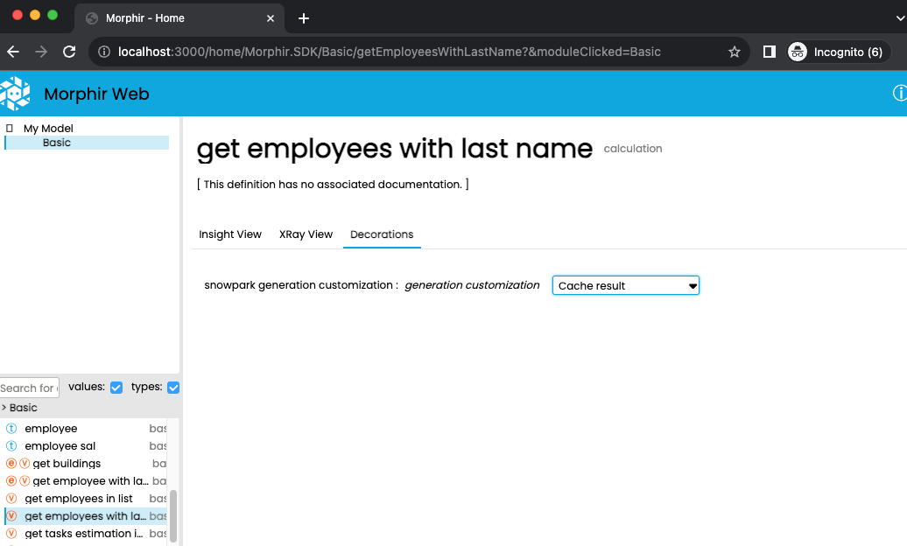

# Using the Snowpark backend and customizing the output

## Using the backend

The backend is selected by specifying `Snowpark` as the target. For example:

```bash
$ morphir-elm gen -t Snowpark -o outputDir
```

## Identifying not supported cases

The output directory where the Scala code was generated contains a file called `GenerationReport.md`. This is a markdown file which contains the following information:

- Generation issues by function: Elements not converted listed by function
- Listing of functions generated using the DataFrame operations strategy
- Listing of functions generated using the Scala expressions strategy
- Listing of types identified as `DataFrames`

An example of this report:

```markdown
# Generation report


## Generation issues


### MyModel:Basic:getTasksEstimationInSeconds22

- Call to function not generated: Morphir.SDK:List:range

## Functions generated using DataFrame operations strategy

- `MyModel:Basic:addThreeNumbers`
- `MyModel:Basic:checkLastName`
- `MyModel:Basic:classifyDepartment`
- `MyModel:Basic:getEmployeeWithLastName`
- `MyModel:Basic:getEmployeesInList`
- `MyModel:Basic:getEmployeesWithLastName`
- `MyModel:Basic:toSpString`

## Functions generated using Scala strategy

- MyModel:Basic:avgSalaries

## Types identified as DataFrames

- MyModel:Basic:department
- MyModel:Basic:employee
```

### Customizing the output using decorations

The Snowpark backend supports a way to apply two customizations using [Morphir decorations](https://morphir.finos.org/docs/decorations-users-guide) . 

Two customizations could be applied : "Inline function call" or "Cache result" .

#### Inlining functions

The **Inline element** decoration allows the user to inline a function definition. For example given the following code:

```elm
toSpString : CardinalDirection -> String
toSpString direction =
   case direction of
      North -> 
         "Norte"
      South ->
         "Sur"
      East ->
         "Este"
      West ->
         "Oeste"

spanishDirections : List Directions -> List { translation : String }
spanishDirections directions =
   directions
      |> List.map (\dir -> { translation = toSpString dir.direction })
```

The generated code for these definitions is:

```scala
def toSpString(
  direction: com.snowflake.snowpark.Column
)(
  implicit sfSession: com.snowflake.snowpark.Session
): com.snowflake.snowpark.Column =
  com.snowflake.snowpark.functions.when(
    (direction) === (myModel.Basic.CardinalDirection.West),
    com.snowflake.snowpark.functions.lit("Oeste")
  ).when(
    (direction) === (myModel.Basic.CardinalDirection.East),
    com.snowflake.snowpark.functions.lit("Este")
  ).when(
    (direction) === (myModel.Basic.CardinalDirection.South),
    com.snowflake.snowpark.functions.lit("Sur")
  ).when(
    (direction) === (myModel.Basic.CardinalDirection.North),
    com.snowflake.snowpark.functions.lit("Norte")
  )

def spanishDirections(
  directions: com.snowflake.snowpark.DataFrame
)(
  implicit sfSession: com.snowflake.snowpark.Session
): com.snowflake.snowpark.DataFrame = {
  val directionsColumns: myModel.Basic.Directions = new myModel.Basic.DirectionsWrapper(directions)
  
  directions.select(myModel.Basic.toSpString(directionsColumns.direction).as("translation"))
}
```

By adding the `Inline element` decoration we can inline the `toSpString` function call inside `spanishDirections`. 


Regenerating the code with these decorations shows that the definition was inlined in the place where the function was invoked.

```scala
  def spanishDirections(
    directions: com.snowflake.snowpark.DataFrame
  )(
    implicit sfSession: com.snowflake.snowpark.Session
  ): com.snowflake.snowpark.DataFrame = {
    val directionsColumns: myModel.Basic.Directions = new myModel.Basic.DirectionsWrapper(directions)
    
    directions.select(com.snowflake.snowpark.functions.when(
      (directionsColumns.direction) === (myModel.Basic.CardinalDirection.West),
      com.snowflake.snowpark.functions.lit("Oeste")
    ).when(
      (directionsColumns.direction) === (myModel.Basic.CardinalDirection.East),
      com.snowflake.snowpark.functions.lit("Este")
    ).when(
      (directionsColumns.direction) === (myModel.Basic.CardinalDirection.South),
      com.snowflake.snowpark.functions.lit("Sur")
    ).when(
      (directionsColumns.direction) === (myModel.Basic.CardinalDirection.North),
      com.snowflake.snowpark.functions.lit("Norte")
    ).as("translation"))
  }
```

### Cache result

Another customization allows the user to specify that caching code need to be generated for a specific function.  

For example given this function:

```elm
getEmployeesWithLastName : String -> List Employee -> List Employee
getEmployeesWithLastName lastName employees =
    employees
       |> List.filter (\employee -> employee.lastName == lastName)
```

The code generated for this function looks like this:

```scala
  def getEmployeeWithLastName(
    lastName: com.snowflake.snowpark.Column
  )(
    employees: com.snowflake.snowpark.DataFrame
  )(
    implicit sfSession: com.snowflake.snowpark.Session
  ): com.snowflake.snowpark.DataFrame = {
    val employeesColumns: myModel.Basic.Employee = new myModel.Basic.EmployeeWrapper(employees)
    
    employees.filter(myModel.Basic.checkLastName(lastName)(employeesColumns))
  }
```

We can add caching to this function with a decoration like this:



Regenerating the code show a different output.

```scala
def getEmployeesWithLastName(
  lastName: com.snowflake.snowpark.Column
)(
  employees: com.snowflake.snowpark.DataFrame
)(
  implicit sfSession: com.snowflake.snowpark.Session
): com.snowflake.snowpark.DataFrame =
  getEmployeesWithLastNameCache.getOrElseUpdate(
    (lastName, employees, sfSession),
    {
      val employeesColumns: myModel.Basic.Employee = new myModel.Basic.EmployeeWrapper(employees)
      
      employees.filter((employeesColumns.lastName) === (lastName))
    }.cacheResult
  )
```

Notice that this code use the [cacheResult](https://docs.snowflake.com/en/developer-guide/snowpark/scala/working-with-dataframes#caching-a-dataframe)  mechanism.

## Configuring the project for using Snowpark decorations

Some modifications to the  `morphir.json` are required to add these decorations. Here is an example of the configuration that needs to be added to this file:

```json
{
   "name": "MyModel",
   "sourceDirectory": "src",
   "decorations": {
      "snowparkgendecorations": {
          "displayName" : "Snowpark generation customization",
          "entryPoint": "SnowparkGenCustomization:Decorations:GenerationCustomization",
          "ir": "out/decorations/morphir-ir.json",
          "storageLocation": "spdecorations.json"
       }
    }
}
```

Every time code is generated with this Snowpark backend a `decorations` directory is created in the output directory. To generate `morphir-ir.json` file for the decorations model you need to run the `make` command in this directory:

```bash
$ cd decorations
$ morphir-elm  make
```

## Using decoration when generating code

The `-dec` command line parameter is used to specify the decorations generated with the Morphir UI . For example given that the `spdecorations.json` name is used in the `storageLocation` section we can write:

```bash
$ morphir-elm gen -t Snowpark -o output -dec spdecorations.json
```
